# AgentForge — Data Flow & System Diagrams

> **AgentForge 数据流与系统架构图**

> Version 1.0 | April 2026 | Bilingual (English / 中文)

---

## Table of Contents / 目录

1. [System Architecture Overview / 系统架构总览](#1-system-architecture-overview--系统架构总览)
2. [Seven-Layer Architecture / 七层架构](#2-seven-layer-architecture--七层架构)
3. [Provider Adapter Layer / 提供者适配器层](#3-provider-adapter-layer--提供者适配器层)
4. [Session & Conversation Data Flow / 会话与对话数据流](#4-session--conversation-data-flow--会话与对话数据流)
5. [Agent Lifecycle Data Flow / 智能体生命周期数据流](#5-agent-lifecycle-data-flow--智能体生命周期数据流)
6. [Team Collaboration Data Flow / 团队协作数据流](#6-team-collaboration-data-flow--团队协作数据流)
7. [SharedTaskList Atomic Claim Flow / 共享任务列表原子认领流程](#7-sharedtasklist-atomic-claim-flow--共享任务列表原子认领流程)
8. [TeamBus Message Routing / 团队总线消息路由](#8-teambus-message-routing--团队总线消息路由)
9. [Orchestration Engine Data Flow / 编排引擎数据流](#9-orchestration-engine-data-flow--编排引擎数据流)
10. [Three Operating Modes / 三种运行模式](#10-three-operating-modes--三种运行模式)
11. [iFlow Workflow Execution / 智能工作流执行](#11-iflow-workflow-execution--智能工作流执行)
12. [Knowledge Base (Brains) Data Flow / 知识库数据流](#12-knowledge-base-brains-data-flow--知识库数据流)
13. [MCP Tool Integration Data Flow / MCP工具集成数据流](#13-mcp-tool-integration-data-flow--mcp工具集成数据流)
14. [Database Entity-Relationship Diagram / 数据库实体关系图](#14-database-entity-relationship-diagram--数据库实体关系图)
15. [Token Management Data Flow / Token管理数据流](#15-token-management-data-flow--token管理数据流)
16. [Security & Audit Data Flow / 安全与审计数据流](#16-security--audit-data-flow--安全与审计数据流)
17. [Document Generation Data Flow / 文档生成数据流](#17-document-generation-data-flow--文档生成数据流)
18. [Monitoring & Observability Data Flow / 监控与可观测性数据流](#18-monitoring--observability-data-flow--监控与可观测性数据流)

---

## 1. System Architecture Overview / 系统架构总览

### Description / 描述

This diagram provides a high-level view of the AgentForge system, showing the four primary external actors (Human User, AI Providers, Obsidian Vault, MCP Tools) and the core internal subsystems that orchestrate AI agent collaboration.

此图提供了AgentForge系统的高层视图，展示了四个主要外部参与者（人类用户、AI提供者、Obsidian仓库、MCP工具）和协调AI智能体协作的核心内部子系统。

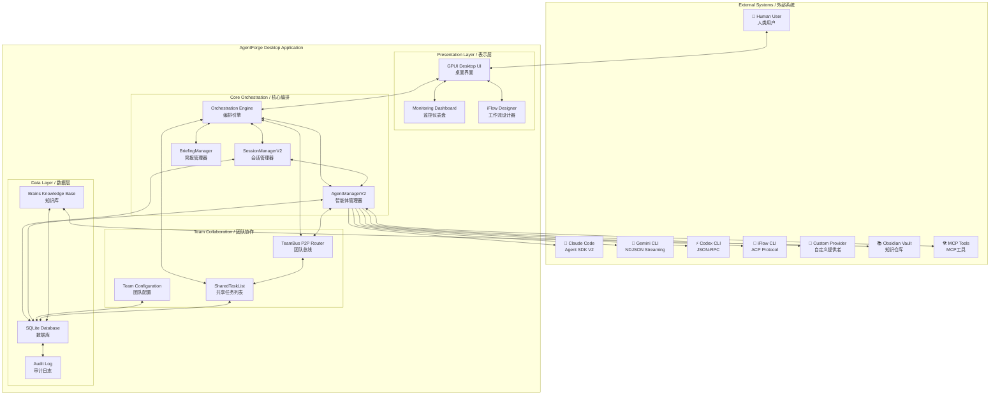
```mermaid
graph TB
    subgraph External["External Systems / 外部系统"]
        User["👤 Human User<br/>人类用户"]
        Claude["🤖 Claude Code<br/>Agent SDK V2"]
        Gemini["🧠 Gemini CLI<br/>NDJSON Streaming"]
        Codex["⚡ Codex CLI<br/>JSON-RPC"]
        iFlow["🔄 iFlow CLI<br/>ACP Protocol"]
        Custom["🔧 Custom Provider<br/>自定义提供者"]
        Obsidian["📚 Obsidian Vault<br/>知识仓库"]
        MCPTools["🛠️ MCP Tools<br/>MCP工具"]
    end

    subgraph AgentForge["AgentForge Desktop Application"]
        subgraph UI["Presentation Layer / 表示层"]
            GPUI["GPUI Desktop UI<br/>桌面界面"]
            Dashboard["Monitoring Dashboard<br/>监控仪表盘"]
            WorkflowDesigner["iFlow Designer<br/>工作流设计器"]
        end

        subgraph Core["Core Orchestration / 核心编排"]
            OrchEngine["Orchestration Engine<br/>编排引擎"]
            SessionMgr["SessionManagerV2<br/>会话管理器"]
            AgentMgr["AgentManagerV2<br/>智能体管理器"]
            BriefingMgr["BriefingManager<br/>简报管理器"]
        end

        subgraph Team["Team Collaboration / 团队协作"]
            TeamBus["TeamBus P2P Router<br/>团队总线"]
            SharedTaskList["SharedTaskList<br/>共享任务列表"]
            TeamConfig["Team Configuration<br/>团队配置"]
        end

        subgraph Data["Data Layer / 数据层"]
            SQLite["SQLite Database<br/>数据库"]
            KnowledgeBase["Brains Knowledge Base<br/>知识库"]
            AuditLog["Audit Log<br/>审计日志"]
        end
    end

    User <--> GPUI
    GPUI <--> OrchEngine
    GPUI <--> Dashboard
    GPUI <--> WorkflowDesigner

    OrchEngine <--> SessionMgr
    OrchEngine <--> AgentMgr
    OrchEngine <--> BriefingMgr
    OrchEngine <--> TeamBus
    OrchEngine <--> SharedTaskList

    SessionMgr <--> AgentMgr
    AgentMgr <--> TeamBus
    TeamBus <--> SharedTaskList

    AgentMgr --> Claude
    AgentMgr --> Gemini
    AgentMgr --> Codex
    AgentMgr --> iFlow
    AgentMgr --> Custom

    KnowledgeBase <--> Obsidian
    SQLite <--> AuditLog
    SessionMgr <--> SQLite
    AgentMgr <--> SQLite
    TeamConfig <--> SQLite
    SharedTaskList <--> SQLite
    KnowledgeBase <--> SQLite
    AgentMgr <--> MCPTools
```

---

## 2. Seven-Layer Architecture / 七层架构

### Description / 描述

AgentForge follows a seven-layer architecture pattern. Each layer has a well-defined responsibility and communicates only with adjacent layers, ensuring loose coupling and testability. The data flows top-down from user interaction to persistence, and bottom-up for data retrieval and event propagation.

AgentForge遵循七层架构模式。每一层都有明确的职责，仅与相邻层通信，确保松耦合和可测试性。数据自上而下从用户交互流向持久化，自下而上进行数据检索和事件传播。

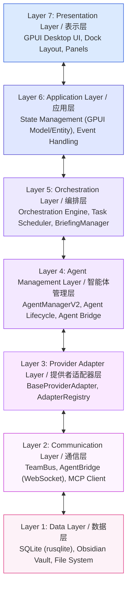
```mermaid
graph TD
    L1["Layer 7: Presentation Layer / 表示层<br/>GPUI Desktop UI, Dock Layout, Panels"]
    L2["Layer 6: Application Layer / 应用层<br/>State Management (GPUI Model/Entity), Event Handling"]
    L3["Layer 5: Orchestration Layer / 编排层<br/>Orchestration Engine, Task Scheduler, BriefingManager"]
    L4["Layer 4: Agent Management Layer / 智能体管理层<br/>AgentManagerV2, Agent Lifecycle, Agent Bridge"]
    L5["Layer 3: Provider Adapter Layer / 提供者适配器层<br/>BaseProviderAdapter, AdapterRegistry"]
    L6["Layer 2: Communication Layer / 通信层<br/>TeamBus, AgentBridge (WebSocket), MCP Client"]
    L7["Layer 1: Data Layer / 数据层<br/>SQLite (rusqlite), Obsidian Vault, File System"]

    L1 <--> L2
    L2 <--> L3
    L3 <--> L4
    L4 <--> L5
    L5 <--> L6
    L6 <--> L7

    style L1 fill:#dbeafe,stroke:#1d4ed8
    style L2 fill:#e0e7ff,stroke:#4338ca
    style L3 fill:#ede9fe,stroke:#7c3aed
    style L4 fill:#f3e8ff,stroke:#9333ea
    style L5 fill:#fae8ff,stroke:#a855f7
    style L6 fill:#fdf4ff,stroke:#c026d3
    style L7 fill:#fdf2f8,stroke:#db2777
```

---

## 3. Provider Adapter Layer / 提供者适配器层

### Description / 描述

The Provider Adapter Layer abstracts provider-specific communication through a unified `BaseProviderAdapter` interface. The `AdapterRegistry` factory manages adapter instantiation and lifecycle. Each adapter normalizes events through `toolMapping` and presents standardized methods for message sending, response receiving, and context management.

提供者适配器层通过统一的`BaseProviderAdapter`接口抽象了提供者特定的通信。`AdapterRegistry`工厂管理适配器的实例化和生命周期。每个适配器通过`toolMapping`规范化事件，并提供标准化的消息发送、响应接收和上下文管理方法。

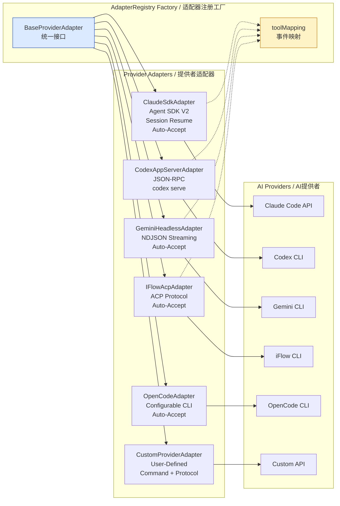
```mermaid
graph LR
    subgraph Registry["AdapterRegistry Factory / 适配器注册工厂"]
        BaseAdapter["BaseProviderAdapter<br/>统一接口"]
        ToolMapping["toolMapping<br/>事件映射"]
    end

    subgraph Adapters["Provider Adapters / 提供者适配器"]
        ClaudeAdapter["ClaudeSdkAdapter<br/>Agent SDK V2<br/>Session Resume<br/>Auto-Accept"]
        CodexAdapter["CodexAppServerAdapter<br/>JSON-RPC<br/>codex serve"]
        GeminiAdapter["GeminiHeadlessAdapter<br/>NDJSON Streaming<br/>Auto-Accept"]
        iFlowAdapter["IFlowAcpAdapter<br/>ACP Protocol<br/>Auto-Accept"]
        OpenCodeAdapter["OpenCodeAdapter<br/>Configurable CLI<br/>Auto-Accept"]
        CustomAdapter["CustomProviderAdapter<br/>User-Defined<br/>Command + Protocol"]
    end

    subgraph External["AI Providers / AI提供者"]
        ClaudeAPI["Claude Code API"]
        CodexAPI["Codex CLI"]
        GeminiAPI["Gemini CLI"]
        iFlowAPI["iFlow CLI"]
        OpenCodeAPI["OpenCode CLI"]
        CustomAPI["Custom API"]
    end

    BaseAdapter --> ClaudeAdapter
    BaseAdapter --> CodexAdapter
    BaseAdapter --> GeminiAdapter
    BaseAdapter --> iFlowAdapter
    BaseAdapter --> OpenCodeAdapter
    BaseAdapter --> CustomAdapter

    ClaudeAdapter --> ClaudeAPI
    CodexAdapter --> CodexAPI
    GeminiAdapter --> GeminiAPI
    iFlowAdapter --> iFlowAPI
    OpenCodeAdapter --> OpenCodeAPI
    CustomAdapter --> CustomAPI

    ClaudeAdapter -.-> ToolMapping
    CodexAdapter -.-> ToolMapping
    GeminiAdapter -.-> ToolMapping
    iFlowAdapter -.-> ToolMapping

    style BaseAdapter fill:#dbeafe,stroke:#1d4ed8
    style ToolMapping fill:#fef3c7,stroke:#d97706
```

---

## 4. Session & Conversation Data Flow / 会话与对话数据流

### Description / 描述

This diagram illustrates the data flow when a user interacts with an AI agent through a session. The user sends a message through the GPUI UI, which is routed through the SessionManagerV2 to the appropriate Provider Adapter. The adapter communicates with the AI provider, and the response flows back through the same path, with each conversation turn persisted to the SQLite database.

此图展示了用户通过会话与AI智能体交互时的数据流。用户通过GPUI界面发送消息，经由SessionManagerV2路由到相应的提供者适配器。适配器与AI提供者通信，响应沿相同路径返回，每个对话轮次都持久化到SQLite数据库。

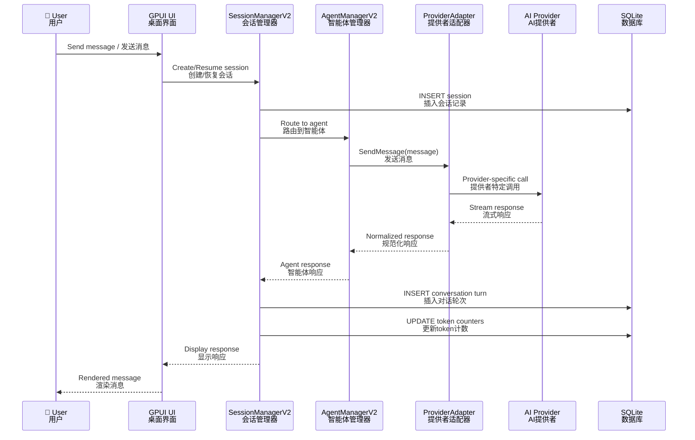
```mermaid
sequenceDiagram
    participant U as 👤 User<br/>用户
    participant UI as GPUI UI<br/>桌面界面
    participant SM as SessionManagerV2<br/>会话管理器
    participant AM as AgentManagerV2<br/>智能体管理器
    participant PA as ProviderAdapter<br/>提供者适配器
    participant AI as AI Provider<br/>AI提供者
    participant DB as SQLite<br/>数据库

    U->>UI: Send message / 发送消息
    UI->>SM: Create/Resume session<br/>创建/恢复会话
    SM->>DB: INSERT session<br/>插入会话记录
    SM->>AM: Route to agent<br/>路由到智能体
    AM->>PA: SendMessage(message)<br/>发送消息
    PA->>AI: Provider-specific call<br/>提供者特定调用
    AI-->>PA: Stream response<br/>流式响应
    PA-->>AM: Normalized response<br/>规范化响应
    AM-->>SM: Agent response<br/>智能体响应
    SM->>DB: INSERT conversation turn<br/>插入对话轮次
    SM->>DB: UPDATE token counters<br/>更新token计数
    SM-->>UI: Display response<br/>显示响应
    UI-->>U: Rendered message<br/>渲染消息
```

---

## 5. Agent Lifecycle Data Flow / 智能体生命周期数据流

### Description / 描述

An agent progresses through defined lifecycle states: Inactive → Active → Running → Idle → Suspended → Retired. Each state transition triggers database updates, audit log entries, and potentially notification events. The AgentManagerV2 manages all lifecycle transitions.

智能体经历定义的生命周期状态：非活跃 → 活跃 → 运行中 → 空闲 → 暂停 → 退役。每个状态转换都会触发数据库更新、审计日志条目和可能的通知事件。AgentManagerV2管理所有生命周期转换。

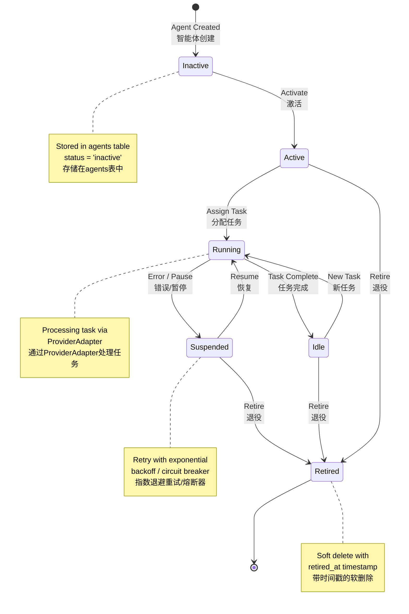
```mermaid
stateDiagram-v2
    [*] --> Inactive: Agent Created<br/>智能体创建
    Inactive --> Active: Activate<br/>激活
    Active --> Running: Assign Task<br/>分配任务
    Running --> Idle: Task Complete<br/>任务完成
    Idle --> Running: New Task<br/>新任务
    Running --> Suspended: Error / Pause<br/>错误/暂停
    Suspended --> Running: Resume<br/>恢复
    Suspended --> Retired: Retire<br/>退役
    Idle --> Retired: Retire<br/>退役
    Active --> Retired: Retire<br/>退役
    Retired --> [*]

    note right of Inactive: Stored in agents table<br/>status = 'inactive'<br/>存储在agents表中
    note right of Running: Processing task via<br/>ProviderAdapter<br/>通过ProviderAdapter处理任务
    note right of Suspended: Retry with exponential<br/>backoff / circuit breaker<br/>指数退避重试/熔断器
    note right of Retired: Soft delete with<br/>retired_at timestamp<br/>带时间戳的软删除
```

---

## 6. Team Collaboration Data Flow / 团队协作数据流

### Description / 描述

This diagram shows how multiple agents collaborate within a team instance. A team is defined by a template (teams table), instantiated with specific agents (team_instances, team_members), and agents communicate via TeamBus while sharing tasks through SharedTaskList. All interactions are persisted to the database.

此图展示了多个智能体如何在团队实例中协作。团队由模板定义（teams表），通过特定智能体实例化（team_instances、team_members），智能体通过TeamBus通信，通过SharedTaskList共享任务。所有交互都持久化到数据库。

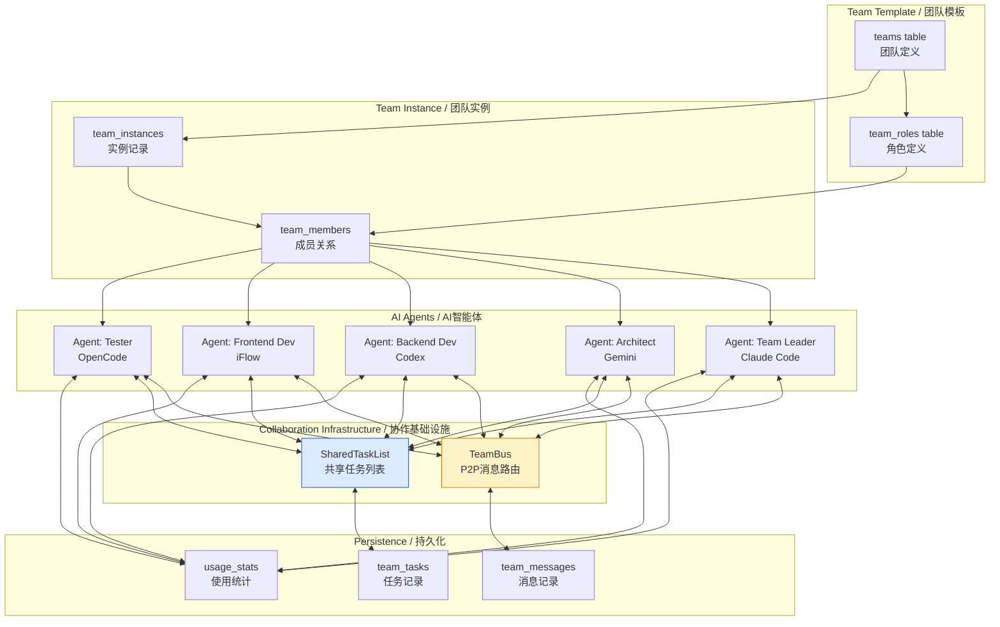
```mermaid
graph TB
    subgraph TeamTemplate["Team Template / 团队模板"]
        TeamDef["teams table<br/>团队定义"]
        RoleDef["team_roles table<br/>角色定义"]
    end

    subgraph TeamInst["Team Instance / 团队实例"]
        Instance["team_instances<br/>实例记录"]
        Members["team_members<br/>成员关系"]
    end

    subgraph Agents["AI Agents / AI智能体"]
        Leader["Agent: Team Leader<br/>Claude Code"]
        Architect["Agent: Architect<br/>Gemini"]
        Backend["Agent: Backend Dev<br/>Codex"]
        Frontend["Agent: Frontend Dev<br/>iFlow"]
        Tester["Agent: Tester<br/>OpenCode"]
    end

    subgraph Collaboration["Collaboration Infrastructure / 协作基础设施"]
        Bus["TeamBus<br/>P2P消息路由"]
        Tasks["SharedTaskList<br/>共享任务列表"]
    end

    subgraph Persistence["Persistence / 持久化"]
        DB_Tasks["team_tasks<br/>任务记录"]
        DB_Msgs["team_messages<br/>消息记录"]
        DB_Usage["usage_stats<br/>使用统计"]
    end

    TeamDef --> RoleDef
    TeamDef --> Instance
    RoleDef --> Members
    Instance --> Members

    Members --> Leader
    Members --> Architect
    Members --> Backend
    Members --> Frontend
    Members --> Tester

    Leader <--> Bus
    Architect <--> Bus
    Backend <--> Bus
    Frontend <--> Bus
    Tester <--> Bus

    Leader <--> Tasks
    Architect <--> Tasks
    Backend <--> Tasks
    Frontend <--> Tasks
    Tester <--> Tasks

    Tasks <--> DB_Tasks
    Bus <--> DB_Msgs
    Leader <--> DB_Usage
    Architect <--> DB_Usage
    Backend <--> DB_Usage
    Frontend <--> DB_Usage
    Tester <--> DB_Usage

    style Bus fill:#fef3c7,stroke:#d97706
    style Tasks fill:#dbeafe,stroke:#1d4ed8
```

---

## 7. SharedTaskList Atomic Claim Flow / 共享任务列表原子认领流程

### Description / 描述

The SharedTaskList uses SQLite's atomic `UPDATE ... WHERE status='pending'` operation to ensure that only one agent can claim a task at a time, even under concurrent access. This eliminates race conditions in distributed task management without requiring external locking mechanisms.

SharedTaskList使用SQLite的原子`UPDATE ... WHERE status='pending'`操作确保即使在并发访问下，一次只有一个智能体可以认领任务。这消除了分布式任务管理中的竞态条件，无需外部锁定机制。

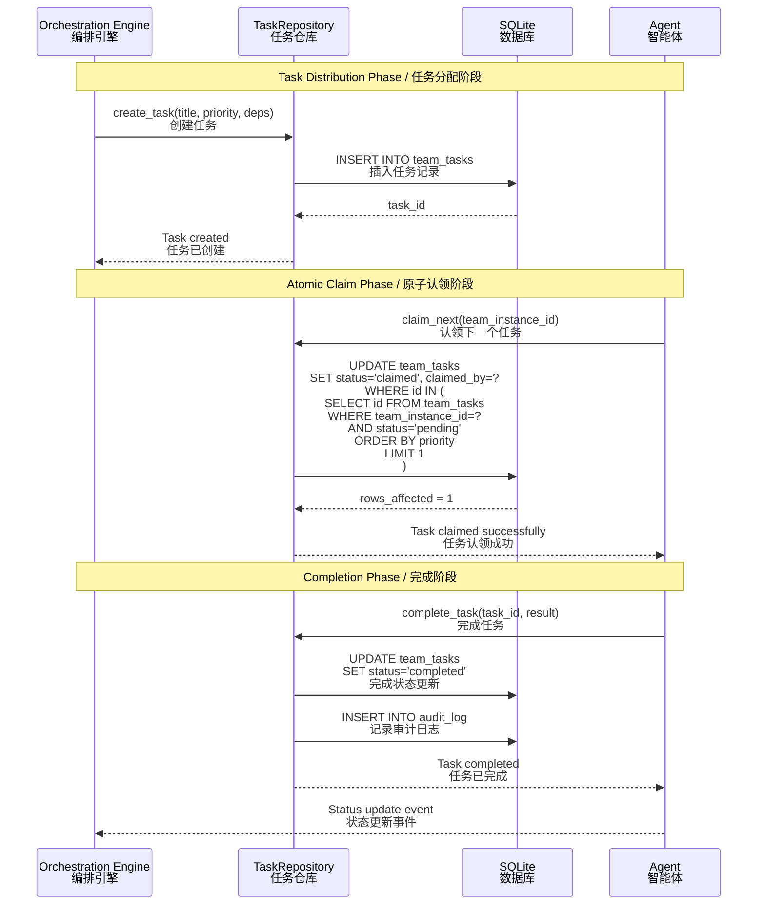
```mermaid
sequenceDiagram
    participant Orch as Orchestration Engine<br/>编排引擎
    participant Repo as TaskRepository<br/>任务仓库
    participant DB as SQLite<br/>数据库
    participant Agent as Agent<br/>智能体

    Note over Orch,Agent: Task Distribution Phase / 任务分配阶段

    Orch->>Repo: create_task(title, priority, deps)<br/>创建任务
    Repo->>DB: INSERT INTO team_tasks<br/>插入任务记录
    DB-->>Repo: task_id
    Repo-->>Orch: Task created<br/>任务已创建

    Note over Orch,Agent: Atomic Claim Phase / 原子认领阶段

    Agent->>Repo: claim_next(team_instance_id)<br/>认领下一个任务
    Repo->>DB: UPDATE team_tasks<br/>SET status='claimed', claimed_by=?<br/>WHERE id IN (<br/>  SELECT id FROM team_tasks<br/>  WHERE team_instance_id=?<br/>  AND status='pending'<br/>  ORDER BY priority<br/>  LIMIT 1<br/>)
    DB-->>Repo: rows_affected = 1
    Repo-->>Agent: Task claimed successfully<br/>任务认领成功

    Note over Orch,Agent: Completion Phase / 完成阶段

    Agent->>Repo: complete_task(task_id, result)<br/>完成任务
    Repo->>DB: UPDATE team_tasks<br/>SET status='completed'<br/>完成状态更新
    Repo->>DB: INSERT INTO audit_log<br/>记录审计日志
    Repo-->>Agent: Task completed<br/>任务已完成
    Agent-->>Orch: Status update event<br/>状态更新事件
```

---

## 8. TeamBus Message Routing / 团队总线消息路由

### Description / 描述

TeamBus supports three routing patterns: Direct (point-to-point to a specific member), Broadcast (to all team members), and Role Group (to all members with a specific role). Messages are persisted to the `team_messages` table with routing metadata for audit and replay.

TeamBus支持三种路由模式：直接（点对点发送给特定成员）、广播（发送给所有团队成员）和角色组（发送给具有特定角色的所有成员）。消息持久化到`team_messages`表，带有路由元数据用于审计和回放。

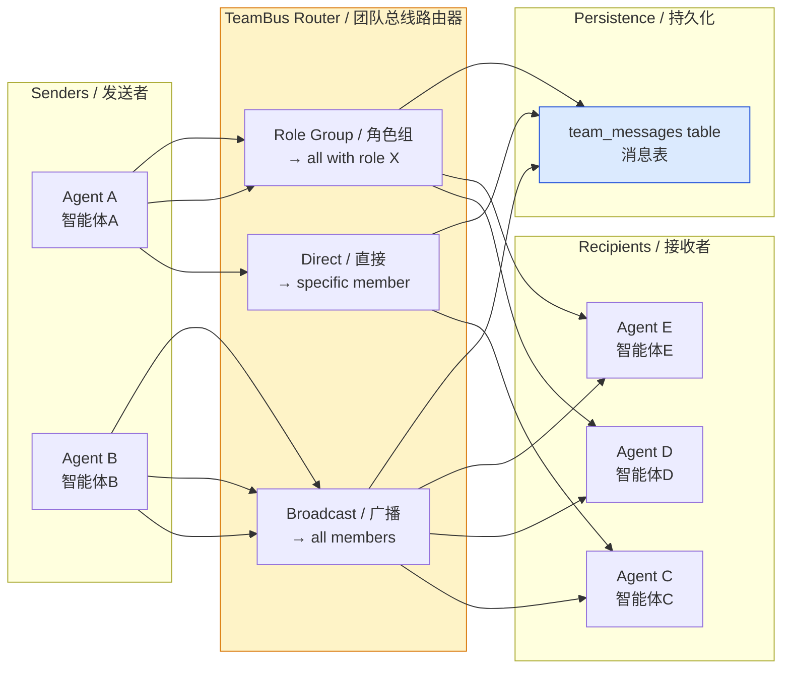
```mermaid
graph LR
    subgraph Senders["Senders / 发送者"]
        S1["Agent A<br/>智能体A"]
        S2["Agent B<br/>智能体B"]
    end

    subgraph TeamBus["TeamBus Router / 团队总线路由器"]
        Direct["Direct / 直接<br/>→ specific member"]
        Broadcast["Broadcast / 广播<br/>→ all members"]
        RoleGroup["Role Group / 角色组<br/>→ all with role X"]
    end

    subgraph Recipients["Recipients / 接收者"]
        R1["Agent C<br/>智能体C"]
        R2["Agent D<br/>智能体D"]
        R3["Agent E<br/>智能体E"]
    end

    subgraph Storage["Persistence / 持久化"]
        MsgDB["team_messages table<br/>消息表"]
    end

    S1 --> Direct --> R1
    S2 --> Broadcast --> R1
    S2 --> Broadcast --> R2
    S2 --> Broadcast --> R3
    S1 --> RoleGroup --> R2
    S1 --> RoleGroup --> R3

    Direct --> MsgDB
    Broadcast --> MsgDB
    RoleGroup --> MsgDB

    style TeamBus fill:#fef3c7,stroke:#d97706
    style MsgDB fill:#dbeafe,stroke:#1d4ed8
```

---

## 9. Orchestration Engine Data Flow / 编排引擎数据流

### Description / 描述

The Orchestration Engine is the central coordinator of AgentForge. It receives high-level tasks from the user or autonomous mode, decomposes them into subtasks, schedules execution across agents, manages dependencies, and aggregates results. This diagram shows the complete orchestration cycle.

编排引擎是AgentForge的中央协调器。它从用户或自主模式接收高级任务，将其分解为子任务，跨智能体调度执行，管理依赖关系，并聚合结果。此图展示了完整的编排周期。

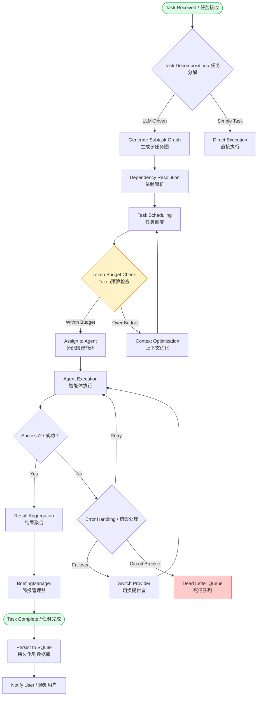
```mermaid
flowchart TD
    Start(["Task Received / 任务接收"]) --> Decompose{"Task Decomposition / 任务分解"}
    Decompose -->|LLM-Driven| SubTasks["Generate Subtask Graph<br/>生成子任务图"]
    Decompose -->|Simple Task| DirectExec["Direct Execution<br/>直接执行"]

    SubTasks --> DepResolve["Dependency Resolution<br/>依赖解析"]
    DepResolve --> Schedule["Task Scheduling<br/>任务调度"]

    Schedule --> CheckBudget{"Token Budget Check<br/>Token预算检查"}
    CheckBudget -->|Within Budget| AssignAgent["Assign to Agent<br/>分配给智能体"]
    CheckBudget -->|Over Budget| OptimizeContext["Context Optimization<br/>上下文优化"]
    OptimizeContext --> Schedule

    AssignAgent --> Execute["Agent Execution<br/>智能体执行"]
    Execute --> Success{"Success? / 成功？"}

    Success -->|Yes| Aggregate["Result Aggregation<br/>结果聚合"]
    Success -->|No| ErrorHandle{"Error Handling / 错误处理"}

    ErrorHandle -->|Retry| Execute
    ErrorHandle -->|Failover| FallbackProvider["Switch Provider<br/>切换提供者"]
    ErrorHandle -->|Circuit Breaker| DeadLetter["Dead Letter Queue<br/>死信队列"]

    FallbackProvider --> Execute
    Aggregate --> Briefing["BriefingManager<br/>简报管理器"]
    Briefing --> Complete(["Task Complete / 任务完成"])

    Complete --> PersistDB["Persist to SQLite<br/>持久化到数据库"]
    PersistDB --> NotifyUser["Notify User / 通知用户"]

    style Start fill:#dcfce7,stroke:#16a34a
    style Complete fill:#dcfce7,stroke:#16a34a
    style DeadLetter fill:#fecaca,stroke:#dc2626
    style CheckBudget fill:#fef3c7,stroke:#d97706
```

---

## 10. Three Operating Modes / 三种运行模式

### Description / 描述

AgentForge supports three operating modes that determine the level of human involvement in agent activities. Modes can be switched dynamically, and different teams can operate in different modes simultaneously.

AgentForge支持三种运行模式，决定人类在智能体活动中的参与程度。模式可以动态切换，不同的团队可以同时在不同模式下运行。

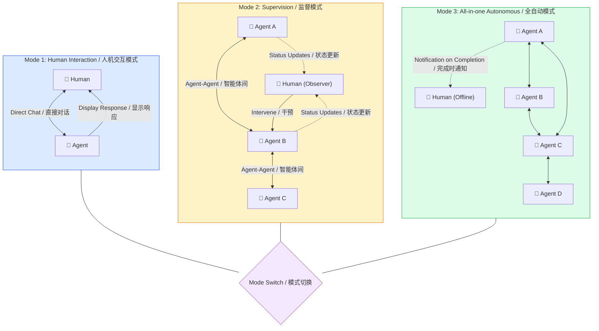
```mermaid
graph TB
    subgraph Mode1["Mode 1: Human Interaction / 人机交互模式"]
        direction TB
        H1["👤 Human"]
        A1["🤖 Agent"]
        H1 <-->|"Direct Chat / 直接对话"| A1
        A1 -->|"Display Response / 显示响应"| H1
    end

    subgraph Mode2["Mode 2: Supervision / 监督模式"]
        direction TB
        H2["👤 Human (Observer)"]
        A2a["🤖 Agent A"]
        A2b["🤖 Agent B"]
        A2c["🤖 Agent C"]
        A2a <-->|"Agent-Agent / 智能体间"| A2b
        A2b <-->|"Agent-Agent / 智能体间"| A2c
        A2a -.->|"Status Updates / 状态更新"| H2
        A2b -.->|"Status Updates / 状态更新"| H2
        H2 -->|"Intervene / 干预"| A2b
    end

    subgraph Mode3["Mode 3: All-in-one Autonomous / 全自动模式"]
        direction TB
        H3["👤 Human (Offline)"]
        A3a["🤖 Agent A"]
        A3b["🤖 Agent B"]
        A3c["🤖 Agent C"]
        A3d["🤖 Agent D"]
        A3a <--> A3b
        A3b <--> A3c
        A3c <--> A3d
        A3a <--> A3c
        A3a -.->|"Notification on Completion / 完成时通知"| H3
    end

    ModeSwitch{"Mode Switch / 模式切换"}
    Mode1 --- ModeSwitch
    Mode2 --- ModeSwitch
    Mode3 --- ModeSwitch

    style Mode1 fill:#dbeafe,stroke:#1d4ed8
    style Mode2 fill:#fef3c7,stroke:#d97706
    style Mode3 fill:#dcfce7,stroke:#16a34a
    style ModeSwitch fill:#f3e8ff,stroke:#7c3aed
```

---

## 11. iFlow Workflow Execution / 智能工作流执行

### Description / 描述

iFlows are DAG-based (Directed Acyclic Graph) workflows that orchestrate multi-step tasks. The workflow engine resolves dependencies, executes steps in parallel where possible, supports manual review gates, and tracks progress in real-time. Each step can be assigned to a specific agent or team.

iFlow是基于DAG（有向无环图）的工作流，用于编排多步骤任务。工作流引擎解析依赖关系，尽可能并行执行步骤，支持人工审核门控，并实时跟踪进度。每个步骤可以分配给特定的智能体或团队。

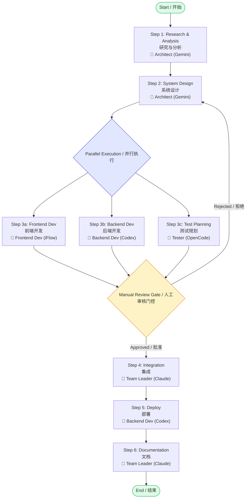
```mermaid
flowchart TD
    Start(["Start / 开始"]) --> Research["Step 1: Research & Analysis<br/>研究与分析<br/>🤖 Architect (Gemini)"]
    Research --> Design["Step 2: System Design<br/>系统设计<br/>🤖 Architect (Gemini)"]
    Design --> ParallelSplit{"Parallel Execution / 并行执行"}

    ParallelSplit --> Frontend["Step 3a: Frontend Dev<br/>前端开发<br/>🤖 Frontend Dev (iFlow)"]
    ParallelSplit --> Backend["Step 3b: Backend Dev<br/>后端开发<br/>🤖 Backend Dev (Codex)"]
    ParallelSplit --> Tests["Step 3c: Test Planning<br/>测试规划<br/>🤖 Tester (OpenCode)"]

    Frontend --> ReviewGate{"Manual Review Gate / 人工审核门控"}
    Backend --> ReviewGate
    Tests --> ReviewGate

    ReviewGate -->|Approved / 批准| Integration["Step 4: Integration<br/>集成<br/>🤖 Team Leader (Claude)"]
    ReviewGate -->|Rejected / 拒绝| Design

    Integration --> Deploy["Step 5: Deploy<br/>部署<br/>🤖 Backend Dev (Codex)"]
    Deploy --> Document["Step 6: Documentation<br/>文档<br/>🤖 Team Leader (Claude)"]
    Document --> End(["End / 结束"])

    style Start fill:#dcfce7,stroke:#16a34a
    style End fill:#dcfce7,stroke:#16a34a
    style ReviewGate fill:#fef3c7,stroke:#d97706
    style ParallelSplit fill:#e0e7ff,stroke:#4338ca
```

---

## 12. Knowledge Base (Brains) Data Flow / 知识库数据流

### Description / 描述

The Brains system manages structured knowledge storage with Obsidian integration. Agents automatically capture knowledge during interactions, which is stored in SQLite with FTS5 indexing. Knowledge can be synced bidirectionally with Obsidian vaults as Markdown files with frontmatter metadata.

Brains系统管理结构化知识存储，并与Obsidian集成。智能体在交互过程中自动捕获知识，存储在SQLite中并通过FTS5索引。知识可以与Obsidian仓库双向同步为带有frontmatter元数据的Markdown文件。

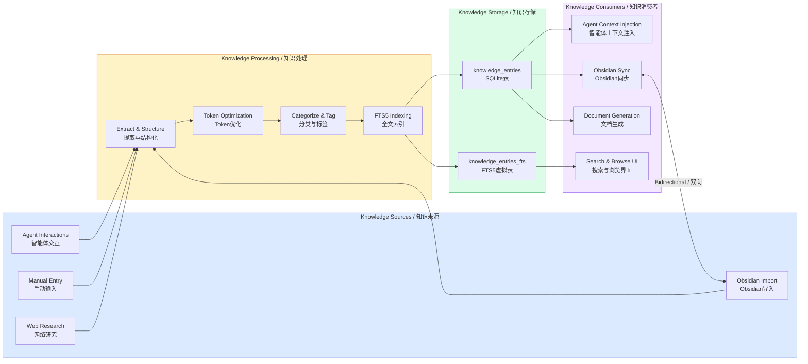
```mermaid
flowchart LR
    subgraph Sources["Knowledge Sources / 知识来源"]
        AgentInteraction["Agent Interactions<br/>智能体交互"]
        ManualEntry["Manual Entry<br/>手动输入"]
        ObsidianImport["Obsidian Import<br/>Obsidian导入"]
        WebResearch["Web Research<br/>网络研究"]
    end

    subgraph Processing["Knowledge Processing / 知识处理"]
        Extract["Extract & Structure<br/>提取与结构化"]
        Compress["Token Optimization<br/>Token优化"]
        Categorize["Categorize & Tag<br/>分类与标签"]
        Embed["FTS5 Indexing<br/>全文索引"]
    end

    subgraph Storage["Knowledge Storage / 知识存储"]
        SQLite_KB["knowledge_entries<br/>SQLite表"]
        FTS5["knowledge_entries_fts<br/>FTS5虚拟表"]
    end

    subgraph Consumers["Knowledge Consumers / 知识消费者"]
        AgentContext["Agent Context Injection<br/>智能体上下文注入"]
        SearchUI["Search & Browse UI<br/>搜索与浏览界面"]
        ObsidianSync["Obsidian Sync<br/>Obsidian同步"]
        DocGen["Document Generation<br/>文档生成"]
    end

    AgentInteraction --> Extract
    ManualEntry --> Extract
    ObsidianImport --> Extract
    WebResearch --> Extract

    Extract --> Compress
    Compress --> Categorize
    Categorize --> Embed
    Embed --> SQLite_KB
    Embed --> FTS5

    SQLite_KB --> AgentContext
    FTS5 --> SearchUI
    SQLite_KB --> ObsidianSync
    SQLite_KB --> DocGen

    ObsidianSync <-->|Bidirectional / 双向| ObsidianImport

    style Sources fill:#dbeafe,stroke:#1d4ed8
    style Processing fill:#fef3c7,stroke:#d97706
    style Storage fill:#dcfce7,stroke:#16a34a
    style Consumers fill:#f3e8ff,stroke:#7c3aed
```

---

## 13. MCP Tool Integration Data Flow / MCP工具集成数据流

### Description / 描述

MCP (Model Context Protocol) tools extend agent capabilities. Tools are registered in the `mcp_tools` table, discovered at runtime by the MCP client, and invoked by agents during task execution. Tool results are captured in conversation records for traceability.

MCP（模型上下文协议）工具扩展智能体能力。工具注册在`mcp_tools`表中，由MCP客户端在运行时发现，并由智能体在任务执行期间调用。工具结果捕获在对话记录中以供追溯。

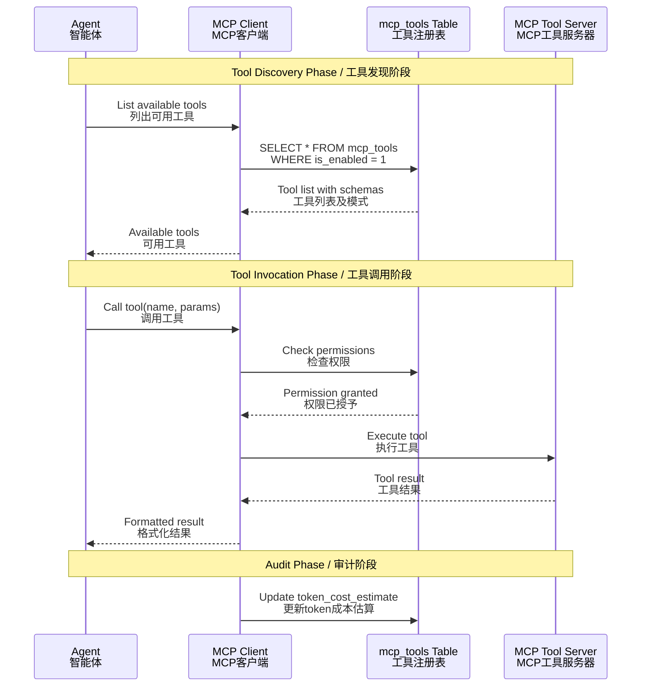
```mermaid
sequenceDiagram
    participant Agent as Agent<br/>智能体
    participant MCPClient as MCP Client<br/>MCP客户端
    participant Registry as mcp_tools Table<br/>工具注册表
    participant Tool as MCP Tool Server<br/>MCP工具服务器

    Note over Agent,Tool: Tool Discovery Phase / 工具发现阶段
    Agent->>MCPClient: List available tools<br/>列出可用工具
    MCPClient->>Registry: SELECT * FROM mcp_tools<br/>WHERE is_enabled = 1
    Registry-->>MCPClient: Tool list with schemas<br/>工具列表及模式
    MCPClient-->>Agent: Available tools<br/>可用工具

    Note over Agent,Tool: Tool Invocation Phase / 工具调用阶段
    Agent->>MCPClient: Call tool(name, params)<br/>调用工具
    MCPClient->>Registry: Check permissions<br/>检查权限
    Registry-->>MCPClient: Permission granted<br/>权限已授予
    MCPClient->>Tool: Execute tool<br/>执行工具
    Tool-->>MCPClient: Tool result<br/>工具结果
    MCPClient-->>Agent: Formatted result<br/>格式化结果

    Note over Agent,Tool: Audit Phase / 审计阶段
    MCPClient->>Registry: Update token_cost_estimate<br/>更新token成本估算
```

---

## 14. Database Entity-Relationship Diagram / 数据库实体关系图

### Description / 描述

This ER diagram shows all 14 database tables and their relationships. The schema is organized into 7 domains: Provider Management, Agent Management, Session Management, Team Collaboration, Knowledge Base, Security & Audit, and Monitoring.

此ER图展示了所有14个数据库表及其关系。模式组织为7个域：提供者管理、智能体管理、会话管理、团队协作、知识库、安全与审计、监控。

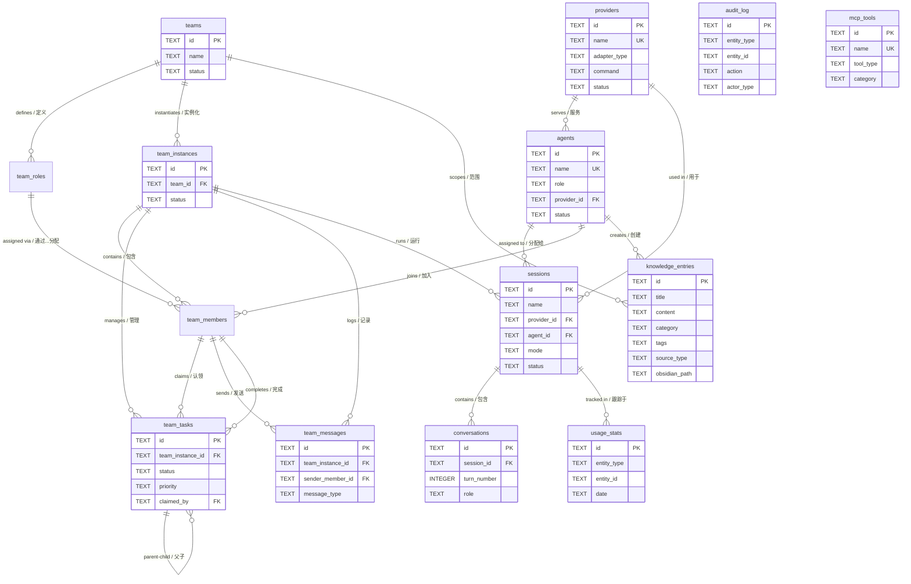
```mermaid
erDiagram
    providers ||--o{ agents : "serves / 服务"
    providers ||--o{ sessions : "used in / 用于"

    agents ||--o{ sessions : "assigned to / 分配给"
    agents ||--o{ team_members : "joins / 加入"
    agents ||--o{ knowledge_entries : "creates / 创建"

    teams ||--o{ team_roles : "defines / 定义"
    teams ||--o{ team_instances : "instantiates / 实例化"
    teams ||--o{ knowledge_entries : "scopes / 范围"

    team_roles ||--o{ team_members : "assigned via / 通过...分配"

    team_instances ||--o{ team_members : "contains / 包含"
    team_instances ||--o{ team_tasks : "manages / 管理"
    team_instances ||--o{ team_messages : "logs / 记录"
    team_instances ||--o{ sessions : "runs / 运行"

    team_members ||--o{ team_tasks : "claims / 认领"
    team_members ||--o{ team_messages : "sends / 发送"
    team_members ||--o{ team_tasks : "completes / 完成"

    team_tasks ||--o{ team_tasks : "parent-child / 父子"

    sessions ||--o{ conversations : "contains / 包含"
    sessions ||--o{ usage_stats : "tracked in / 跟踪于"

    knowledge_entries {
        TEXT id PK
        TEXT title
        TEXT content
        TEXT category
        TEXT tags
        TEXT source_type
        TEXT obsidian_path
    }

    providers {
        TEXT id PK
        TEXT name UK
        TEXT adapter_type
        TEXT command
        TEXT status
    }

    agents {
        TEXT id PK
        TEXT name UK
        TEXT role
        TEXT provider_id FK
        TEXT status
    }

    sessions {
        TEXT id PK
        TEXT name
        TEXT provider_id FK
        TEXT agent_id FK
        TEXT mode
        TEXT status
    }

    teams {
        TEXT id PK
        TEXT name
        TEXT status
    }

    team_instances {
        TEXT id PK
        TEXT team_id FK
        TEXT status
    }

    team_tasks {
        TEXT id PK
        TEXT team_instance_id FK
        TEXT status
        TEXT priority
        TEXT claimed_by FK
    }

    team_messages {
        TEXT id PK
        TEXT team_instance_id FK
        TEXT sender_member_id FK
        TEXT message_type
    }

    conversations {
        TEXT id PK
        TEXT session_id FK
        INTEGER turn_number
        TEXT role
    }

    usage_stats {
        TEXT id PK
        TEXT entity_type
        TEXT entity_id
        TEXT date
    }

    audit_log {
        TEXT id PK
        TEXT entity_type
        TEXT entity_id
        TEXT action
        TEXT actor_type
    }

    mcp_tools {
        TEXT id PK
        TEXT name UK
        TEXT tool_type
        TEXT category
    }
```

---

## 15. Token Management Data Flow / Token管理数据流

### Description / 描述

Token management is critical for cost control and context optimization. This diagram shows how token usage is tracked at multiple granularities (per-turn, per-session, per-agent, per-team), how budgets are enforced, and how context optimization strategies (summarization, knowledge compression) reduce token consumption.

Token管理对于成本控制和上下文优化至关重要。此图展示了token使用如何在多个粒度级别（每轮、每会话、每智能体、每团队）进行跟踪，如何执行预算，以及上下文优化策略（摘要、知识压缩）如何减少token消耗。

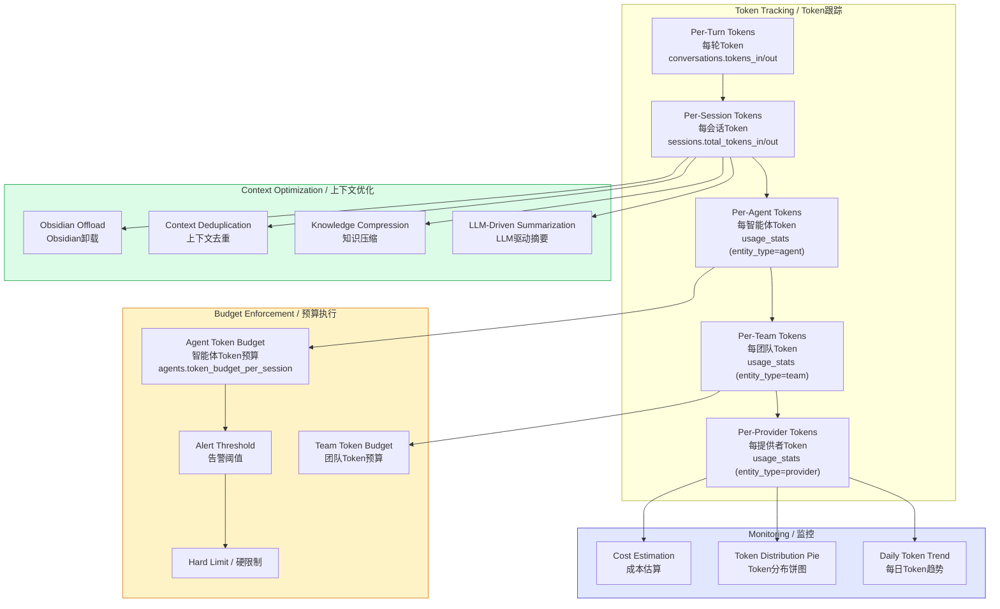
```mermaid
flowchart TD
    subgraph Tracking["Token Tracking / Token跟踪"]
        TurnTokens["Per-Turn Tokens<br/>每轮Token<br/>conversations.tokens_in/out"]
        SessionTokens["Per-Session Tokens<br/>每会话Token<br/>sessions.total_tokens_in/out"]
        AgentTokens["Per-Agent Tokens<br/>每智能体Token<br/>usage_stats (entity_type=agent)"]
        TeamTokens["Per-Team Tokens<br/>每团队Token<br/>usage_stats (entity_type=team)"]
        ProviderTokens["Per-Provider Tokens<br/>每提供者Token<br/>usage_stats (entity_type=provider)"]
    end

    subgraph Budget["Budget Enforcement / 预算执行"]
        AgentBudget["Agent Token Budget<br/>智能体Token预算<br/>agents.token_budget_per_session"]
        TeamBudget["Team Token Budget<br/>团队Token预算"]
        AlertThreshold["Alert Threshold<br/>告警阈值"]
        HardLimit["Hard Limit / 硬限制"]
    end

    subgraph Optimization["Context Optimization / 上下文优化"]
        Summarize["LLM-Driven Summarization<br/>LLM驱动摘要"]
        KnowledgeCompress["Knowledge Compression<br/>知识压缩"]
        Dedup["Context Deduplication<br/>上下文去重"]
        ObsidianOffload["Obsidian Offload<br/>Obsidian卸载"]
    end

    subgraph Dashboard["Monitoring / 监控"]
        DailyChart["Daily Token Trend<br/>每日Token趋势"]
        Distribution["Token Distribution Pie<br/>Token分布饼图"]
        CostEstimate["Cost Estimation<br/>成本估算"]
    end

    TurnTokens --> SessionTokens
    SessionTokens --> AgentTokens
    AgentTokens --> TeamTokens
    TeamTokens --> ProviderTokens

    AgentTokens --> AgentBudget
    TeamTokens --> TeamBudget
    AgentBudget --> AlertThreshold
    AlertThreshold --> HardLimit

    SessionTokens --> Summarize
    SessionTokens --> KnowledgeCompress
    SessionTokens --> Dedup
    SessionTokens --> ObsidianOffload

    ProviderTokens --> DailyChart
    ProviderTokens --> Distribution
    ProviderTokens --> CostEstimate

    style Budget fill:#fef3c7,stroke:#d97706
    style Optimization fill:#dcfce7,stroke:#16a34a
    style Dashboard fill:#e0e7ff,stroke:#4338ca
```

---

## 16. Security & Audit Data Flow / 安全与审计数据流

### Description / 描述

The security architecture implements RBAC (Role-Based Access Control) with four roles: Admin, Team Lead, Operator, and Viewer. All mutations are recorded in an immutable audit log. API keys are stored in the OS keychain, not in the database. This diagram shows the access control and audit flow.

安全架构实现了RBAC（基于角色的访问控制），包含四个角色：管理员、团队负责人、操作员和查看者。所有变更都记录在不可变的审计日志中。API密钥存储在操作系统密钥链中，而非数据库。此图展示了访问控制和审计流程。

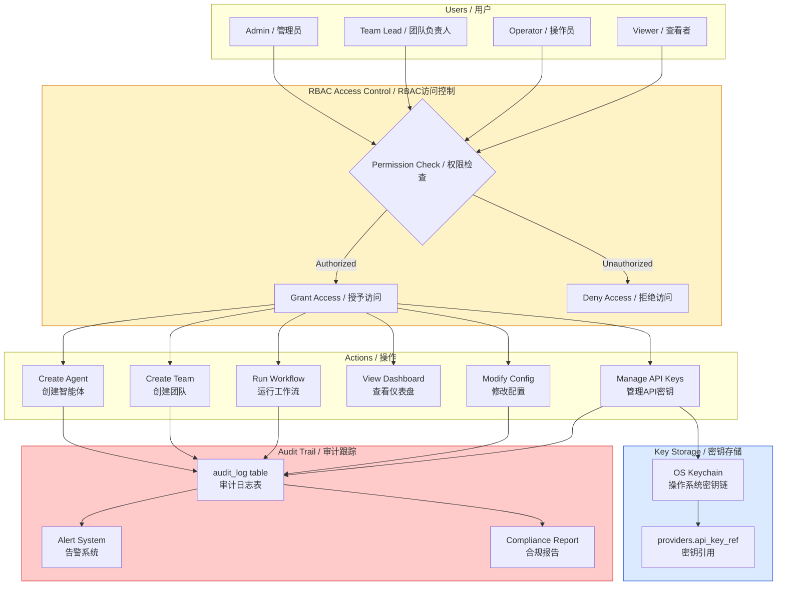
```mermaid
flowchart TD
    subgraph Users["Users / 用户"]
        Admin["Admin / 管理员"]
        TeamLead["Team Lead / 团队负责人"]
        Operator["Operator / 操作员"]
        Viewer["Viewer / 查看者"]
    end

    subgraph RBAC["RBAC Access Control / RBAC访问控制"]
        PermissionCheck{"Permission Check / 权限检查"}
        Grant["Grant Access / 授予访问"]
        Deny["Deny Access / 拒绝访问"]
    end

    subgraph Actions["Actions / 操作"]
        CreateAgent["Create Agent<br/>创建智能体"]
        CreateTeam["Create Team<br/>创建团队"]
        RunWorkflow["Run Workflow<br/>运行工作流"]
        ViewDashboard["View Dashboard<br/>查看仪表盘"]
        ModifyConfig["Modify Config<br/>修改配置"]
        ManageKeys["Manage API Keys<br/>管理API密钥"]
    end

    subgraph Audit["Audit Trail / 审计跟踪"]
        AuditDB["audit_log table<br/>审计日志表"]
        AlertSystem["Alert System<br/>告警系统"]
        ComplianceReport["Compliance Report<br/>合规报告"]
    end

    subgraph KeyStorage["Key Storage / 密钥存储"]
        OSKeychain["OS Keychain<br/>操作系统密钥链"]
        KeyRef["providers.api_key_ref<br/>密钥引用"]
    end

    Admin --> PermissionCheck
    TeamLead --> PermissionCheck
    Operator --> PermissionCheck
    Viewer --> PermissionCheck

    PermissionCheck -->|Authorized| Grant
    PermissionCheck -->|Unauthorized| Deny

    Grant --> CreateAgent
    Grant --> CreateTeam
    Grant --> RunWorkflow
    Grant --> ViewDashboard
    Grant --> ModifyConfig
    Grant --> ManageKeys

    CreateAgent --> AuditDB
    CreateTeam --> AuditDB
    RunWorkflow --> AuditDB
    ModifyConfig --> AuditDB
    ManageKeys --> AuditDB

    AuditDB --> AlertSystem
    AuditDB --> ComplianceReport

    ManageKeys --> OSKeychain
    OSKeychain --> KeyRef

    style RBAC fill:#fef3c7,stroke:#d97706
    style Audit fill:#fecaca,stroke:#dc2626
    style KeyStorage fill:#dbeafe,stroke:#1d4ed8
```

---

## 17. Document Generation Data Flow / 文档生成数据流

### Description / 描述

AgentForge can generate various document types (PRD, SRS, BRD, .md, .docx) using AI agents. The document generation pipeline extracts context from conversations, knowledge base entries, and project files, then uses AI providers to produce structured documents that are saved to the file system.

AgentForge可以使用AI智能体生成各种文档类型（PRD、SRS、BRD、.md、.docx）。文档生成管道从对话、知识库条目和项目文件中提取上下文，然后使用AI提供者生成结构化文档并保存到文件系统。

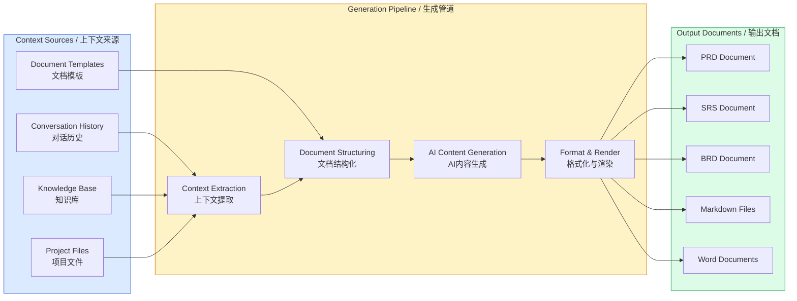
```mermaid
flowchart LR
    subgraph Inputs["Context Sources / 上下文来源"]
        ConvHistory["Conversation History<br/>对话历史"]
        Knowledge["Knowledge Base<br/>知识库"]
        ProjectFiles["Project Files<br/>项目文件"]
        Templates["Document Templates<br/>文档模板"]
    end

    subgraph Pipeline["Generation Pipeline / 生成管道"]
        Extract["Context Extraction<br/>上下文提取"]
        Structure["Document Structuring<br/>文档结构化"]
        Generate["AI Content Generation<br/>AI内容生成"]
        Format["Format & Render<br/>格式化与渲染"]
    end

    subgraph Outputs["Output Documents / 输出文档"]
        PRD["PRD Document"]
        SRS["SRS Document"]
        BRD["BRD Document"]
        MD["Markdown Files"]
        DOCX["Word Documents"]
    end

    ConvHistory --> Extract
    Knowledge --> Extract
    ProjectFiles --> Extract
    Templates --> Structure

    Extract --> Structure
    Structure --> Generate
    Generate --> Format

    Format --> PRD
    Format --> SRS
    Format --> BRD
    Format --> MD
    Format --> DOCX

    style Inputs fill:#dbeafe,stroke:#1d4ed8
    style Pipeline fill:#fef3c7,stroke:#d97706
    style Outputs fill:#dcfce7,stroke:#16a34a
```

---

## 18. Monitoring & Observability Data Flow / 监控与可观测性数据流

### Description / 描述

The monitoring system collects metrics from all subsystems and presents them through a real-time dashboard. Metrics include token usage, session counts, agent health, error rates, and workflow progress. Data flows from operational components through the monitoring subsystem to the dashboard UI.

监控系统从所有子系统收集指标，并通过实时仪表盘展示。指标包括token使用量、会话计数、智能体健康状况、错误率和工作流进度。数据从操作组件通过监控子系统流向仪表盘UI。

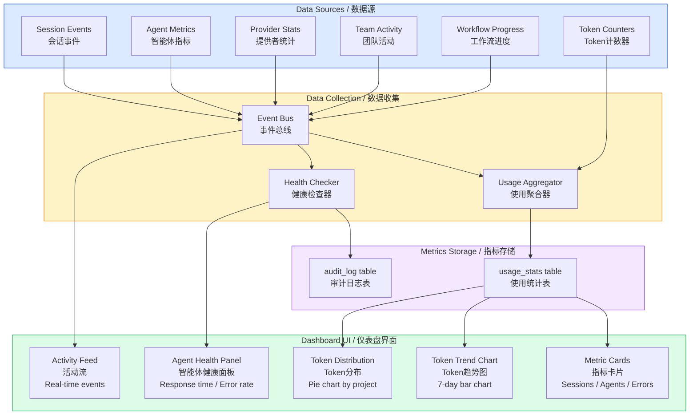
```mermaid
flowchart TB
    subgraph Sources["Data Sources / 数据源"]
        SessionEvents["Session Events<br/>会话事件"]
        AgentMetrics["Agent Metrics<br/>智能体指标"]
        ProviderStats["Provider Stats<br/>提供者统计"]
        TeamActivity["Team Activity<br/>团队活动"]
        WorkflowProgress["Workflow Progress<br/>工作流进度"]
        TokenCounters["Token Counters<br/>Token计数器"]
    end

    subgraph Collection["Data Collection / 数据收集"]
        EventBus["Event Bus<br/>事件总线"]
        UsageAggregator["Usage Aggregator<br/>使用聚合器"]
        HealthChecker["Health Checker<br/>健康检查器"]
    end

    subgraph Storage["Metrics Storage / 指标存储"]
        UsageDB["usage_stats table<br/>使用统计表"]
        AuditDB2["audit_log table<br/>审计日志表"]
    end

    subgraph Dashboard["Dashboard UI / 仪表盘界面"]
        MetricCards["Metric Cards<br/>指标卡片<br/>Sessions / Agents / Errors"]
        TokenTrend["Token Trend Chart<br/>Token趋势图<br/>7-day bar chart"]
        TokenDist["Token Distribution<br/>Token分布<br/>Pie chart by project"]
        ActivityFeed["Activity Feed<br/>活动流<br/>Real-time events"]
        AgentHealth["Agent Health Panel<br/>智能体健康面板<br/>Response time / Error rate"]
    end

    SessionEvents --> EventBus
    AgentMetrics --> EventBus
    ProviderStats --> EventBus
    TeamActivity --> EventBus
    WorkflowProgress --> EventBus
    TokenCounters --> UsageAggregator

    EventBus --> UsageAggregator
    EventBus --> HealthChecker
    UsageAggregator --> UsageDB
    HealthChecker --> AuditDB2

    UsageDB --> MetricCards
    UsageDB --> TokenTrend
    UsageDB --> TokenDist
    EventBus --> ActivityFeed
    HealthChecker --> AgentHealth

    style Sources fill:#dbeafe,stroke:#1d4ed8
    style Collection fill:#fef3c7,stroke:#d97706
    style Storage fill:#f3e8ff,stroke:#7c3aed
    style Dashboard fill:#dcfce7,stroke:#16a34a
```

---

## Appendix: Diagram Legend / 附录：图例

| Symbol / 符号 | Meaning / 含义 |
|---|---|
| `👤` | Human User / 人类用户 |
| `🤖` | AI Agent / AI智能体 |
| `→` | Data flow direction / 数据流方向 |
| `<-->` | Bidirectional communication / 双向通信 |
| `-.->` | Async/notification / 异步/通知 |
| `-->` | Sync data flow / 同步数据流 |
| Blue fill / 蓝色填充 | Data/Storage layer / 数据/存储层 |
| Yellow fill / 黄色填充 | Processing/Routing layer / 处理/路由层 |
| Green fill / 绿色填充 | Success/Output / 成功/输出 |
| Red fill / 红色填充 | Error/Dead letter / 错误/死信 |
| Purple fill / 紫色填充 | External/Consumer / 外部/消费者 |

---

> **Document Information / 文档信息**
> - Version / 版本: 1.0
> - Date / 日期: April 2026
> - Source Materials / 来源材料: AgentForge BRD, PRD, SRS, Database Design Document
> - Tool / 工具: Mermaid.js (compatible with GitHub, Obsidian, VS Code, Typora)
