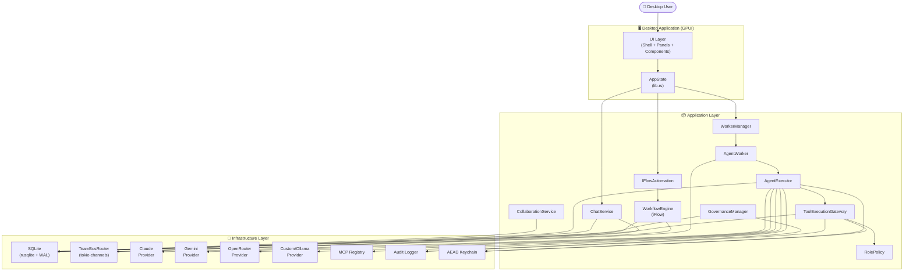
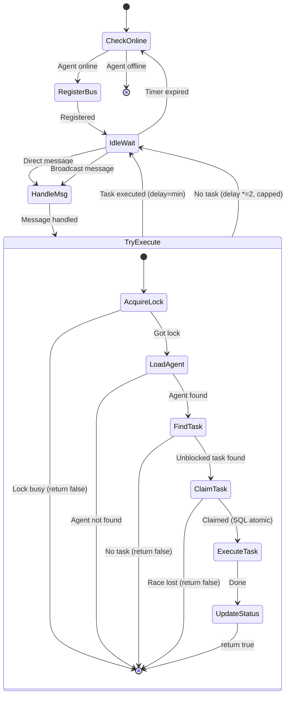
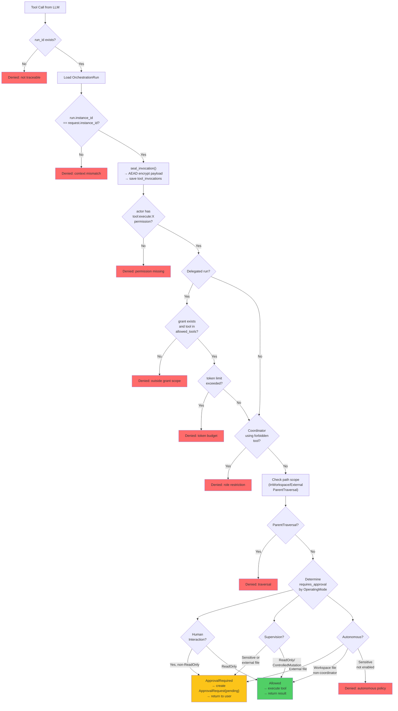
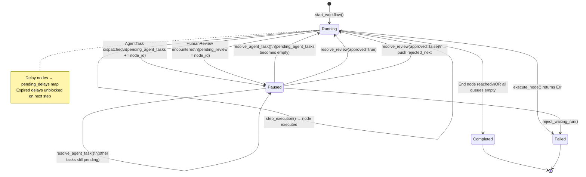
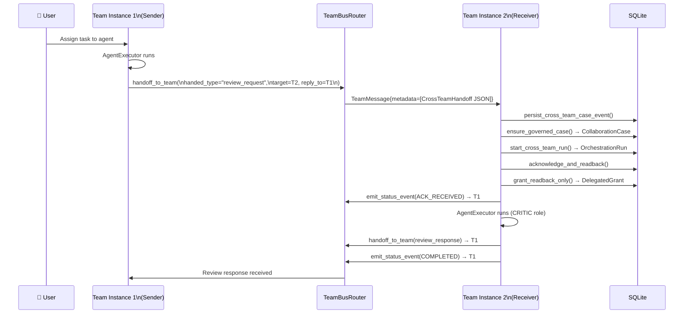
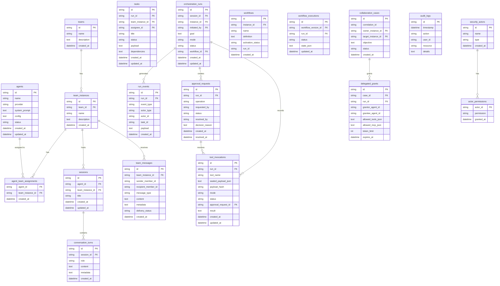
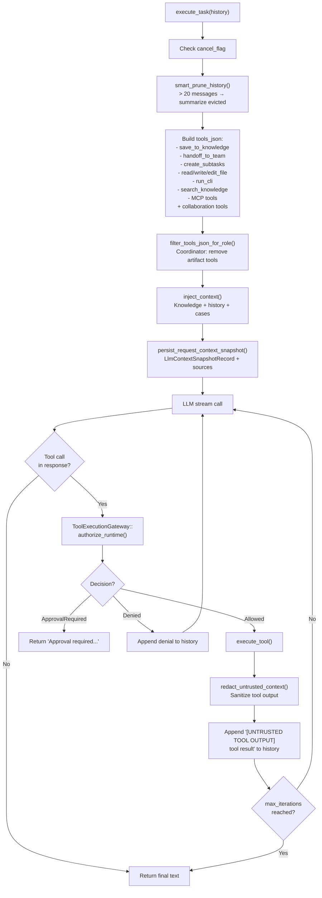
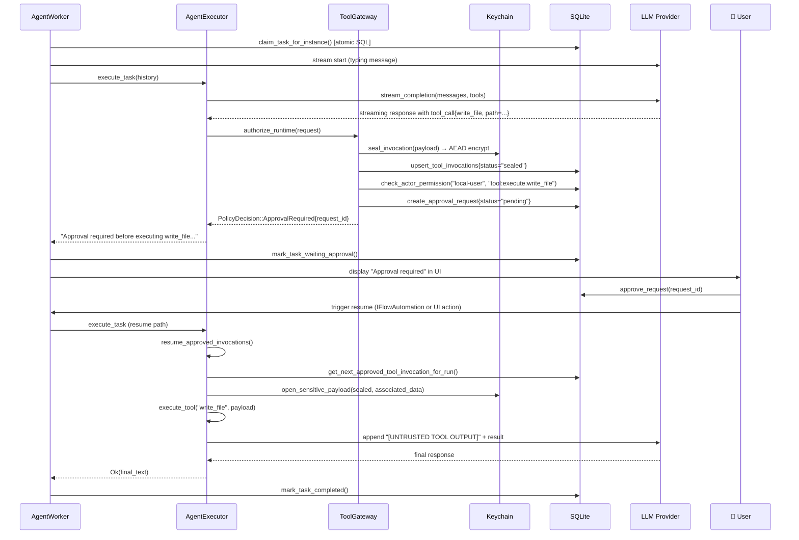

# System Diagrams — AgentForge AI
> **Phiên bản:** 2.1 (Từ mã nguồn thực tế)
> **Cập nhật:** 2026-06-26

---

## 1. Kiến trúc tổng thể (C4 Level 2)



---

## 2. Clean Architecture Layers

```mermaid
graph LR
    subgraph Core["Core Layer (Domain)"]
        Models["Models\nagent.rs\norchestration.rs\nworkflow.rs\n..."]
        Traits["Traits\nDatabasePort\nBaseProviderAdapter"]
    end
    
    subgraph Application["Application Layer (Use Cases)"]
        Orch["orchestration/\nworker.rs\nexecutor.rs\ngovernance.rs\ntool_gateway.rs\nrole_policy.rs"]
        IFlow["iflow_engine/\nengine.rs\nnodes.rs\nautomation.rs"]
        Services["services/\nchat_service.rs\ncapability_router.rs\nfile_intelligence.rs"]
    end
    
    subgraph Infrastructure["Infrastructure Layer (Adapters)"]
        DB["database/\nsqlite_adapter.rs"]
        LLM["llm_providers/\nclaude.rs\ngemini.rs\nopenrouter.rs\ncustom.rs"]
        Bus["message_bus/\nrouting.rs"]
        MCP["mcp/\nregistry.rs\ntools.rs"]
        Security["security/\naudit.rs\nkeychain.rs"]
    end
    
    subgraph UI["UI Layer"]
        Shell["shell/\ntitle_bar\nactivity_bar\nstatus_bar\ndock_layout"]
        Panels["panels/\nsession\nagents\norchestration\nworkflow..."]
    end
    
    UI --> Application
    Application --> Core
    Infrastructure --> Core
    Application -.->|"impl Traits"| Infrastructure
```



---

## 3. Worker Loop State Machine



---

## 4. Tool Authorization Flow



---

## 5. iFlow Workflow Engine State Transitions



---

## 6. iFlow Node Execution Graph

```mermaid
graph LR
    Start([▶ Start]) --> |push next_nodes|NextNodes
    CronTrigger([⏰ CronTrigger\ninterval_ms]) --> |push next_nodes|NextNodes
    
    AgentTask([🤖 AgentTask\nagent_id + instruction\ninput_vars + output_var]) --> |dispatch TeamMessage\niflow_dispatch:exec:node\nstate=Paused| Pending
    Pending -.->|"iflow_result:exec:node\nresolved by automation"| AgentTask2([resolve_agent_task\n→ state=Running\ndata[output_var]=result])
    
    Decision{🔀 Decision\ncondition_var} --> |bool=true|TrueNext
    Decision --> |bool=false|FalseNext
    
    HumanReview([👤 HumanReview\nprompt\nstate=Paused]) --> |approved|ApprovedNext
    HumanReview --> |rejected|RejectedNext
    
    Transform([🔄 Transform\nIdentity/ToString]) --> |output_var set|NextNodes
    Merge([⊕ Merge\njoin barrier]) --> |push next_nodes|NextNodes
    
    Delay([⏳ Delay\nduration_ms]) --> |pending_delays map\nnow_ms + duration|NextNodes
    
    End([⏹ End]) --> |status=Completed|Done([Done])
```

---

## 7. Cross-Team Collaboration Flow



---

## 8. Database Entity Relationship Diagram



---

## 9. Agent Executor Context Flow



---

## 10. Operating Mode Decision Matrix

```mermaid
quadrantChart
    title Tool Execution Policy by Mode
    x-axis Safe → Sensitive
    y-axis Manual → Automatic
    quadrant-1 Auto in Supervision + Autonomous
    quadrant-2 Auto in All Modes
    quadrant-3 Always Approval
    quadrant-4 Auto in Autonomous only
    ReadOnly (workspace): [0.1, 0.9]
    save_to_knowledge: [0.3, 0.7]
    handoff_to_team: [0.3, 0.65]
    create_subtasks: [0.3, 0.7]
    write_file (workspace): [0.6, 0.55]
    edit_file (workspace): [0.6, 0.5]
    run_cli (workspace): [0.75, 0.35]
    MCP tools: [0.85, 0.1]
    write_file (external): [0.8, 0.1]
    run_cli (external): [0.9, 0.05]
```

---

## 11. Sequence: Task Execution với Approval


