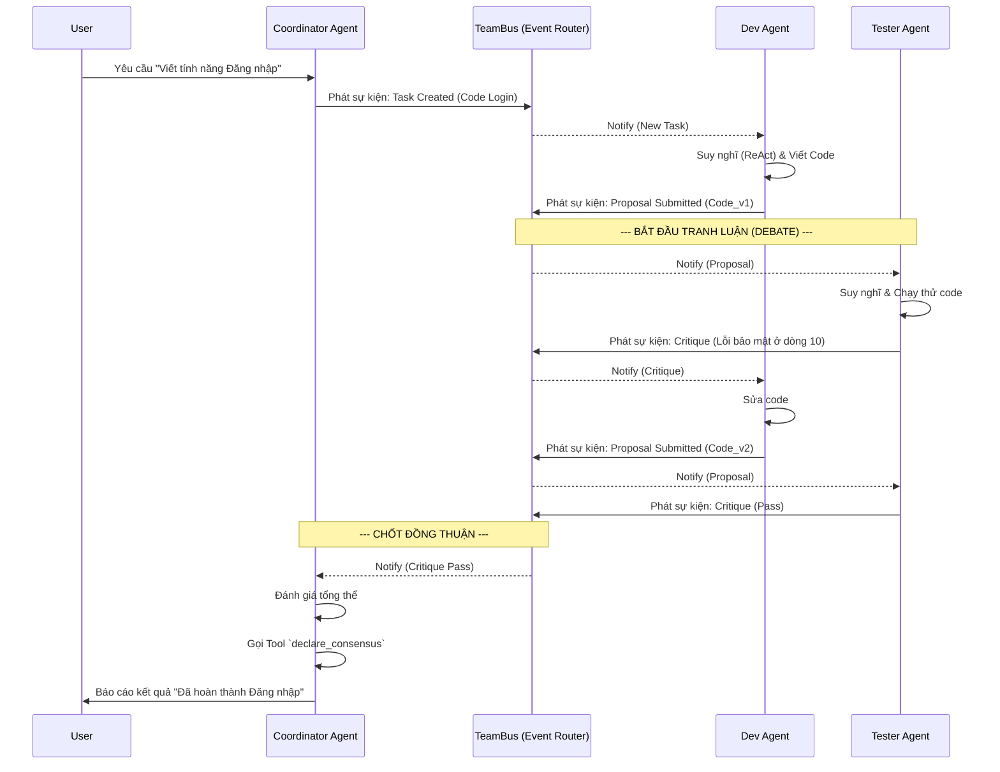
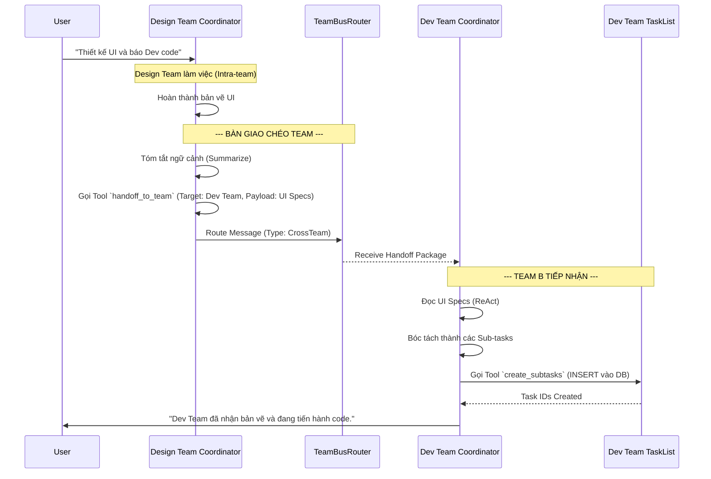

# Đặc Tả Kỹ Thuật (Technical Specification) - AgentForge Core Engine (Cập nhật Chi tiết)

Tài liệu này định nghĩa chi tiết các cấu trúc dữ liệu, luồng xử lý (kèm sơ đồ Mermaid), và logic giao tiếp giữa các Agent và các Team.

---

## 1. Logic Phối hợp và Tranh luận trong 1 Team (Intra-team)

### 1.1 Cơ chế Debate (Tranh luận) và Đồng thuận
Thay vì dùng vòng lặp `for` lặp qua danh sách Agent một cách cứng nhắc, hệ thống áp dụng mô hình **Event-Driven Debate**.
- **Vai trò:** Phải có 1 Agent đóng vai trò `Coordinator` (Người ra quyết định) và các Agent khác là `Contributor/Reviewer`.
- **Logic:** Khi Contributor A đưa ra code, Reviewer B nhận được sự kiện qua `TeamBus`, kiểm tra và phản biện. Coordinator theo dõi cuộc hội thoại. Khi thấy đủ thông tin, Coordinator gọi tool `declare_consensus` để chốt.

### 1.2 Sơ đồ luồng Debate (Intra-team)


---

## 2. Logic Phối hợp chéo giữa các Team (Cross-team)

### 2.1 Cơ chế Bàn giao (Handoff)
Các Team độc lập không chia sẻ chung ngữ cảnh (tránh quá tải token). Để giao tiếp, chúng dùng `Briefing Package` (Gói tóm tắt). Khi Team A (Design) làm xong, Coordinator A gọi tool `handoff_to_team("Team_B", "Briefing_Package")`.

### 2.2 Sơ đồ luồng Phối hợp chéo (Cross-team)


---

## 3. Database Schema Updates (`src/infrastructure/database/sqlite_adapter.rs`)

### 3.1 Bảng `mcp_tools`
Bảng này thay thế cho bộ nhớ RAM hiện tại của `McpToolRegistry`.
```sql
CREATE TABLE IF NOT EXISTS mcp_tools (
    id TEXT PRIMARY KEY,
    name TEXT NOT NULL UNIQUE,
    description TEXT NOT NULL,
    version TEXT NOT NULL,
    command TEXT NOT NULL, 
    args TEXT NOT NULL, 
    input_schema TEXT NOT NULL, 
    is_active BOOLEAN DEFAULT 1,
    created_at DATETIME DEFAULT CURRENT_TIMESTAMP
);
```

### 3.2 Bảng `knowledge_entries` (Long-term Memory)
```sql
CREATE TABLE IF NOT EXISTS knowledge_entries (
    id TEXT PRIMARY KEY,
    agent_id TEXT NOT NULL,
    session_id TEXT,
    title TEXT NOT NULL,
    content TEXT NOT NULL,
    tags TEXT, 
    created_at DATETIME DEFAULT CURRENT_TIMESTAMP,
    FOREIGN KEY(agent_id) REFERENCES agents(id)
);

CREATE VIRTUAL TABLE IF NOT EXISTS knowledge_entries_fts 
USING fts5(title, content, tags, content='knowledge_entries', content_rowid='id');
```

---

## 4. Quản lý Bộ nhớ (Context & Summarization)

### 4.1 Cắt tỉa ngữ cảnh (Sliding Window)
Trong `chat.rs`, thay vì `current_history.clone()`, áp dụng logic:
```rust
fn prune_history(history: &[ChatMessage], max_messages: usize) -> Vec<ChatMessage> {
    let mut pruned = Vec::new();
    // Luôn giữ System Prompt (Index 0)
    if let Some(sys) = history.first().filter(|m| m.role == "system") {
        pruned.push(sys.clone());
    }
    // Lấy K tin nhắn cuối cùng
    let tail_start = history.len().saturating_sub(max_messages);
    let start_idx = std::cmp::max(1, tail_start); // Bỏ qua index 0
    
    pruned.extend_from_slice(&history[start_idx..]);
    pruned
}
```

### 4.2 Tool nội bộ: `save_to_knowledge`
Định nghĩa một tool bắt buộc truyền vào mọi request của Agent:
```json
{
  "name": "save_to_knowledge",
  "description": "Lưu các quyết định quan trọng, bài học hoặc kết quả nghiên cứu vào bộ nhớ dài hạn để dùng cho sau này.",
  "parameters": {
    "type": "object",
    "properties": {
      "title": { "type": "string" },
      "content": { "type": "string" },
      "tags": { "type": "array", "items": { "type": "string" } }
    },
    "required": ["title", "content"]
  }
}
```