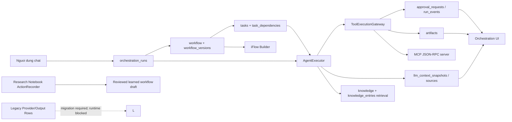
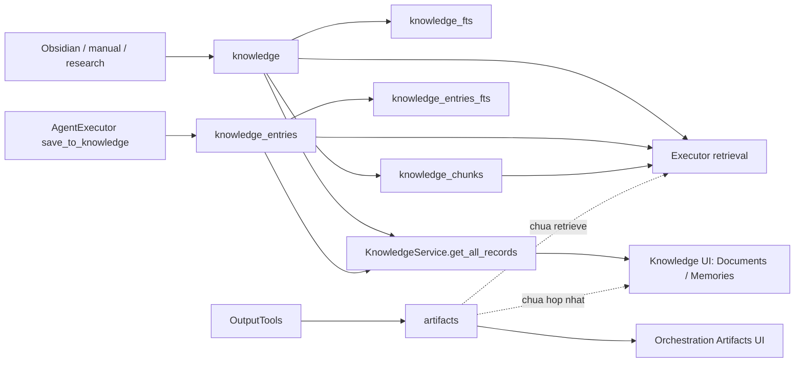

# AgentForge UI - Bao cao danh gia cuoi cung cac van de da neu

**Ngay danh gia:** 2026-05-27  
**Pham vi:** Source hien co trong `agentforge-ui/src`, cac test lien quan, schema SQLite trong `src/infrastructure/database/sqlite_adapter.rs`, va cac bao cao/spec/plan da lap trong chuoi trao doi.  
**Muc dich:** Xac dinh thang than he thong da xu ly duoc gi, con no ky thuat gi, va co the tuyen bo IDE da hoan thien hay chua.  
**Trang thai worktree:** Danh gia dua tren source dang co thay doi chua commit; database runtime dang dirty va khong duoc sua trong dot danh gia nay.

## 1. Ket luan dieu hanh

He thong **da tien rat xa so voi audit ban dau**, vi hien tai co mot execution spine co persistence:

`Chat -> orchestration_run -> iFlow/version -> task/executor -> policy/events/context/artifacts`.

He thong **chua hoan hao va chua production-ready cho autonomous IDE**. Cac blocker source-level lon da duoc trien khai tiep trong cung ngay; release gate con lai la:

| ID | Blocker P0 | Ket luan |
|---|---|---|
| P0-01 | Release verification gate chua dat | AES-GCM invocation replay, iFlow authority va secret scrub migration da co trong source, nhung chua duoc verify tren upgraded DB/restart/e2e fixture. |
| P0-02 | Secret leakage/upgraded-data gate | Migration scrub duoc biet da co; can negative leakage test va backup/rollback verification tren database nang cap. |
| P1-01 | MCP external isolation | Local stdio external fail-closed tru khi operator bat unsafe override; chua co OS/network/resource sandbox. |
| P1-02 | Evolution automation safety | Manual governed lifecycle da co; chua co automated benchmark runner/canary circuit breaker/pullback. |

Ngoai ra con cac gap P1/P2 quan trong: MCP sandbox/catalog install, tokenizer/adversarial context evaluation, RBAC business role admin UX, queue command `/run` tach khoi normal-chat iFlow semantics va mot so module experimental can retire. Delegated authorization, artifact Knowledge projection, direct Research workflow bypass va raw RAG preassembly da duoc dong trong continuation pass.

## 2. Tai lieu va bang chung da doi chieu

### 2.1 Tai lieu nen

| Tai lieu | Vai tro trong lan danh gia nay |
|---|---|
| `report/module_database_logic_audit_2026-05-22.md` | Audit goc: role, knowledge, orchestration mock, MCP denied, iFlow va secret. |
| `report/module_database_logic_audit_2026-05-25.md` | Audit mo rong: inventory `knowledge_*`, database/linkage va UI/business expectation. |
| `report/system_completion_implementation_spec_2026-05-25.md` | Spec Phase 0-6 va status reconciliation ngay 2026-05-27. |
| `report/system_completion_delivery_plan_2026-05-26.md` | Ke hoach delivery va cac work package con lai. |
| `report/system_completion_reassessment_2026-05-26.md` | Reassessment sau cac dot implementation Phase 4-5. |

### 2.2 Vung source duoc doi chieu truc tiep

| Vung | File chinh |
|---|---|
| Schema/database contract | `src/infrastructure/database/sqlite_adapter.rs`, `src/core/traits/database.rs` |
| Run, policy, executor, worker | `src/application/orchestration/executor.rs`, `worker.rs`, `tool_gateway.rs`, `modes.rs` |
| iFlow | `src/application/iflow_engine/engine.rs`, `automation.rs`, `src/ui/panels/iflow_builder.rs` |
| Chat UX va run creation | `src/ui/panels/team_workspace/chat.rs` |
| Knowledge/artifact | `src/application/services/knowledge_service.rs`, `src/ui/panels/knowledge.rs`, `src/application/output_tools.rs` |
| MCP/context/secret | `src/infrastructure/mcp/*`, `src/ui/panels/mcp_marketplace.rs`, `src/infrastructure/security/*` |
| Provider/output credential | `src/ui/panels/custom_provider.rs`, `src/ui/panels/settings.rs`, `src/application/output_tools.rs`, `src/infrastructure/llm_providers/*` |
| Operational UI | `src/ui/panels/orchestration.rs`, `src/ui/panels/monitoring.rs`, `src/ui/panels/monitoring/dashboard.rs` |

## 3. So do logic hien tai sau implementation

### 3.1 Phan lien ket da co that

| Contract | Bang chung source | Danh gia |
|---|---|---|
| Chat tao run co session/mode/actor | `src/ui/panels/team_workspace/chat.rs:2162-2199` tao `OrchestrationRunRecord` va `run_created`. | Da co. |
| Chat tao iFlow toi thieu xem duoc | `chat.rs:1927-2020` tao flow Start -> AgentTask -> End, version va lien ket run; UI co View iFlow. | Da co visualization/plan. |
| Orchestration doc du lieu persist | `src/ui/panels/orchestration.rs:93-112`, `304-319`, `444-454`, `482-686`, `693-865`. | Da thay the phan mock chinh. |
| Mode dung shared runtime state | `orchestration.rs:887-1092` doc `mode_manager`, ghi transition; `tool_gateway.rs:110-195` ap dung matrix mode. | Loi current mode ban dau da duoc dong. |
| iFlow side effect khong chay raw | `src/application/iflow_engine/engine.rs:138`, `485-490` tu choi `SystemCommand`/`HttpRequest`. | Da dong bypass cu. |
| iFlow AgentTask vao executor | `src/application/orchestration/worker.rs:1016-1165`. | Da co run-bound executor slice. |
| Dependencies duoc normalize va enforce | `sqlite_adapter.rs:403-407`, `843-887`, `1719-1795`; `worker.rs:287-299`. | Da co scheduler guard. |
| Artifact co provenance | `sqlite_adapter.rs:409-420`, `3740-3798`; `output_tools.rs:328`; `orchestration.rs:789-865`. | Da co DB va projection. |
| MCP selected tool + skill injection | `executor.rs:561-579`, `752-785`; MCP selection/UI va registry da co. | Da co tren duong executor. |
| Request context snapshot | `executor.rs:151-254`, `598-748`, `800+`; `orchestration.rs:693-787`. | Da co cho request qua executor. |

### 3.2 Phan van khong co mot authority duy nhat

| Van de | Bang chung | Tac dong |
|---|---|---|
| Normal chat va queue command co semantics khac nhau | Normal chat dispatch persisted iFlow; `/run` van xu ly pending queue tasks qua `AgentExecutor`. Nhanh direct chat cu nam duoi `#[cfg(any())]`. | Khong con bypass normal chat; can don source legacy va dinh danh ro queue command trong product. |
| Raw RAG preassembly trong worker va `/run` | Snapshot audit phat hien tai `worker.rs` va `chat.rs`; continuation pass da xoa cac block nay. | Closed: hai luong su dung retrieval/context assembly cua `AgentExecutor`. |
| Research Notebook learned automation | `ActionRecorder::generate_iflow_and_save` tao deterministic reviewed draft, khong goi provider truc tiep. | Closed cho provider bypass; learned flow van chi active qua Phase 8 promotion. |
| `Orchestrator::decompose_goal` legacy | Function hien fail-closed va yeu cau persisted iFlow/`AgentExecutor`. | Closed latent provider bypass. |

## 4. Bang trang thai toan bo cac van de tu hoi thoai

Quy uoc:

- `Closed`: source hien tai da co contract xu ly ro va khong tim thay bypass truc tiep trong cung feature.
- `Substantial`: functionality chinh da co, nhung con gap nghiep vu/security/UX quan trong.
- `Open`: van de cot loi van ton tai.
- `Superseded`: y nghia cu da duoc thay bang contract moi, nhung du lieu/UX legacy van can don dep.

### 4.1 Module linkage, business flow va giao dien

| ID | Van de nguoi dung neu | Trang thai | Ket qua hien tai | No con lai |
|---|---|---|---|---|
| MOD-01 | Cac module khong lien ket thanh flow san pham | Substantial | Co run/event/context/artifact spine va cac panel doc DB. | Chat/iFlow chua cung mot execution authority; monitoring va learned automation chua tron ven. |
| MOD-02 | Chat nen tao iFlow va nguoi dung mo iFlow xem/chay | Substantial | Moi chat turn khong phai `/run` tao initial validated iFlow lien ket run; co nut View iFlow. | Flow chi la minimal Start-AgentTask-End va khong drive toan bo hanh dong chat. |
| MOD-03 | iFlow builder trong/khong co lifecycle | Substantial | Co versions, executions, run loading, execution state va logs that. | Manual execution va chat direct executor van song song; promotion learned workflow con thieu. |
| MOD-04 | Orchestration Dashboard/Tracking/Logs/Governance la mock | Closed cho panel orchestration | Panel doc persisted runs/tasks/events/approvals/context/artifacts. | Monitoring `System Health` rieng van rong/prototype. |
| MOD-05 | Autonomous chuyen roi nhung current mode van Human | Closed | Mode Transition va Governance doc chung `ModeManager`, gateway dung persisted run mode. | Chua the goi autonomous production-safe vi security gate con mo. |
| MOD-06 | Tracking co du lieu mau | Closed cho Orchestration | Tracking doc `list_recent_tasks`, logs doc `run_events`. | Cac mock/prototype o module khac van ton tai. |
| MOD-07 | Skills rong/khong lien ket model request | Substantial | Built-in skill catalog va user selection duoc inject trong executor. | Learned workflow draft chua co promote/activate/rollback governed. |

### 4.2 Database, role va knowledge

| ID | Van de nguoi dung neu | Trang thai | Ket qua hien tai | No con lai |
|---|---|---|---|---|
| DB-01 | Khong ro bang `roles` khai bao/them moi/dung kieu gi | Superseded/Partial | `roles` duoc giu cho business member/routing; runtime tool permission chuyen sang `security_*`. Parser legacy `all` da duoc normalize. | Khong co UX/admin workflow ro cho business role hoac security grants/delegation; hai khai niem van de gay nham. |
| DB-02 | `knowledge_*` chua duoc liet ke day du | Closed ve inventory | Source hien tai duoc liet ke day du tai Muc 5; docs/memories/FTS/chunks/audit/artifact duoc phan biet. | Can cap nhat docs khi schema doi tiep; artifact chua la tab/nguon retrieval trong Knowledge. |
| DB-03 | Knowledge document va memory tach roi, UI khong thay memory | Closed cho docs/memories | `KnowledgeService::get_all_records` hop `knowledge` va `knowledge_entries`; UI co filter Documents/Memories. | Artifact va learned output chua duoc hop nhat vao Knowledge. |
| DB-04 | Duplicate/provenance cua Obsidian knowledge | Substantial | `source_kind`, URI normalized, content hash, origin run/session va `knowledge_migration_audit` da co. | Can regression/runtime data validation tren database that sau migration. |
| DB-05 | Dependency chi nhung trong JSON payload | Closed | `task_dependencies` duoc backfill/sync va claim query enforce. | Test moi chua duoc chay trong pass nay. |
| DB-06 | Artifact/file output khong trace duoc ve run | Closed foundation | `artifacts` co run/session/agent/invocation/hash va UI projection. | Chua promote/retrieve artifact nhu tri thuc. |
| DB-07 | DB path/data runtime khong ro | Khong tai kiem day du trong pass nay | Source van dung `AGENTFORGE_DB_PATH` hoac default relative `agentforge.db` tai `sqlite_adapter.rs:58-60`. | Can buoc workspace/db profile ro va migration backup/verification production. |

### 4.3 Orchestration, governance va autonomy

| ID | Van de | Trang thai | Bang chung | No con lai |
|---|---|---|---|---|
| ORCH-01 | Khong co run spine noi chat, task, mode, log | Closed foundation | `orchestration_runs`, `run_events`, `approval_requests`, `mode_transitions`, workflow versions/executions. | Full authority va release tests van mo. |
| ORCH-02 | Runtime khong branch theo mode | Closed | `ToolExecutionGateway` ap matrix Human/Supervision/Autonomous. | Policy autonomous sensitive co toggle, can threat tests/sandbox. |
| ORCH-03 | Side effect iFlow chay shell/HTTP raw | Closed | Engine reject nodes tai validation va runtime. | Can dam bao khong co utility side-effect moi bypass gateway. |
| ORCH-04 | Approval khong gan dung thao tac can duyet | Closed source-level | `tool_invocations` AES-GCM sealed payload/result, approval link va exact iFlow redispatch/resume. | Can restart/e2e release verification. |
| ORCH-05 | Cross-team khong trace/khong governed | Closed foundation | Case/handoff/readback/delegated grant/competency routing/consensus/escalation da persist va enforce. | Can cross-team e2e va MCP isolation gate. |
| ORCH-06 | Budget/analytics khong dang tin | Substantial | Run token/delegated budgets va Monitoring Dashboard doc persisted run/event/token metrics. | Cost/failover va automated learning telemetry van can mo rong. |

### 4.4 MCP, skill, context va security

| ID | Van de | Trang thai | Ket qua hien tai | No con lai |
|---|---|---|---|---|
| CTX-01 | Selected MCP va skill phai inject vao input LLM | Closed cho active model execution spine | Executor them selected MCP, built-in/promoted skill; Research direct provider va legacy decomposition da dong. | `/run` van la queue UX rieng nhung dung chung executor. |
| CTX-02 | Knowledge/orchestration/context phai inject va audit duoc | Substantial | Executor inject bounded run/case/grant/artifact/lesson/knowledge context; luu snapshot/sources va UI Inspector. | Adversarial/token-accurate evaluation con mo. |
| MCP-01 | MCP marketplace khong dung mo hinh installed/config server | Substantial | Co `mcp_servers`, import config stdio/remote, enable, refresh discovery, selection, secret reference. | Chua co catalog/Add install lifecycle nhu IDE mau. |
| MCP-02 | MCP execution khong dung chung permission | Closed cho duong executor | External invoke di qua gateway; UI khong con direct Run. | External permitted process chua OS sandbox/network/resource isolation. |
| SEC-01 | Keychain la mock | Closed cho new secret-reference paths | `keyring` Windows/macOS duoc dung trong `security/keychain.rs`; MCP/provider/output runtime resolve `secret://`. | Secret legacy va leakage validation van la release concern. |
| SEC-02 | Provider/output credential chua an toan | Implemented, release verification pending | Provider/output reference-only; migration `2026052704` scrub legacy known values va audit count. | Negative leakage va upgraded-data tests van bat buoc. |

## 5. Inventory database hien tai va y nghia nghiep vu

Source schema authority nam trong `src/infrastructure/database/sqlite_adapter.rs:71-542`. Bang duoi day tap trung vao cac aggregate co y nghia lien ket.

### 5.1 Nhom identity, team va security

| Bang | Y nghia dung | Noi doc/ghi chinh | Danh gia |
|---|---|---|---|
| `teams` | Template/nhom nghiep vu | Team workspace/services | Nen tang. |
| `instances` | Mot lan van hanh cua team | Chat/run/worker | Nen tang runtime. |
| `agents` | Agent profile/provider/system prompt | Team/worker | Nen tach ro voi identity bao mat. |
| `members` | Gan agent vao team/instance va optional business role | Team member logic | `role_id` la business membership, khong phai tool authorization hien tai. |
| `roles` | Business/team role legacy (`permissions`, `capabilities`) | `teams/role.rs`, legacy DB API | Khong nen dung lam runtime security policy nua. |
| `security_actors` | Chu the duoc cap quyen | App bootstrap/gateway | Runtime security authority. |
| `security_roles` | Nhom quyen security | Gateway/bootstrap | Runtime security authority. |
| `security_permissions` | Permission code nhu `tool:execute:*` | Gateway | Runtime security authority. |
| `security_actor_roles` | Gan actor voi security role | Bootstrap/DB | Chua co admin/delegation UX. |
| `security_role_permissions` | Gan role voi permission | Bootstrap/DB | Chua co policy editor. |

### 5.2 Tra loi cu the ve `roles`

`roles` khong con la bang quyet dinh autonomous/tool/MCP execution. Source hien tai tach hai nghia:

| Khai niem | Bang/field | Dung cho viec gi | Cach them hien co | Khoang trong |
|---|---|---|---|---|
| Business role cua member | `roles`, `members.role_id` | Nhan dien vai tro trong team/routing | `RoleManager::create_role`, `MemberService::reassign_role` | Khong co UI CRUD ro rang; task routing con co cac field agent/role khac nhau. |
| Security principal/authorization | `security_*`, `orchestration_runs.initiated_by` | Quyet dinh tool co duoc thuc thi hay can approval | Bootstrap local owner bang `ensure_local_security_owner`; gateway check permission | Chua co UI tao role/grant; cross-team delegated grant chua co. |

Ket luan nghiep vu: can dat ten va UI ro rang theo `Team Position` va `Security Access Role`; neu tiep tuc goi chung la `Role`, nguoi dung se van khong biet sua bang nao de tac dong den hanh vi nao.

### 5.3 Nhom execution, workflow, approval va observability

| Bang | Vai tro | Trang thai |
|---|---|---|
| `sessions`, `conversations`, `team_messages` | Chat/session va team bus | Co dung trong UI/runtime; van la nhieu loai message contract. |
| `orchestration_runs` | Aggregate trung tam cua mot muc tieu | Da co va duoc chat/cross-team su dung. |
| `run_events` | Timeline audit/runtime | Da duoc Orchestration Logs doc. |
| `tasks` | Work item giao agent | Da lien ket run va scheduler. |
| `task_dependencies` | Prerequisite normalized | Da enforce claim; khong con chi dua payload JSON. |
| `workflows` | iFlow definition/draft | Da co lien ket run va learned draft. |
| `workflow_versions` | Snapshot definition validated theo run | Da co. |
| `workflow_executions`, `workflow_states` | State khi flow chay | Da co cho iFlow lifecycle, nhung chat action chua phai luc nao cung drive boi no. |
| `approval_requests` | Quy trinh duyet side effect | Da co decision UI; thieu invocation sealed/resume. |
| `mode_transitions` | Lich su chuyen mode | Da noi UI/shared mode. |
| `token_usage` | Token metrics | Duoc dung trong analytics/budget; monitoring tong quat chua day du. |
| `artifacts` | File/output sinh tu run/tool call | Da co projection o Orchestration. |

### 5.4 Toan bo family Knowledge co y nghia application

| Object khai bao trong source | Loai | Noi dung | Ai ghi/doc | Trang thai |
|---|---|---|---|---|
| `knowledge` | Table business | Tai lieu/manual/Obsidian/research document; co source/provenance | Knowledge service, Obsidian, executor retrieval | Active. |
| `knowledge_fts` | Virtual FTS5 | Full-text index cua `knowledge` | SQLite adapter rebuild/upsert/search | Active; virtual table tao shadow object vat ly. |
| `knowledge_chunks` | Table support | Chunks + vector embedding cua document | Obsidian/indexer, semantic retrieval | Active. |
| `knowledge_entries` | Table business | Agent memory/save-to-knowledge; co instance/run | Executor, Knowledge service | Active. |
| `knowledge_entries_fts` | Virtual FTS5 | Full-text index cua agent memory | SQLite adapter/search | Active. |
| `knowledge_migration_audit` | Table audit | Record duplicate source duoc hop nhat khi migrate | Migration | Active cho audit migration. |
| `artifacts` | Table provenance lien quan | Ket qua sinh ra tu runtime, chua phai `knowledge_*` | Output tools, Orchestration UI | Active nhung chua hop vao Knowledge. |

#### 5.4.1 Cac shadow table `knowledge_*` vat ly

SQLite FTS5 tao cac shadow table cho moi virtual table. Trong snapshot database da audit truoc day, family vat ly bao gom:

| Virtual table | Shadow table tu dong |
|---|---|
| `knowledge_fts` | `knowledge_fts_config`, `knowledge_fts_content`, `knowledge_fts_data`, `knowledge_fts_docsize`, `knowledge_fts_idx` |
| `knowledge_entries_fts` | `knowledge_entries_fts_config`, `knowledge_entries_fts_content`, `knowledge_entries_fts_data`, `knowledge_entries_fts_docsize`, `knowledge_entries_fts_idx` |

Cac shadow table nay phai duoc liet ke trong database audit vat ly, nhung khong phai entity nghiep vu va application khong duoc CRUD truc tiep.

#### 5.4.2 Duong su dung Knowledge hien tai

Ket luan: thac mac ban dau ve `knowledge_entries` da duoc giai quyet mot phan lon: memory hien duoc UI hop nhat va executor retrieve. Tuy nhien, khai niem "knowledge cua he thong" van chua hoan chinh vi output artifact va learned workflow khong nam trong mot lifecycle review/promote/retrieve duy nhat.

### 5.5 Nhom MCP va model context

| Bang | Vai tro | Source evidence | Khoang trong |
|---|---|---|---|
| `mcp_servers` | Installed/configured local hoac remote MCP server | Schema `348-363`; UI/import/server runtime | Chua co marketplace catalog/install va sandbox. |
| `mcp_tools` | Tool schema phat hien tu server, co `server_id` migration | Registry/executor | Tool duoc inject khi selected/enabled. |
| `capability_selections` | Lua chon MCP/skill theo default hoac run | Session/MCP UI/executor | Direct LLM paths khong dung. |
| `llm_context_snapshots` | Hash/metadata cua request LLM | Executor va Context Inspector | Khong cover request ngoai executor. |
| `llm_context_sources` | Source provenance/trust cua context | Executor va Context Inspector | Raw RAG preassembly o worker va `/run` da xoa; direct LLM paths ngoai executor van can gom lai. |

## 6. Findings con mo xep theo muc do nghiem trong

## P0-01 - Approval chua la deterministic resume cua tool invocation

**Bang chung:**

- `src/application/orchestration/tool_gateway.rs:133-181` tao/tra ve approval theo `operation_key`.
- `src/ui/panels/orchestration.rs:546-618` resolve request va dua tasks ve state tiep theo.
- Khong co bang/model `tool_invocations` luu tool name + payload sealed + attempt + exact resume target.

**Tai sao chua dat nghiep vu:**

Nguoi dung dang duyet mot hanh dong cu the. Hien tai, sau khi duyet, model/runtime phai lap lai tool call khop operation key. Neu prompt/context thay doi, khong co bang chung hanh dong duoc chay chinh la payload nguoi dung da xem va duyet.

**Can lam:**

1. Them `tool_invocations` va `tool_invocation_decisions`.
2. Luu payload canonical/hash truoc khi yeu cau approval.
3. Approve gan invocation ID, khong chi gan run/operation text.
4. Resume dispatcher tu invocation da sealed, khong hoi LLM tao lai side effect.
5. Test cancel/reject/retry/restart va replay integrity.

## P0-02 - Chat-created iFlow chua dieu khien toan bo execution

**Bang chung:**

- `chat.rs:1927-2020` tao initial flow co mot `AgentTask`.
- `chat.rs:2162-2227` tao run va chon flow.
- Cung turn chat, `chat.rs:2768-3430` tiep tuc goi executor truc tiep theo tung provider.
- iFlow execution co engine rieng tai `iflow_builder.rs` va `iflow_engine/automation.rs`.

**Tac dong:**

Video/UX mong muon cho thay nguoi dung chat, flow duoc tao va flow la noi xem/dieu khien cong viec. Source hien tai moi dat muc "flow document linked to run", khong dat muc "flow is the execution authority".

**Can lam:**

1. Chon mot contract: actionable chat bat buoc compile thanh workflow va scheduler chay workflow, hoac UI phai ghi ro flow chi la plan.
2. Neu chon IDE workflow authority: chat chi tao/activate version, khong direct-execute cung hanh dong.
3. Moi agent/tool/result phai gan `workflow_execution_id` va `node_id`.
4. Approval resume phai resume node dang paused.

## P0-03 - Credential legacy migration van la release blocker

**Bang chung sau continuation implementation:**

- `src/infrastructure/security/keychain.rs` co `is_credential_reference` va `resolve_credential_reference`: `secret://` doc OS keychain, `env:` doc bien moi truong, raw stored value bi tu choi.
- `src/ui/panels/custom_provider.rs` chi cho phep luu reference `secret://`/`env:` vao `Provider.api_key_ref`.
- `src/infrastructure/llm_providers/openrouter.rs`, `gemini.rs`, `claude.rs` da bo nhanh dung raw `Some(v)` va lay credential qua resolver.
- `src/ui/panels/settings.rs` ghi cac reference key moi `output_image_api_key_ref`, `output_pdf_api_key_ref`, `output_video_api_key_ref`.
- `src/application/output_tools.rs` chi dung reference moi hoac fallback environment; gap legacy `output_*_api_key` se fail closed va yeu cau migration.
- `src/infrastructure/database/sqlite_adapter.rs` van giu cot/settings co the chua raw value tu truoc dot sua; pass nay khong sua database runtime dang dirty.

**Ket luan hien tai:**

Duong ghi va su dung credential moi cua MCP/provider/output da co boundary reference-only. Khong the dong blocker release cho den khi raw legacy values da duoc migration/xoa an toan va co test chung minh khong lo ra DB export, log hoac snapshot.

**Can lam:**

1. Migrate/xoa cac raw `provider_configs.api_key_ref` va `app_settings.output_*_api_key` dang ton tai voi backup/rollback.
2. Them Credential Vault UX ro rang cho provider/output de nguoi dung tao `secret://account` ngay trong luong cau hinh.
3. Redact logs, export va snapshot; viet negative leakage tests.

## P0-04 - Chua co regression/release gate day du

**Bang chung:**

- `cargo check --lib` da pass trong dot implementation 2026-05-27, chi con warning dead code cu.
- Test moi da duoc them cho context/mode/dependency/artifact.
- Theo yeu cau nguoi dung, khong chay `cargo test --test integration_tests -- --test-threads=1` trong pass gan nhat.

**Ket luan:**

Bao cao nay khong duoc phep danh dau implementation la release-ready khi chua co ket qua runtime test cho nhung contract moi, dac biet DB migration, atomic claim, artifact provenance, approval va MCP.

## P1-01 - Raw RAG bypass da dong; direct LLM boundary van mo

**Bang chung:**

- Boundary dung: `executor.rs` redact/bound retrieval va danh dau context untrusted; semantic retrieval con lai tai `executor.rs:677`.
- `worker.rs` va `team_workspace/chat.rs` khong con goi `search_similar_chunks`; hai preassembly block duoc xoa trong continuation pass.
- Direct request bypass van ton tai o `src/infrastructure/mcp/action_recorder.rs:76` va latent `src/application/orchestration/core.rs:242,253`.

**Tac dong con lai:**

Hai retrieval bypass da khong con la rui ro tren worker va `/run`. Tuy nhien request tao learned workflow hoac legacy orchestration neu duoc su dung van co the bo qua selection/context snapshot/budget va governance contract cua executor.

**Can lam:**

1. Chuyen moi product `send_message` con lai vao mot request/executor contract co run/context snapshot.
2. Giu moi source retrieval trong boundary co source row, trust level, hash, redaction va budget.
3. Them test cho prompt injection tu documents va tool result.

## P1-02 - Direct LLM call paths nam ngoai capability/context contract

**Bang chung:**

- Reachable: Research Notebook goi `ActionRecorder::generate_iflow_and_save` tai `research_notebook.rs:190`; ham nay goi `llm.send_message` tai `mcp/action_recorder.rs:76`.
- Latent/legacy: `Orchestrator::decompose_goal` tai `orchestration/core.rs:169-266` tu tao adapter va goi `send_message`; khong tim thay caller trong source hien tai.

**Tac dong:**

Request tao learned workflow co the khong inject selected skill/MCP, khong co context snapshot/run/mode, khong bi budget gate, va khong co cung governance contract voi chat.

**Can lam:**

Chuyen moi request LLM co y nghia san pham qua mot `ModelRequestService`/`AgentExecutor` scoped bang run; xoa hoac danh dau experimental cac legacy direct adapters.

## P1-03 - Delegated authorization va budget scope chua co model

**Bang chung:**

- Cross-team runtime tao traceable run trong `worker.rs:537-638`.
- `ToolExecutionGateway` quyet dinh quyen dua tren `run.initiated_by`, hien chu yeu la local owner.

**Tac dong:**

Agent duoc giao viec lien team khong co grant rieng cho capability/workspace/token/cost. Audit biet ai khoi tao run nhung khong chung minh agent duoc uy quyen den muc nao.

**Can lam:**

Them delegated grants/budget scopes gan run, assignee, tool allowlist va expiry; gateway phai intersect owner policy voi delegated scope.

## P1-04 - MCP real runtime da co nhung sandbox/install chua co

**Bang chung:**

- `mcp/server.rs:18-294` implement local stdio va remote JSON-RPC discovery/invocation.
- `mcp/server.rs:148-155` spawn external command bang `tokio::process::Command`.
- UI co config import/Refresh Tools/Store Secret tai `mcp_marketplace.rs`, khong tim thay curated install lifecycle hay process isolation.

**Tac dong:**

Khi nguoi dung cho phep mot MCP server, process do chay voi quyen host hien tai. Approval/gateway khong thay the OS process isolation, network allowlist hay resource limits.

## P1-05 - Knowledge chua bao gom artifact/learned automation trong lifecycle dung

**Bang chung:**

- Knowledge UI chi co `KnowledgeFilter::{All, Documents, Memories}` tai `knowledge.rs:40-43`, `575-583`.
- Artifact chi duoc doc o Orchestration `orchestration.rs:789-865`.
- Executor retrieve `knowledge`, `knowledge_entries`, `knowledge_chunks`, khong retrieve `artifacts`.
- Learned workflow draft co `activation_status = review_required` trong `mcp/action_recorder.rs`, nhung khong co promote/rollback governed.

**Tac dong:**

Ket qua co ich cua run da trace duoc, nhung khong tro thanh tai san tri thuc co review, search, promote va reuse nhat quan.

## P1-06 - Role/RBAC con dung ve ky thuat nhung chua ro ve product

**Bang chung:**

- `roles` van co business columns tai schema `sqlite_adapter.rs:105-112`; `members.role_id` tham chieu bang nay.
- `security_*` la authorization authority va bootstrap local owner tai `sqlite_adapter.rs:3361-3410`.
- Tim kiem UI khong cho thay management surface cho security grants/delegations.

**Tac dong:**

Nguoi dung van kho hieu "them role de lam gi": role team, routing key va security role co y nghia khac nhau nhung chua duoc trinh bay/quan tri tach bach.

## P2-01 - Monitoring `System Health` con la vo rong

**Bang chung:**

- `src/ui/panels/monitoring/dashboard.rs:12-34` khoi tao toan bo metrics/activities/agents/analytics/chart thanh `Vec::new()` va comment noi la mock data/demo.
- `MonitoringPanel` render dashboard nay tai `monitoring.rs:31-37`, `143-146`.
- `UsageAnalytics` da duoc chinh de doc persisted values, nhung khong thay the `System Health`.

**Tac dong:**

Nguoi dung van co the mo mot tab operational khong phan anh thuc te, gay cam giac module roi rac du audit goc da duoc sua phan Orchestration.

## P2-02 - Cac prototype/legacy implementation van can retire hoac danh nhan

| Source | Van de |
|---|---|
| `src/application/knowledge/search.rs:52-54` | Mock embedding vector. |
| `src/infrastructure/message_bus/security.rs:15-30` | "Encryption" mock bang dao chuoi. |
| `src/infrastructure/llm_providers/plugin.rs:17-24` | Mock plugin loading. |
| `src/infrastructure/performance/crash.rs:45` | Placeholder backtrace. |
| `src/application/orchestration/core.rs:169-266` | Legacy direct LLM orchestration path. |

Cac module nay khong nhat thiet dang nam tren luong UI chinh, nhung neu van duoc build/advertise nhu kha nang san pham thi chung la no ky thuat va rui ro ky vong.

## 7. Danh gia theo Phase trong spec/plan

| Phase | Muc tieu trong spec | Trang thai cuoi cung | Ly do chua danh dau complete |
|---|---|---|---|
| Phase 0 - Integrity/truthful UI | Sua mock visible, role/mode inconsistency, knowledge visibility | Substantial/gan dong | Orchestration va Knowledge da that hon; Monitoring System Health va role UX van thieu. |
| Phase 1 - Execution spine | Run/event/approval/mode persistence | Implemented foundation | Approval exact continuation chua co. |
| Phase 2 - iFlow lifecycle | Chat tao/open/execute/resume flow | Partial/Substantial | Chat co linked flow va engine lifecycle, nhung flow khong phai authority duy nhat cua chat execution. |
| Phase 3 - Knowledge/learned automation | Provenance, reuse, learned lifecycle | Partial/Substantial | Docs/memory/artifact provenance co; artifact integration va learned promotion con mo. |
| Phase 4 - Governed autonomy | Policy/RBAC/secrets/approval o moi side effect | Partial - release blocked | Gateway/mode/iFlow boundary va new credential reference-only path co; legacy migration, deterministic resume, delegation va sandbox con mo. |
| Phase 5 - Context assembly/MCP config | Selected injection, context provenance, MCP server lifecycle | Partial/Substantial | Executor path tot hon va raw worker/chat RAG bypass da dong; direct LLM bypass, catalog/install va isolation con mo. |
| Phase 6 - Production completion gates | Loai bo bypass/placeholder va pass release matrix | Not completed | Nhieu P0/P1 va test gate chua dong. |

### 7.1 Phase 5 co hoan thien chua?

Khong. Phase 5 co nen tang chinh:

- persisted MCP servers/tools/selections;
- selected MCP/skills injection tren `AgentExecutor`;
- run/knowledge context va request snapshot;
- Context Inspector;
- real JSON-RPC MCP discovery/call;
- new MCP secret references qua keychain.

Nhung chua the danh dau complete vi:

- Research Notebook van goi LLM ngoai executor;
- MCP chua co install catalog va isolation;
- credential legacy trong DB neu co chua duoc migrate/xoa co kiem soat.

## 8. Backlog bat buoc de dat muc "IDE hoan thien"

### 8.1 Thu tu trien khai de nghi

| Order | Cong viec | Priority | Acceptance gate |
|---:|---|---:|---|
| 1 | Hoan tat migration/xoa raw provider/output credential legacy | P0 | Runtime reference-only da co; old data khong con trong SQLite/settings/log va leakage test pass. |
| 2 | Durable `tool_invocations` va exact approval resume | P0 | Approve/restart chi chay payload da sealed; audit chung minh dung invocation. |
| 3 | Chat/iFlow execution authority duy nhat | P0 | Moi actionable chat run co node execution/result/tool event lien ket; UI flow phan anh dung thuc thi. |
| 4 | Gom toan bo LLM/context path vao request service duy nhat | P1 | Khong con `send_message` product path ngoai contract; khong con raw RAG assembly. |
| 5 | Delegated security grants va budgets | P1 | Cross-team agent chi thuc thi trong grant va ngan sach duoc persist. |
| 6 | MCP catalog/install + process/network sandbox | P1 | Install/discover/invoke co isolation, allowlist, timeout/resource va live conformance tests. |
| 7 | Knowledge asset lifecycle | P1/P2 | Artifacts searchable/promotable; learned workflow activate/rollback co approval va audit. |
| 8 | Monitoring va prototype retirement | P2 | System Health doc persisted telemetry; mock modules bi xoa/an/gan experimental. |
| 9 | Full migration/e2e/security regression gate | P0 release gate | Full suite pass tren DB moi va upgraded DB; khong con blocker finding. |

### 8.2 Definition of done toi thieu cho production

He thong chi nen duoc danh dau production-ready khi tat ca dieu kien sau dung:

1. Moi model request co tinh nang san pham deu co run/session/context snapshot va selection policy, hoac duoc khai bao ro la nongoverned preview.
2. Moi mutation/tool/MCP/output deu di qua gateway va durable invocation/approval contract.
3. Khong credential thuc nao duoc persist plain text trong database hoac app settings.
4. UI iFlow, Orchestration, Knowledge va Monitoring cung mo ta mot execution truth, khong con state demo voi ten tinh nang production.
5. Autonomous mode co delegated scope, MCP isolation, workspace boundary va budget/security tests.
6. Migration, unit, integration, e2e va negative security tests pass tren release candidate.

## 9. Verification record cua lan danh gia nay

| Kiem tra | Ket qua |
|---|---|
| Doi chieu audit/spec/plan voi source | Da thuc hien cho tat ca nhom van de trong hoi thoai: module linkage, database/knowledge/role, orchestration/mode/mock, iFlow, MCP/skills/context, security va observability. |
| Tim tat ca direct provider/request context path lien quan | `ActionRecorder` tao reviewed draft khong dung provider; `Orchestrator::decompose_goal` fail-closed; raw RAG preassembly da xoa khoi worker/chat. |
| Doi chieu schema family `knowledge_*` | Da liet ke business tables, virtual FTS va shadow-object semantics; them `knowledge_migration_audit` va quan he artifact. |
| Doi chieu credential path | New provider/output execution da doi sang reference-only/fail-closed; cot/settings legacy va migration/leakage gate van con. |
| `cargo check --lib` | Da pass trong implementation pass ngay 2026-05-27; khong chay lai vi report nay chi la audit bo sung. |
| `cargo test --test integration_tests -- --test-threads=1` | Khong chay theo yeu cau ro rang cua nguoi dung. Khong co pass claim cho test moi. |

## 10. Verdict cuoi cung

Du an hien tai khong con la mot tap hop panel mock roi rac nhu thoi diem audit 2026-05-22: run spine, mode, task dependency, context provenance, MCP selected injection/runtime va artifact traceability da tao duoc nen tang lien ket that.

Tuy nhien, cau tra loi chinh xac cho cau hoi "con no ky thuat hay muc nao chua xu ly khong" la: **con, va con cac muc anh huong truc tiep toi tinh dung dan nghiep vu va an toan production**.

Ban chat cua phan viec con lai khong phai them man hinh. Can dong cac contract authority va security:

- flow nao thuc su dieu khien hanh dong;
- payload nao da duoc phep va replay;
- request nao nhan context/capability gi;
- agent nao duoc uy quyen den dau;
- process MCP nao duoc phep lam gi tren may nguoi dung;
- credential co con nam trong SQLite hay khong.

Cho toi khi cac P0/P1 tren duoc xu ly va release gate pass, he thong nen duoc danh gia la **functional foundation with major production blockers**, khong phai **IDE autonomous hoan thien**.

## 11. Continuation implementation va Phase 7/8 - 2026-05-27

Muc nay supersede cac nhan dinh snapshot cu ve raw RAG va provider/output credential path trong report tren.

### 11.1 Debt da dong hoac thu hep trong source

| Item | Source change | Trang thai sau sua |
|---|---|---|
| Provider credential boundary | `src/infrastructure/security/keychain.rs`, `src/infrastructure/llm_providers/{claude,gemini,openrouter}.rs`, `src/ui/panels/custom_provider.rs` | Cau hinh moi chi luu `secret://`/`env:`; adapter tu choi raw stored secret. |
| Output credential boundary | `src/application/output_tools.rs`, `src/ui/panels/settings.rs` | Settings moi dung `output_*_api_key_ref`; raw legacy setting bi chan tai runtime. |
| Shared OS secret resolver | `src/infrastructure/security/keychain.rs`, `src/infrastructure/mcp/server.rs` | MCP/provider/output dung cung OS credential service cho reference. |
| Raw RAG outside executor | `src/application/orchestration/worker.rs`, `src/ui/panels/team_workspace/chat.rs` | Hai block retrieval tu ghep prompt da xoa; context retrieval di qua executor. |

### 11.2 Debt van mo va khong duoc tuyen bo complete

| Priority | Item con mo | Gate can dat |
|---:|---|---|
| P0 | Release verification va upgraded-data leakage gate | Chay migration/restart/e2e/security fixture; migration/seal da implemented nhung chua co pass evidence. |
| P1 | Delegated grants va MCP sandbox | Delegated grant da co logical enforcement theo run/tool/token; external MCP server van can OS/network/resource isolation. |
| P1 | Automatic governed evolution operations | Manual lifecycle va active version materialization da co; automated canary routing/observations/circuit breaker van con mo. |
| P1 | Context security maturity | Snapshots/redaction/budget da co; can tokenizer/adversarial gate. |
| P0 | Release verification | Full migration/security/e2e/test matrix chua pass. |

### 11.3 Spec tiep theo

Phase 7 va Phase 8 duoc dac ta tai `report/phase_7_8_humanlike_collaboration_governed_learning_spec_2026-05-27.md`. Tai lieu nay quy dinh state machine, bang du lieu, application service, UI projection, security invariant va acceptance tests de tien toi tam nhin agent phoi hop nhu con nguoi va tu cai thien co quan tri.

### 11.5 Phase 7/8 implementation foundation

| Phase | Da noi vao source | Chua duoc xem la release complete vi |
|---|---|---|
| Phase 7 | Case/handoff/readback/grant/routing/decision/deliverable/review/consensus/escalation, operator resolution va sealed-approval continuation da noi source. | MCP isolation va e2e/restart verification con mo. |
| Phase 8 | Evidence admission, validated lesson, candidate, benchmark/canary, human promotion/rollback va active version materialization da noi source/UI. | Automated benchmark/canary circuit breaker va release tests con mo. |

### 11.4 Verification cua continuation pass

| Check | Result |
|---|---|
| `cargo check --lib` | Pass ngay 2026-05-27; chi con warning dead-code co san trong `src/ui/text`. |
| Unit test moi cho credential reference validator | Test da in `1 passed; 0 failed`; command process khong thoat truoc timeout sau khi in ket qua, nen khong dung lam full-test gate. |
| Unit test Phase 7 state-machine | Test da in `1 passed; 0 failed`; command tiep tuc bi treo sau khi in ket qua, nen Phase 8 unit test khong duoc lap lai trong pass nay. |
| `cargo test --test integration_tests -- --test-threads=1` | Khong chay theo yeu cau cua nguoi dung. |

## 12. Final reconciliation sau continuation implementation - 2026-05-27

Muc nay supersede cac ket luan P0/P1 snapshot tai muc 1, 4, 6, 8 va 11 neu co mau thuan voi source sau dot trien khai tiep theo.

### 12.1 Nhung van de da dong o source boundary

| Van de da neu | Trang thai cap nhat | Noi dung da thuc hien |
|---|---|---|
| Approval khong replay dung tool payload | Closed source-level | `tool_invocations` co hash, AES-256-GCM sealed payload/result va approval link; executor mo dung payload da approve va iFlow redispatch pending node. |
| Chat chi tao flow de xem nhung execute ngoai flow | Closed cho normal chat | Chat khong phai `/run` tao persisted workflow/version va dispatch engine; node AgentTask qua executor; direct response branch cu bi compile-disable. |
| Cross-team message khong co case authority | Closed source-level | Chat va tool handoff persist case/package truoc khi route; worker enforce readback-only grant va expanded mandate sau khi duoc chap nhan. |
| Consensus/escalation thieu operational resolution | Closed foundation | Vote/resolve consensus va resolve escalation da co persistence/service/UI; human authority duoc kiem tra. |
| Promotion chi ghi state ma khong activate/rollback version | Closed foundation | Skill version active va workflow promoted version duoc materialize; rollback khoi phuc baseline/review-required. |
| Phase 8 khong co human operation path | Closed foundation | Learning UI ho tro feedback validation, candidate creation, benchmark evidence, canary result, promote va rollback; service enforce governor permission. |
| Legacy credential chua co migration | Implemented, can verify release | Migration startup scrub settings/provider/MCP raw references da biet va audit count; runtime van reference-only/fail-closed. |
| Knowledge khong thay artifact | Closed projection | Knowledge service/panel hop artifacts vao record view; executor inject bounded artifact metadata cho run. |

### 12.2 Contract da siết them trong pass cuoi

| Contract | Ket qua |
|---|---|
| Learning evidence | Evaluation chi ghi cho run terminal co evidence; agent khong duoc self-evaluate run dang chay; feedback tham chieu run/case hop le va luon quarantine truoc human validation. |
| Handoff do user chon team | Neu khong persist duoc governed case/package thi khong route message legacy; ghi `governed_handoff_persist_failed`. |
| Invocation confidentiality | Payload va successful result duoc seal bang AES-GCM; key nam trong OS credential store tren Windows/macOS hoac cau hinh base64 32-byte qua `AGENTFORGE_INVOCATION_SEAL_KEY`. |

### 12.3 No con lai va verdict chinh xac

| Priority | Con lai | Danh gia |
|---:|---|---|
| P0 release gate | Chua chay fixture upgraded DB, restart/resume approval, negative secret leakage va full e2e matrix; integration test da duoc loai tru theo yeu cau nguoi dung. | Khong du co so de tuyen bo production-ready. |
| P1 MCP isolation | MCP stdio external mac dinh bi chan neu khong co explicit unsafe override; chua co sandbox OS/network/resource hoac catalog install da xac minh. | Autonomous voi MCP external chua dat muc an toan production. |
| P1 governed evolution automation | Manual governed lifecycle da day du; chua co benchmark runner, canary eligible-routing/observation va automatic circuit breaker/pullback. | He thong co the cai thien co quan tri, chua "tu tien hoa" tu dong an toan. |
| P1 context maturity | Context/source snapshots, redaction va char limit da co; chua tokenizer-aware/adversarial security gate. | Can danh gia truoc rollout autonomous quy mo lon. |
| P2 cleanup | `/run` la queue command tach biet qua executor; legacy direct-chat source compile-disabled va mot so module experimental chua duoc retire. | Khong tao bypass cho normal chat, nhung tang chi phi bao tri. |

**Verdict:** Source hien tai da co contract nhat quan cho normal Chat -> iFlow -> executor -> approval/context/artifact, collaboration human-like co governance, va vong learning co human-controlled promotion/rollback. No van **chua du de tuyen bo mot IDE autonomous production-grade hoac tu tien hoa tu dong an toan**, vi release verification, MCP isolation va automation safety gates con mo.
