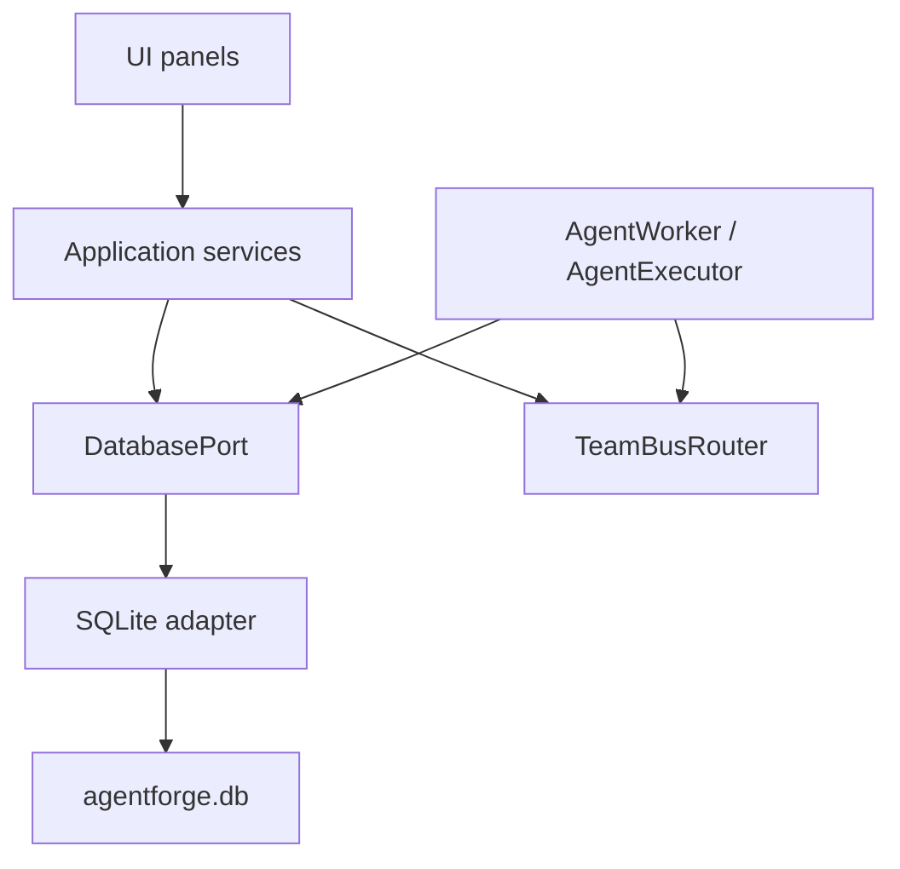
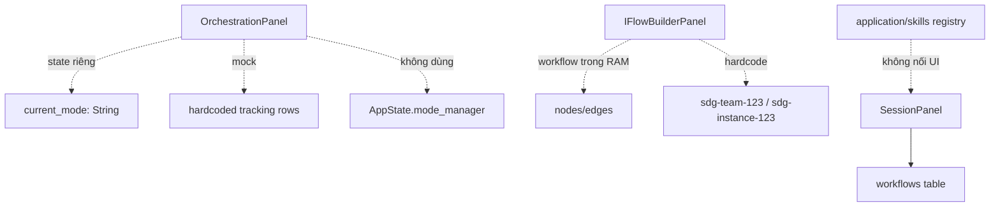
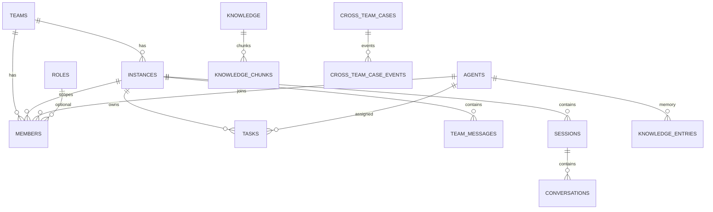
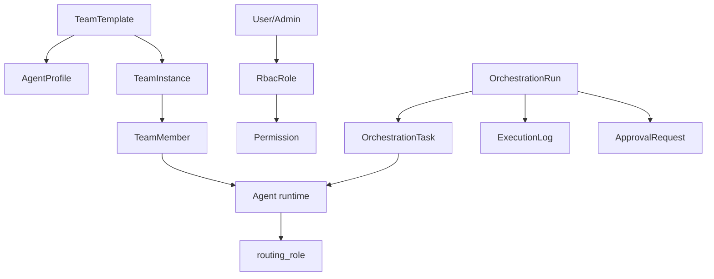

# Báo cáo rà soát liên kết module, logic nghiệp vụ và database

Ngày rà soát: 2026-05-22  
Phạm vi: `agentforge-ui` trong workspace `E:\KT_KT\AgentForceAi`  
Kết quả ngắn: hệ thống đã có nền tảng thật cho team, agent, task, chat, provider, knowledge và workflow, nhưng nhiều module UI đang chạy bằng state riêng hoặc dữ liệu tĩnh. Database có schema rộng nhưng chưa có contract nghiệp vụ rõ giữa các bảng. Các vấn đề người dùng thấy trong ảnh là có cơ sở trong mã nguồn, không chỉ là lỗi giao diện.

## 1. Phạm vi kiểm tra

Tôi đã rà soát toàn bộ cây mã Rust hiện tại:

- Tổng số file Rust trong `src`: 196 file, khoảng 39.843 dòng.
- Các vùng được đọc kỹ và trace luồng: `lib.rs`, `main.rs`, `core/models`, `core/traits/database.rs`, `infrastructure/database/sqlite_adapter.rs`, `application/orchestration`, `application/iflow_engine`, `application/services`, `application/teams`, `application/skills`, `application/research`, `infrastructure/mcp`, `infrastructure/fs`, `infrastructure/security`, các panel UI trong `ui/panels`.
- Database được kiểm tra trực tiếp bằng SQLite qua file `agentforge-ui/agentforge.db` và đối chiếu với file phụ `agentforge-ui/src/agentforge.db`.

Các ảnh giao diện người dùng cung cấp khớp với các đoạn mã đang có: orchestration dashboard/tracking/log/governance còn tĩnh, mode transition có state riêng, skill view phụ thuộc bảng `workflows`, MCP bị denied do sai định dạng permission, knowledge panel chỉ đọc một phần của hệ tri thức.

## 2. Tổng quan kiến trúc hiện tại

Luồng khởi tạo chính nằm ở:

- `src/lib.rs`: tạo `Database`, `TeamBusRouter`, `ModeManager`, `ChatService`, `TeamService`, `KnowledgeService`, seed data, register MCP tools, start worker loop.
- `src/main.rs`: gọi init GPUI, sau đó khởi tạo `RoleManager` và `load_roles()`.
- `src/infrastructure/database/sqlite_adapter.rs`: vừa tạo schema, vừa migration thủ công, vừa seed dữ liệu, vừa implement toàn bộ `DatabasePort`.
- `src/core/traits/database.rs`: interface database rất lớn, trộn provider, team, instance, task, message, session, knowledge, workflow, role, MCP, token usage, audit và cross-team.

Về mặt layering, kiến trúc đang có ý định tốt:



Nhưng thực tế một số panel đi tắt hoặc giữ state riêng:



## 3. Hiện trạng database

Database chính: `agentforge-ui/agentforge.db`

Số lượng bản ghi tại thời điểm kiểm tra:

| Bảng | Số bản ghi | Nhận xét |
|---|---:|---|
| `provider_configs` | 2 | Có provider thực; cột `api_key_ref` đang chứa raw-looking secret, không phải reference an toàn. |
| `teams` | 3 | Team template và team thực dùng chung bảng. |
| `instances` | 4 | Instance là runtime của team, ví dụ `backend`, `test`, `Untitled`. |
| `agents` | 99 | Có nhiều agent, routing role nằm trong `agents.config`. |
| `members` | 6 | Phần lớn membership không gắn `instance_id` và không gắn `role_id`. |
| `tasks` | 8 | Task có `assignee_id` là agent id, payload đôi khi chứa role theo DAG. |
| `team_messages` | 17 | Message runtime theo instance. |
| `conversations` | 12 | Chat history theo session. |
| `sessions` | 5 | Session có `team_instance_id`. |
| `knowledge` | 17 | Obsidian/research documents. |
| `knowledge_chunks` | 27 | Chunk vector lưu embedding dạng JSON text. |
| `knowledge_entries` | 0 | Long-term memory của agent chưa có dữ liệu. |
| `workflows` | 0 | Là lý do Skills/iFlow saved workflows trống. |
| `workflow_states` | 0 | Không có execution state persisted. |
| `roles` | 1 | Chỉ có admin role seed. |
| `mcp_tools` | 5 | 5 tool team MCP tĩnh. |
| `token_usage` | 34 | Có tracking token thật. |
| `audit_log` | 4 | Có audit nhưng governance UI chưa đọc. |
| `cross_team_cases` | 1 | Cross-team case đã được persist. |
| `cross_team_case_events` | 10 | Cross-team events đã được persist. |

Ngoài ra có database phụ `agentforge-ui/src/agentforge.db` với dữ liệu khác: 3 teams, 3 instances, 4 agents, 1 provider, 1 role, không có MCP tools, không có workflows. Đây là một nguồn nhầm lẫn nghiêm trọng vì code dùng `Database::new()` với path mặc định tương đối `"agentforge.db"`. Khi chạy từ working directory khác, app có thể mở DB khác nhau.

## 4. Sơ đồ schema nghiệp vụ chính



Điểm yếu của schema không nằm ở việc thiếu bảng, mà nằm ở định nghĩa nghiệp vụ chưa rõ:

- `teams` vừa là template, vừa là team.
- `instances` là runtime nhưng `members` thường không gắn `instance_id`, nên instance fallback về member của team.
- `roles` là RBAC role, nhưng agent business role/routing role lại nằm trong JSON `agents.config.role`.
- `tasks.assignee_id` là agent id, nhưng `DagTask.assignee_id` trong orchestration prompt được mô tả như role.
- `knowledge` và `knowledge_entries` là hai kho tri thức độc lập, UI chỉ hiển thị một kho.
- `workflows` dùng cho iFlow, learned skills và action recorder, nhưng không có contract định nghĩa thống nhất.

## 5. Vấn đề lớn nhất theo mức độ ưu tiên

### P0 - Role/RBAC đang sai contract, gây MCP denied

Hiện có 3 khái niệm role khác nhau:

1. DB table `roles`: dùng cho quyền/RBAC, cột `permissions`, `capabilities`.
2. `agents.config.role`: dùng làm business routing role, ví dụ `DEV`, `Coordinator`, `Product Owner`.
3. `infrastructure/security/rbac.rs`: enum `Role::Admin/User/Guest` độc lập, gần như không nối với DB role.

MCP Marketplace dùng role id hardcode:

- `src/ui/panels/mcp_marketplace.rs`: `role_id()` trả về `"admin-role-123"`.
- `check_allowed()` gọi `db.check_role_permission("admin-role-123", "mcp:execute:<tool>")`.

Database hiện tại có:

```text
roles.id = admin-role-123
permissions = all
capabilities = all
```

Trong khi `check_role_permission()` ở `sqlite_adapter.rs` parse `permissions` bằng:

```rust
serde_json::from_str::<Vec<String>>(&permissions).unwrap_or_default()
```

Nghĩa là `"all"` không phải JSON array nên parse fail thành `[]`, kết quả tất cả MCP tools bị denied. `lib.rs` seed đúng dạng `["all"]`, nhưng `RoleManager::load_roles()` lại seed `"all"` và `INSERT OR IGNORE` không sửa dữ liệu cũ. Đây chính là nguyên nhân ảnh MCP hiện `permission = denied`.

Không có UI để tạo/list/update/delete role. Nếu muốn “khai báo thêm role” ở trạng thái hiện tại, chỉ có thể gọi code `RoleManager.create_role()` hoặc `db.create_role()` với `permissions` là chuỗi JSON array, ví dụ `["mcp:execute:team_get_tasks"]` hoặc `["all"]`. Tuy nhiên role này không quyết định việc agent nhận task; agent nhận task bằng `agents.config.role` và membership.

Kết luận: cần tách tên rõ `RbacRole` và `AgentRoutingRole`. Nếu giữ bảng `roles`, `permissions`/`capabilities` phải là JSON array hoặc tách thành bảng quan hệ `role_permissions`.

### P0 - Orchestration Panel không nối với orchestration runtime

Panel `src/ui/panels/orchestration.rs` có state riêng:

```rust
current_mode: String
```

`new()` set mặc định `"Human Interaction"`. Khi bấm Autonomous, dialog chỉ gán:

```rust
this.current_mode = target_mode_save3.clone();
```

Nó không gọi `AppState.mode_manager.transition_to()`, không persist DB, không ảnh hưởng worker/chat/task execution. Vì vậy có thể xảy ra tình trạng title bar hoặc runtime đang ở mode khác, nhưng Orchestration tab vẫn hiện `Current Mode: Human Interaction`.

Trong khi đó global mode thật nằm ở:

- `src/application/orchestration/modes.rs`: `OperatingMode::{HumanInteraction, Supervision, Autonomous}`.
- `src/lib.rs`: `AppState.mode_manager`.
- `src/ui/shell/title_bar.rs`: title bar select có gọi `ModeManager.transition_to()`.
- `src/ui/panels/team_workspace/chat.rs`: đọc global mode, nhưng xử lý sau đó gần như không branch theo mode.

Dashboard/tracking/logs/governance trong `OrchestrationPanel` cũng là static/mock:

- Dashboard cards hardcode `0`, `0%`, `0`, `0`.
- Tracking hardcode 3 task mẫu: Requirements Analysis, UI Design & Mockup, Backend API Setup.
- Logs render empty area với nút Export/Clear.
- Governance render trống.
- Safety Constraints hardcode `500ms`, `$10.00 / hour`, `Enabled`.

Kết luận: Orchestration UI hiện là prototype, chưa phải view của `Orchestrator`, `WorkerManager`, `GovernanceManager`, `tasks`, `token_usage`, `audit_log`.

### P0 - Knowledge bị tách thành nhiều hệ, UI chỉ thấy một phần

Có 4 lớp knowledge:

| Lớp | Bảng/module | Dùng để làm gì | UI/RAG hiện tại |
|---|---|---|---|
| Document knowledge | `knowledge` | Obsidian/research notes | Knowledge panel đọc bảng này. |
| Full-text docs | `knowledge_fts` | FTS cho docs | `AgentExecutor` dùng trong RAG. |
| Vector chunks | `knowledge_chunks` | Semantic retrieval | `AgentExecutor` scan toàn bảng và cosine trong Rust. |
| Agent memory | `knowledge_entries`, `knowledge_entries_fts` | `save_to_knowledge`, session summary | RAG đọc trước, nhưng Knowledge panel không hiển thị. |

`KnowledgePanel` chỉ dùng `KnowledgeService.get_all_knowledge_items()` từ bảng `knowledge`. Vì vậy người dùng không thấy agent memory trong `knowledge_entries`. Trong DB hiện tại `knowledge_entries = 0`, nên tính năng “agent nhớ dài hạn” chưa có dữ liệu.

`save_to_knowledge` trong `AgentExecutor` ghi vào `knowledge_entries`, không ghi vào `knowledge`. `ResearchNotebookPanel` và Obsidian sync ghi vào `knowledge`. Hai luồng này độc lập.

`auto_summarize_session()` tạo `KnowledgeEntry` nhưng gán `session_id = Some(self.team_instance_id.clone())`, tức dùng instance id làm session id. Điều này sai semantic vì `knowledge_entries.session_id` nên trỏ đến `sessions.id`.

`get_all_knowledge_items()` dùng `GROUP BY title ORDER BY updated_at DESC`, đây là truy vấn không deterministic trong SQLite nếu có nhiều row cùng title. Watcher Obsidian cũng có đường update dễ tạo duplicate vì scan ban đầu preserve id theo `vault_path`, nhưng event update tạo `KnowledgeItem` mới.

Kết luận: cần unify knowledge model hoặc ít nhất UI phải hiển thị rõ `Documents` và `Agent Memories`. Cần sửa semantic `session_id`.

### P1 - iFlow Builder và iFlow Engine chưa nối end-to-end

`src/ui/panels/iflow_builder.rs` tạo workflow trong RAM với `nodes = {}` nên dashboard hiện `Nodes: 0, Connections: 0`. Palette thêm node được, Save Workflow lưu vào `workflows`, nhưng:

- `serialize_to_workflow()` hardcode `team_id = "sdg-team-123"` và `instance_id = "sdg-instance-123"`.
- Run Serial/Parallel tạo `WorkflowEngine::new()` không có execution context, nên `AgentTask` không dispatch tới worker; engine chỉ chuyển node tiếp theo.
- Execution Logs luôn có dòng tĩnh “Initialize Environment...”, “Ready for execution...”, “Waiting for AI response...”.
- `workflows` hiện có 0 bản ghi nên Saved Workflows trống.

`IFlowAutomation::start()` có context thật, nhưng chọn instance bằng `list_instances().pop()` hoặc fallback `"sdg-instance-123"`, không theo workflow. Nó chỉ chạy workflow có `CronTrigger`. UI run và automation run là hai đường khác nhau.

`WorkflowEngine` có khả năng dispatch `AgentTask` qua TeamBus nếu có `ExecutionContext`, rồi chờ `iflow_result:<execution_id>:<node_id>`. Worker cũng có `execute_iflow_task()`, nhưng hiện path này chưa được UI wired đúng.

Kết luận: iFlow có lõi engine nhưng panel đang demo. Cần truyền selected instance/team vào panel, tạo `ExecutionContext`, persist `workflow_states`, và render logs từ execution state thật.

### P1 - Seed/migration database chưa an toàn

Schema được tạo trong `Database::new()` bằng nhiều `CREATE TABLE IF NOT EXISTS`, sau đó migration bằng `ALTER TABLE ... .ok()`. Không có `schema_migrations` version table. Điều này gây các lỗi khó truy vết:

- DB cũ có `roles.permissions = "all"` không được migrate thành `["all"]`.
- `seed_sdg_team()` có phần insert team SDG bị comment. Nếu DB mới chưa có `sdg-team-123`, hàm vẫn insert agents/members/role trỏ về team này, dễ vướng foreign key hoặc tạo trạng thái thiếu team.
- Có 2 file DB trong repo: `agentforge.db` và `src/agentforge.db`. App dùng path tương đối nên working directory quyết định DB nào được mở.
- `src/agentforge.db` có dữ liệu khác và không có MCP tools, dễ làm người dùng thấy UI khác nhau giữa các cách chạy.

Kết luận: cần một DB path duy nhất, migration versioned, seed idempotent thực sự, và dọn DB phụ khỏi source tree hoặc đổi sang test fixture rõ tên.

### P1 - MCP registry/UI/executor không cùng một policy

MCP tools được register tĩnh:

- `team_message_role`
- `team_broadcast`
- `team_claim_task`
- `team_complete_task`
- `team_get_tasks`

Các tool này có command `agentforge-cli`, args dạng `["team", "..."]`. Trong repo không thấy implementation rõ của `agentforge-cli`. UI Marketplace gọi process này khi Run.

`McpAuthMiddleware` có logic RBAC tốt hơn, kiểm tra `all`, `mcp:execute:all`, `mcp:execute:<tool>`, nhưng Marketplace không đi qua middleware; nó gọi trực tiếp `db.check_role_permission()`.

`AgentExecutor` inject các MCP tools vào tool list rồi nếu agent gọi tool, executor chạy command trực tiếp bằng `std::process::Command::new(&mcp_tool.command)`, không kiểm tra RBAC. Nghĩa là UI có thể denied nhưng agent runtime vẫn có thể attempt execute MCP tool.

Kết luận: cần một `McpExecutionService` duy nhất: resolve tool, check permission, audit, execute, return result. UI và AgentExecutor cùng dùng service này.

### P1 - Team/template/instance/member logic gây hiểu nhầm

Trong UI Teams:

- “Instances” render từ bảng `instances`.
- “Templates” render từ bảng `teams`.
- “Modules” chỉ là label UI, không có bảng/module concept tương ứng.

Instance không có member riêng nếu `members.instance_id` null. `get_instance_agents(instance_id)` trước tiên lấy members theo instance, nếu không có thì fallback về toàn bộ team members. Vì vậy một instance có thể trông như có members nhưng database không thể hiện rõ agent nào thuộc instance nào.

Task count trong members panel tính theo 2 cách:

- `task.assignee_id == agent.id`
- hoặc `payload.role == agent.routing_role()`

Đây là dấu hiệu bridge tạm giữa “task assign theo agent id” và “task assign theo role”.

Kết luận: cần định nghĩa rõ: Team template gồm agent profile mặc định; Team instance gồm member binding cụ thể; task assignment nên dùng một cột chính (`assignee_agent_id`) và nếu cần role thì có `requested_role`.

### P1 - Skills panel không hiển thị skill registry

`src/application/skills` có registry built-in cho code/research/communication skills. Nhưng `src/ui/panels/session.rs` lại đọc `db.list_workflows()` và biến workflow thành `LearnedSkill`.

Vì `workflows = 0`, UI hiện “Select a learned skill to view details”. Đây không phải skill engine trống, mà là panel đang nối với bảng workflow, không nối với `SkillRegistry`.

Kết luận: cần tách `Skills` thành hai tab: `Built-in Skills` từ registry và `Learned Workflows` từ bảng workflows.

### P1 - Security/provider secret chưa đúng thiết kế

`CustomProviderSection.save_provider()` lưu API key nhập từ UI vào `Provider.api_key_ref`. `sqlite_adapter.insert_provider()` ghi thẳng vào cột `provider_configs.api_key_ref`.

Trong khi đó:

- `Keychain` là in-memory mock, restart là mất.
- `EncryptionService` pass-through, không encrypt.
- DB hiện có raw-looking provider secrets trong `api_key_ref`. Báo cáo này không ghi lại giá trị.

File tools cũng cần siết lại:

- `ChatService.parse_and_write_files()` cho phép absolute path, không canonicalize để ép nằm trong workspace.
- `AgentExecutor.write_file/edit_file/read_file` cũng cho phép absolute path.
- `run_cli` có kiểm tra cwd không vượt workspace nếu có workspace, nhưng command vẫn có quyền tùy process.
- `iFlowEngine::SystemCommand` dùng `bash -lc`; trên Windows sẽ dễ lỗi nếu không có bash.

Kết luận: trước khi cho autonomous mode chạy thật, cần policy sandbox rõ cho file/command tools.

## 6. Trả lời trực tiếp các ví dụ người dùng nêu

### 6.1. Bảng `role` khai báo thêm như nào, dùng kiểu gì?

Trạng thái hiện tại:

- Tạo role qua code `RoleManager.create_role()` hoặc `DatabasePort.create_role()`.
- Cần truyền:
  - `id`
  - `team_id`
  - `name`
  - `permissions`: chuỗi JSON array, ví dụ `["all"]`, `["mcp:execute:team_get_tasks"]`
  - `capabilities`: nên cũng là JSON array, ví dụ `["all"]`
- Không có UI quản lý role.
- `members.role_id` có foreign key tới `roles.id`, nhưng luồng tạo/manage team hiện không gán `role_id`.
- Agent business role không dùng bảng `roles`, mà lấy từ `agents.config.role`.

Nói cách khác: nếu muốn phân quyền MCP thì dùng `roles.permissions`; nếu muốn agent nhận task theo vai trò thì sửa “Role / Position” trong agent dialog, tức `agents.config.role`. Hai cái này đang bị đặt cùng tên “role” nhưng là hai nghiệp vụ khác nhau.

### 6.2. Các bảng knowledge dùng như nào?

`knowledge`: tài liệu Obsidian/research, có `title`, `content`, `tags`, `category`, `vault_path`, timestamps. Knowledge panel đọc bảng này.

`knowledge_fts`: index full-text thủ công cho `knowledge`. RAG của agent dùng để tìm context.

`knowledge_chunks`: chunks của document, embedding lưu JSON text. Agent RAG tạo embedding query rồi scan/cosine trong Rust.

`knowledge_entries`: long-term memory do agent tự lưu qua `save_to_knowledge` hoặc auto summary. Knowledge panel hiện chưa đọc bảng này.

`knowledge_entries_fts`: FTS cho agent memory, RAG đọc trước `knowledge_fts`.

Hiện DB có `knowledge = 17`, `knowledge_chunks = 27`, `knowledge_entries = 0`.

### 6.3. Tracking/mode transition trong Orchestration là mock?

Đúng. Tracking trong `OrchestrationPanel` hardcode 3 task mẫu. Dashboard hardcode số 0. Logs/Governance gần như rỗng. Mode transition dùng `self.current_mode` cục bộ, không nối với `ModeManager` trong `AppState`.

Vì vậy khi chuyển sang Autonomous Mode nhưng vẫn hiện `Current Mode: Human Interaction`, nguyên nhân chính là UI orchestration không đọc global mode và không gọi transition global mode.

## 7. Luồng module thực tế theo từng màn hình ảnh

### Teams / backend instance

Ảnh Teams đang là module thật nhất trong hệ thống:

- List instances từ `instances`.
- List templates từ `teams`.
- Members lấy từ `get_instance_agents(instance_id)`.
- Chat lưu vào `team_messages` và `conversations`.
- Task pending được worker xử lý qua `tasks`.
- Agent role hiển thị và route bằng `Agent.routing_role()`.

Nhưng còn mơ hồ:

- “Modules” không phải entity DB.
- “Templates” là chính bảng `teams`.
- Instance không có config nên UI hiện “No configuration provided”.
- Members fallback từ team nếu instance không có member binding riêng.

### Skills screen

Màn hình trống vì `SessionPanel` đọc `workflows`; DB hiện `workflows = 0`. Built-in skills trong `application/skills` không hiển thị ở đây.

### MCP Tools

Tools có trong DB nhưng permission denied do `roles.permissions = all` không phải JSON array. Ngoài ra command `agentforge-cli` chưa rõ có binary thực thi.

### Workflow Pipeline

Canvas và node palette có UI, nhưng không có workflow saved và không có execution context khi bấm Run từ UI. Logs là placeholder.

### Research Notebook

Search/save có code thật: search web, synthesis, lưu Obsidian hoặc `knowledge`, action recorder có thể generate workflow bằng LLM. Nhưng scratchpad không phải editor hoàn chỉnh và generated workflow chưa chắc đúng schema của iFlow engine.

### Orchestration Dashboard/Tracking/Logs/Governance/Mode

Panel này hiện chủ yếu là prototype. Nó chưa dùng:

- `tasks`
- `token_usage`
- `audit_log`
- `workflow_states`
- `GovernanceManager`
- `ModeManager` global
- `Orchestrator`

## 8. Đề xuất kiến trúc mục tiêu

Nên tách rõ các khái niệm nghiệp vụ:



Database nên thêm hoặc chuẩn hóa:

- `schema_migrations(version, applied_at)`
- `rbac_roles`, `rbac_permissions`, `user_roles` hoặc chuẩn hóa lại `roles.permissions`.
- `agent_profiles` hoặc dùng `agents` nhưng rename rõ `routing_role`.
- `team_templates` tách khỏi `team_instances` nếu muốn template thật.
- `orchestration_runs(id, instance_id, mode, status, started_at, ended_at)`
- `orchestration_run_tasks(id, run_id, task_id, agent_id, requested_role, status, progress)`
- `orchestration_logs(id, run_id, level, message, created_at)`
- `mode_transitions(id, from_mode, to_mode, reason, actor, created_at)`
- `governance_policies(instance_id/team_id, policy_json, updated_at)`
- `approval_requests(id, run_id, operation, status, requested_by, created_at, resolved_at)`
- `knowledge_documents`, `knowledge_document_chunks`, `knowledge_memories`, `knowledge_links`, hoặc giữ bảng cũ nhưng expose rõ source type.

## 9. Roadmap sửa theo pha

### Pha 0 - Sửa lỗi gây sai UI ngay

1. Migrate `roles.permissions` từ `"all"` sang `["all"]`, và sửa `RoleManager::load_roles()` để seed JSON array.
2. OrchestrationPanel đọc `AppState.mode_manager.current_mode()` thay vì `self.current_mode`.
3. Khi bấm transition trong OrchestrationPanel, gọi `ModeManager.transition_to()` và refresh UI.
4. Xóa hoặc gắn nhãn mock cho tracking rows; tốt hơn là đọc từ `tasks` theo selected instance.
5. MCP Marketplace dùng chung `McpAuthMiddleware` hoặc service execute chung.
6. Không hiển thị raw key ở bất kỳ UI/log nào; đổi `api_key_ref` thành reference, migrate secret ra keychain thật.

### Pha 1 - Làm database contract rõ

1. Thêm `schema_migrations`.
2. Chốt một DB path duy nhất, không dùng DB phụ trong `src`.
3. Viết tài liệu schema `docs/database.md`.
4. Tách `RbacRole` và `AgentRoutingRole`.
5. Thêm CRUD/list roles nếu vẫn dùng bảng `roles`.
6. Sửa seed SDG team idempotent, không để đoạn insert team bị comment.

### Pha 2 - Nối Orchestration và iFlow với runtime

1. Tạo bảng `orchestration_runs`, `orchestration_logs`, `orchestration_tasks`.
2. Dashboard đọc từ run/task/token/audit thật.
3. Tracking đọc từ `tasks` hoặc `orchestration_run_tasks`.
4. Logs đọc từ `audit_log` hoặc bảng log riêng.
5. Governance panel đọc/ghi `GovernancePolicy`.
6. IFlow panel truyền selected instance/team và tạo `WorkflowEngine::with_context()`.
7. Lưu `workflow_states` khi chạy từ UI, không chỉ automation.

### Pha 3 - Hợp nhất knowledge/RAG

1. Knowledge UI thêm tab `Documents`, `Agent Memories`, `Chunks/Index`.
2. `save_to_knowledge` cho phép chọn ghi document hay memory.
3. `auto_summarize_session` dùng đúng `sessions.id`.
4. Obsidian watcher update theo `vault_path` để không tạo duplicate.
5. FTS search trả metadata đầy đủ, không set `created_at/updated_at = now`.
6. Vector search nên có index hoặc ít nhất cache embedding, không scan toàn bộ khi dữ liệu lớn.

### Pha 4 - Skills và workflow học được

1. Session/Skills panel hiển thị built-in `SkillRegistry`.
2. Learned workflows hiển thị riêng từ `workflows`.
3. `ActionRecorder.generate_iflow_and_save()` validate LLM JSON theo schema `WorkflowDefinition` trước khi save.
4. Nếu generated workflow không hợp lệ, lưu draft và báo lỗi rõ.

## 10. Các điểm cần quyết định nghiệp vụ

1. “Team” là template hay runtime? Nếu cả hai, cần rename UI và schema.
2. Agent role trong UI là job title, routing key hay RBAC role? Hiện đang là routing key.
3. Task nên assign theo agent id hay role? Nên chọn agent id là nguồn thật, role chỉ là yêu cầu ban đầu.
4. Autonomous mode có quyền gì khác Human mode? Hiện chưa có policy thực sự.
5. Knowledge nào là tài liệu dự án, knowledge nào là memory của agent? UI cần phân loại rõ.
6. Workflow learned từ action recorder có được chạy tự động không, hay phải review/approve trước?
7. MCP tool permission áp dụng cho user, role, agent hay team? Hiện hardcode admin role.

## 11. Danh sách file then chốt cần sửa trước

| File | Lý do |
|---|---|
| `src/application/teams/role.rs` | Seed role sai định dạng permission. |
| `src/infrastructure/database/sqlite_adapter.rs` | Schema, migrations, role permission parse, knowledge, tasks, seed SDG. |
| `src/ui/panels/mcp_marketplace.rs` | Hardcode role id, permission check riêng, execute command trực tiếp. |
| `src/infrastructure/mcp/registry.rs` | Có middleware permission nhưng chưa được dùng thống nhất. |
| `src/application/orchestration/modes.rs` | Global mode manager đúng nhưng chưa được OrchestrationPanel dùng. |
| `src/ui/panels/orchestration.rs` | Mock dashboard/tracking/logs/governance, current mode local. |
| `src/ui/shell/title_bar.rs` | Đang update global mode; cần đồng bộ với panel. |
| `src/ui/panels/team_workspace/chat.rs` | Đọc mode nhưng chưa áp dụng rõ theo business policy. |
| `src/application/orchestration/executor.rs` | Tool execution, RAG, knowledge_entries, MCP bypass RBAC, file/CLI tools. |
| `src/application/orchestration/worker.rs` | Worker task execution thật, cross-team case persistence, iflow dispatch. |
| `src/ui/panels/iflow_builder.rs` | Hardcode SDG ids, run không có execution context, logs tĩnh. |
| `src/application/iflow_engine/engine.rs` | Có context dispatch nhưng UI chưa dùng; SystemCommand dùng bash trên Windows. |
| `src/application/iflow_engine/automation.rs` | Chọn instance tùy tiện bằng `pop()`. |
| `src/ui/panels/knowledge.rs` | Chỉ đọc `knowledge`, chưa hiển thị `knowledge_entries`. |
| `src/infrastructure/fs/obsidian_adapter.rs` | Sync/update có rủi ro duplicate theo vault_path. |
| `src/ui/panels/session.rs` | Skills panel đọc `workflows`, không đọc skill registry. |
| `src/application/skills/*` | Built-in skill registry/execute còn placeholder. |
| `src/ui/panels/custom_provider.rs` | API key đang lưu vào DB field. |
| `src/infrastructure/security/keychain.rs` | Keychain chỉ là in-memory mock. |
| `src/infrastructure/security/encryption.rs` | Encryption pass-through. |

## 12. Inventory module theo mức độ hoàn thiện

| Nhóm module | File/Folder chính | Trạng thái liên kết | Nhận xét |
|---|---|---|---|
| App bootstrap | `src/lib.rs`, `src/main.rs` | Khá thật | Khởi tạo DB, bus, services, mode manager, worker manager. Có seed và register MCP nhưng seed/migration còn lẫn vào bootstrap. |
| Core models | `src/core/models/*` | Khá thật | Model `Agent`, `Team`, `Instance`, `Task`, `Knowledge`, `Workflow` đủ nền tảng. Một số semantic chưa rõ, đặc biệt role/task/knowledge. |
| Database adapter | `src/infrastructure/database/sqlite_adapter.rs` | Thật nhưng quá tải | Implement gần như toàn bộ persistence. Cần tách migration, seed, repository theo domain. |
| Team workspace | `src/ui/panels/team_workspace/*`, `src/application/services/chat_service.rs` | Thật nhất | Chat, task, worker, session, cross-team có nối DB/bus. Còn fallback template/member gây mơ hồ. |
| Agent worker | `src/application/orchestration/worker.rs` | Thật một phần | Worker tự claim task, gọi provider, ghi token, ghi messages. Không bị điều khiển rõ bởi autonomous/human mode. |
| Agent executor tools | `src/application/orchestration/executor.rs` | Thật nhưng rủi ro | Có RAG, tool loop, file/CLI/MCP tools, knowledge memory. Cần policy permission/sandbox thống nhất. |
| Orchestration core | `src/application/orchestration/core.rs`, `modes.rs`, `governance.rs`, `resilience.rs`, `primitives.rs` | Lõi có, UI chưa nối | State machine, mode manager, governance manager tồn tại nhưng OrchestrationPanel không đọc/ghi đúng runtime. |
| Orchestration UI | `src/ui/panels/orchestration.rs` | Prototype | Dashboard/tracking/log/governance/mode state chủ yếu static/local. |
| iFlow engine | `src/application/iflow_engine/*` | Lõi có, context yếu | Engine có dispatch nếu có `ExecutionContext`; UI run không truyền context; automation chọn instance không đúng nghiệp vụ. |
| iFlow UI | `src/ui/panels/iflow_builder.rs` | Prototype có lưu workflow | Canvas và save workflow có nhưng hardcode SDG ids, logs tĩnh, run không chạy agent thật từ UI. |
| MCP | `src/infrastructure/mcp/*`, `src/ui/panels/mcp_marketplace.rs` | Registry có, execution phân mảnh | DB tools có nhưng command `agentforge-cli`; permission bug làm UI denied; executor bypass RBAC. |
| Knowledge documents | `src/ui/panels/knowledge.rs`, `src/application/services/knowledge_service.rs`, `src/infrastructure/fs/obsidian_adapter.rs` | Thật một phần | Obsidian sync và document display có thật. Graph/analytics một phần static; agent memory không hiển thị. |
| Research notebook | `src/ui/panels/research_notebook.rs`, `src/application/research/*` | Thật một phần | Search/save có code thật; scratchpad chưa là editor mạnh; action-to-workflow chưa validate schema. |
| Skills | `src/application/skills/*`, `src/ui/panels/session.rs` | Tách rời | Built-in registry không nối với UI. SessionPanel dùng `workflows` như learned skills. |
| Provider config | `src/ui/panels/custom_provider.rs`, `src/infrastructure/llm_providers/*` | Thật nhưng secret yếu | Provider CRUD có thật. API key đang lưu vào DB field, keychain/encryption chưa production. |
| Monitoring | `src/ui/panels/monitoring/*`, `src/infrastructure/monitoring/*` | Khung/prototype | Dashboard có component nhưng data arrays trống/mock; chưa nối token_usage/audit/task runtime đầy đủ. |
| Cost optimization | `src/application/cost_optimization/*` | In-memory | Budget/failover/optimizer chủ yếu struct/service trong RAM, chưa persist DB hoặc nối provider selection rõ. |
| Marketplace service | `src/application/marketplace_service/*` | Mock | Listing HashMap rỗng, install/security/versioning là khung. Không nên coi là marketplace thật. |
| Document engine | `src/application/doc_engine/*`, `src/application/output_tools.rs` | Engine utility | Có template/format/output generation, dùng bởi tool output nhiều hơn là một module UI business hoàn chỉnh. |
| Session manager V2 | `src/application/session_manager/*` | Có DB nhưng ít được dùng | Có concurrency guard và persistence qua sessions/conversations, nhưng TeamWorkspace đang tự quản nhiều session logic riêng. |
| Tasks helpers | `src/application/tasks/*` | Có khung, không thống nhất | `DependencyManager` tạo bảng `task_dependencies`, nhưng schema chính không tạo bảng này trong `Database::new()`; runtime lại đọc dependency từ JSON payload. |
| Security | `src/infrastructure/security/*` | Stub/prototype | RBAC enum riêng, keychain in-memory, encryption pass-through, audit có DB. Cần production hardening trước autonomous. |
| UI framework/text/shell | `src/ui/framework/*`, `src/ui/text/*`, `src/ui/shell/*` | Infrastructure UI | Shell/title bar dùng global mode; text renderer/framework khá độc lập với business. |

Điểm đáng chú ý: nhiều module có tên và cấu trúc như đã hoàn thiện, nhưng trạng thái runtime khác nhau rất nhiều. Team workspace và worker là phần thực nhất; orchestration UI, monitoring, marketplace, skills view và nhiều governance/cost/security module vẫn là khung.

## 13. Kết luận kỹ thuật

Cảm giác “các module chưa liên kết tốt” là đúng. Hệ thống có nhiều module đã bắt đầu được dựng, nhưng các hợp đồng dữ liệu giữa UI, application service, worker, orchestration, MCP và knowledge chưa thống nhất.

Các lỗi gây thấy ngay trên UI:

- MCP denied: do `roles.permissions` sai định dạng và permission service không thống nhất.
- Orchestration tracking/log/governance: mock/static, chưa đọc DB.
- Autonomous mode vẫn Human: OrchestrationPanel dùng state local, không dùng global `ModeManager`.
- Skills trống: panel đọc `workflows`, không đọc skill registry, DB hiện không có workflow.
- Workflow Pipeline trống/static: builder có canvas nhưng run không nối context thật.
- Knowledge khó hiểu: docs, chunks, FTS và agent memories là các luồng tách rời.

Ưu tiên sửa nên bắt đầu từ role/mode/orchestration mock vì đây là nguyên nhân trực tiếp của các ảnh lỗi. Sau đó chuẩn hóa DB path/migration và hợp nhất knowledge + workflow runtime.
