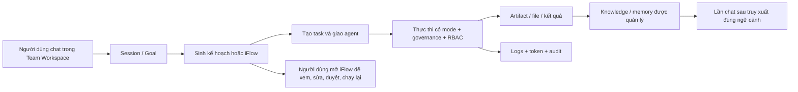
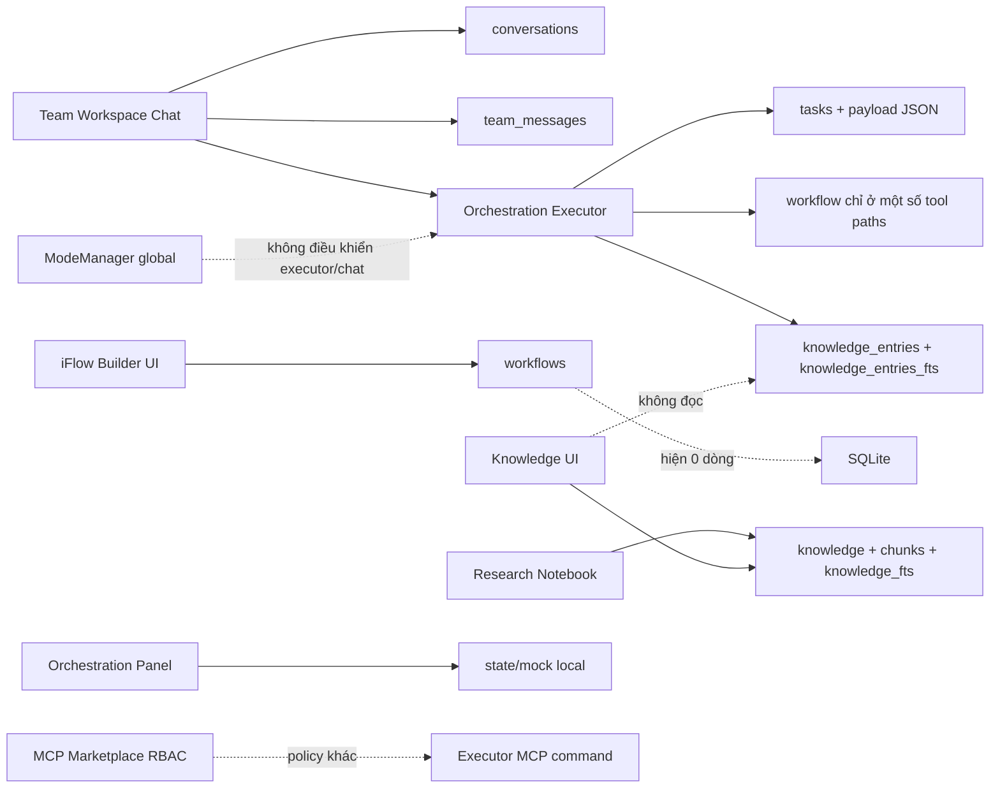
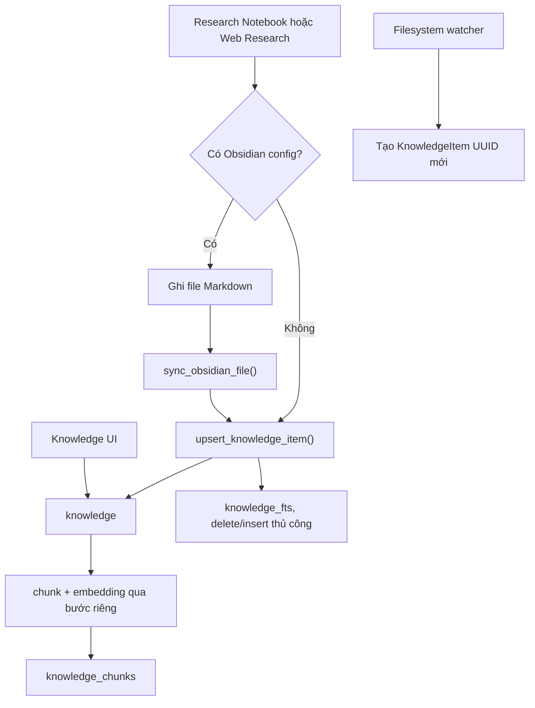
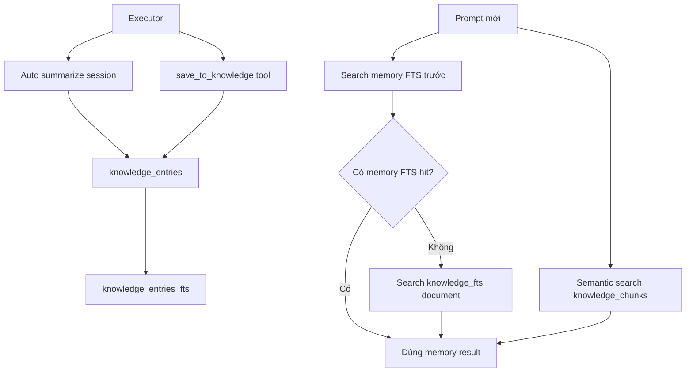
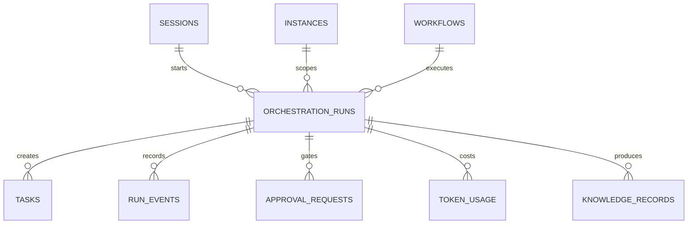
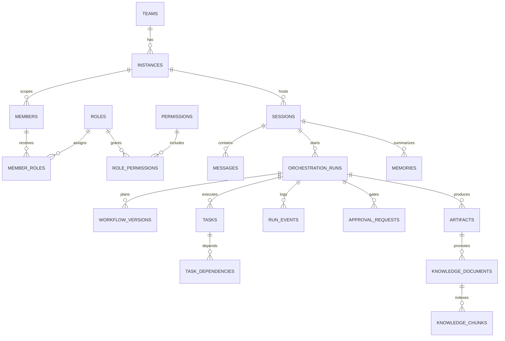

# Báo cáo audit liên kết module, database và logic nghiệp vụ AgentForge UI

**Phiên bản mở rộng:** 2026-05-25  
**Báo cáo trước:** `report/module_database_logic_audit_2026-05-22.md`  
**Phạm vi:** `agentforge-ui/src`, database SQLite đang có trong workspace, tài liệu và ảnh giao diện người dùng cung cấp.  
**Mục tiêu:** xác định chính xác hệ thống hiện đã kết nối đến đâu, dữ liệu nào là thật, dữ liệu nào chỉ là giao diện hoặc mock, và thiết kế cần sửa để IDE vận hành như một sản phẩm thống nhất.

---

## 0. Kết luận điều hành

Hệ thống hiện không thiếu module theo tên gọi. Vấn đề chính là nhiều module cùng tồn tại nhưng không cùng chia sẻ một contract dữ liệu và một luồng nghiệp vụ xuyên suốt. Người dùng nhìn thấy Teams, Chat, iFlow, Knowledge, Skills, MCP, Monitoring và Orchestration như một sản phẩm; mã nguồn hiện thực thi chúng như nhiều lát cắt rời rạc.

### 0.1 Các phát hiện quan trọng nhất

| Mức độ | Phát hiện | Bằng chứng chính | Hậu quả nhìn thấy |
|---|---|---|---|
| P0 | Knowledge bị tách thành document store và agent memory, nhưng UI chỉ hiển thị document store; memory hiện không có dữ liệu | `knowledge=17`, `knowledge_entries=0`; `KnowledgePanel` dùng `KnowledgeItem`, executor ghi `KnowledgeEntry` | Người dùng không biết "knowledge" nào được dùng khi agent suy luận; màn hình Knowledge không phản ánh memory |
| P0 | Database có 15 object bắt đầu bằng `knowledge`, không chỉ các bảng đã liệt kê trước đây | `knowledge`, `knowledge_chunks`, `knowledge_entries`, 2 virtual FTS và 10 FTS shadow table | Không thể đánh giá đúng dữ liệu/index/sync nếu chỉ kiểm tra 3-4 bảng nghiệp vụ |
| P0 | Dữ liệu document knowledge đã trùng lặp do hai đường đồng bộ Obsidian chuẩn hóa đường dẫn khác nhau | `knowledge=17` nhưng chỉ 11 title duy nhất; hai tài liệu research có 4 bản ghi mỗi tài liệu | UI che trùng bằng `GROUP BY title`; retrieval/vector có thể tính lặp và tăng nhiễu |
| P0 | Role/RBAC làm MCP Marketplace luôn `denied`, trong khi runtime orchestration có đường thực thi MCP không đi qua cùng middleware quyền | DB có role `permissions='all'`; parser mong `Vec<String>` JSON; executor gọi command trực tiếp | UI báo không được chạy nhưng agent có thể thử chạy; quyền không nhất quán và không đáng tin |
| P0 | Chuyển Autonomous Mode trong màn hình Orchestration chỉ đổi state cục bộ của panel; mode toàn cục không điều khiển hành vi chat/execution | `orchestration.rs` giữ `current_mode` riêng; `ModeManager` riêng; chat chỉ đọc mode rồi không sử dụng | Đúng với ảnh: bấm Autonomous nhưng `Current Mode` vẫn có thể là Human Interaction hoặc không thay đổi hành vi |
| P1 | iFlow không phải là lịch sử flow được sinh từ mọi phiên chat; builder hiện tạo workflow rỗng cục bộ và database không có workflow lưu | `workflows=0`, `workflow_states=0`; `IFlowBuilder` khởi tạo workflow mới; action recorder chỉ nối vào một số đường | Kỳ vọng "chat tạo iFlow rồi mở iFlow xem/điều khiển" chưa được đáp ứng |
| P1 | Cùng một ý nghĩa nghiệp vụ có nhiều persistence contract song song: chat/messages, task dependency/history, skill/workflow | `team_messages=17`, `messages=0`, `conversations=12`; không có `task_dependencies`/`task_history`; Skills UI đọc `workflows` | Dữ liệu tạo ở module này không bảo đảm xuất hiện hoặc dùng được ở module kia |
| P1 | Có hai file SQLite với dữ liệu khác nhau và đường dẫn database mặc định là tương đối | `agentforge-ui/agentforge.db` và `agentforge-ui/src/agentforge.db` có row count khác nhau | Chạy ứng dụng từ working directory khác có thể mở nhầm database và tạo cảm giác dữ liệu mất/không liên kết |
| P1 | Monitoring và Governance có màn hình hoặc class nhưng không nối vào runtime orchestration đáng kể | `token_usage=34` nhưng dashboard orchestration hardcode 0; Governance panel trống | UI cung cấp tab nhưng không trả lời được agent đã làm gì, tốn bao nhiêu, cần duyệt gì |
| P0 | Secret/provider và autonomous tool surface chưa có cơ chế bảo vệ hoàn chỉnh | API key được ghi qua `api_key_ref`; keychain/encryption đang là mock; executor có file/CLI/MCP tools | Không nên bật autonomous thật trước khi thống nhất authorization, sandbox và secret storage |

### 0.2 Chẩn đoán ngắn gọn

Kiến trúc hiện tại là **module-oriented UI**, chưa phải **event/data-oriented product**. Mỗi tab thể hiện một năng lực mong muốn, nhưng chưa có các aggregate và event chung để buộc mọi tab mô tả cùng một thực tế:

- Không có `execution/run` trung tâm nối chat -> plan/iFlow -> tasks -> agent actions -> approval -> artifacts -> knowledge -> monitoring.
- Không có `active_instance/session/context` thống nhất cho Teams, iFlow, Orchestration, Research và Knowledge.
- Không có RBAC policy duy nhất áp dụng đồng thời cho UI, API/tool execution và agent runtime.
- Không có taxonomy rõ ràng cho Knowledge Document, Agent Memory, Skill, Artifact và Workflow.

---

## 1. Phạm vi, phương pháp và giới hạn kiểm tra

### 1.1 Phạm vi mã nguồn

Việc audit đã kiểm tra inventory và truy vết các vùng mã nguồn trọng yếu dưới `agentforge-ui/src`:

| Khu vực | Vai trò được kiểm tra |
|---|---|
| `core/models` | Kiểu dữ liệu nền: agent, knowledge, team, task, workflow |
| `application/knowledge`, `application/research` | Thu nạp document, tìm kiếm, nghiên cứu, ghi knowledge |
| `application/orchestration` | Executor, worker, mode, governance, tool calls |
| `application/iflow_engine` | Workflow parse/execute/state/automation |
| `application/tasks`, `application/teams`, `application/skills` | Task lifecycle, member/role, skill registry |
| `infrastructure/database` | Schema, CRUD, FTS, persistence contract |
| `infrastructure/fs` | Đồng bộ Obsidian và watcher |
| `infrastructure/mcp`, `infrastructure/security`, `infrastructure/monitoring` | Tool permission, secret/security, metrics |
| `ui/panels`, `ui/shell` | Dữ liệu thực tế được từng màn hình đọc/ghi |

Inventory hiện có khoảng 199 entry dưới `src`, tập trung thành các nhóm chính: `application`, `core`, `infrastructure`, `ui`.

### 1.2 Snapshot database được đối chiếu

Audit đọc database theo chế độ kiểm tra, không sửa dữ liệu:

| Database | Trạng thái phát hiện |
|---|---|
| `agentforge-ui/agentforge.db` | Database chính có dữ liệu Teams, tasks, knowledge, token usage, MCP; dùng làm snapshot chi tiết trong báo cáo |
| `agentforge-ui/src/agentforge.db` | Database thứ hai, dữ liệu ít hơn và khác database chính; chứng minh rủi ro đường dẫn tương đối |

Snapshot chính kiểm tra được:

- `PRAGMA integrity_check`: `ok`.
- `PRAGMA foreign_key_check`: không trả về lỗi tại thời điểm audit.
- Database có 35 table object nếu tính cả 10 FTS shadow tables.
- Không phát hiện trigger đồng bộ FTS.
- Chỉ phát hiện 4 index thường, chủ yếu phục vụ conversation/message.

Lưu ý: đây là dữ liệu runtime tại thời điểm 2026-05-25. Row count có thể thay đổi sau khi người dùng thao tác ứng dụng.

### 1.3 Ảnh giao diện được dùng để đối chiếu

Ảnh người dùng cung cấp cho thấy các biểu hiện thực tế sau:

- Teams/Agent Workspace đã có instance, agent và task, nhưng mô hình instance/member không rõ.
- Skills trống hoàn toàn.
- MCP Marketplace có 5 tool nhưng toàn bộ quyền là `denied`.
- Workflow Pipeline hiển thị canvas rỗng, log chờ AI, saved workflows bằng 0.
- Research/Knowledge Notebook chưa hiển thị intake/result.
- Orchestration Dashboard hiển thị số 0; Tracking có ba dòng ví dụ; Logs/Governance trống.
- Mode Transition hiển thị `Current Mode: Human Interaction` dù người dùng mong chuyển sang autonomous.

Các biểu hiện này phù hợp với dữ liệu database và đường code được truy dấu dưới đây; không chỉ là lỗi trình bày.

---

## 2. Bản đồ liên kết hiện tại

### 2.1 Luồng sản phẩm mà người dùng kỳ vọng



### 2.2 Luồng thực tế theo mã nguồn và database



Điểm đứt gãy là các nhánh có giao diện tên gọi liên quan nhưng không đọc cùng dữ liệu hoặc không tham gia cùng transaction/lifecycle.

---

## 3. Inventory database đầy đủ

## 3.1 Các bảng nghiệp vụ và virtual table

Database chính có 25 object nghiệp vụ hoặc virtual table cấp ứng dụng. Bảng dưới đây liệt kê toàn bộ, thay vì chỉ các bảng từng xuất hiện trên UI.

| Object | Loại | Rows | Chức năng dự kiến | Vấn đề liên kết phát hiện |
|---|---:|---:|---|---|
| `agents` | table | 99 | Agent definitions/config/provider | Có nhiều agent ngoài các instance đang hiển thị; role routing nằm trong JSON config, tách DB role |
| `app_settings` | table | 10 | Cấu hình ứng dụng | Có thể chi phối đường dẫn/provider nhưng không giải quyết database path tuyệt đối |
| `audit_log` | table | 4 | Audit action chung | Không có mode transition/governance/tool execution đầy đủ |
| `conversations` | table | 12 | Turn hội thoại theo session | Song song với `team_messages`, không có atomic consistency |
| `cross_team_case_events` | table | 10 | Event của case liên team | Instance IDs không được FK bảo vệ |
| `cross_team_cases` | table | 1 | Trạng thái case liên team | Owner/target instance chỉ là text, không FK |
| `instances` | table | 4 | Team runtime instance | Config không đồng nhất; membership thường không gắn instance |
| `knowledge` | table | 17 | Document knowledge | Có duplicate; `category` toàn NULL; retention không được persist đầy đủ |
| `knowledge_chunks` | table | 27 | Chunks + embedding document | Embedding lưu JSON text; semantic query tính trong Rust |
| `knowledge_entries` | table | 0 | Agent/session memory | Không được UI hiển thị; `session_id` được ghi bằng instance ID trong executor |
| `knowledge_entries_fts` | virtual FTS5 | 0 | Full-text index memory | Không có row do memory rỗng; sync thủ công |
| `knowledge_fts` | virtual FTS5 | 17 | Full-text index document | Sync thủ công; có thể lệch khỏi document khi ghi lỗi |
| `mcp_tools` | table | 5 | Tool catalog | UI denied nhưng runtime execution không dùng cùng RBAC gate |
| `members` | table | 6 | Thành viên team/instance/role | Tất cả `instance_id` và `role_id` NULL trong snapshot |
| `messages` | table | 0 | Message schema thứ hai | Không phải nơi UI hiện dùng, tạo contract thừa/mơ hồ |
| `provider_configs` | table | 2 | Provider runtime config | Có nguy cơ lưu API key thô trong `api_key_ref` |
| `provider_templates` | table | 6 | Provider templates | Catalog tách khỏi security/secrets lifecycle |
| `roles` | table | 1 | RBAC role | Dữ liệu quyền sai format so với parser; không được member sử dụng |
| `sessions` | table | 5 | Session theo agent/instance | Knowledge memory không FK vào session; chat/session/instance chưa thống nhất |
| `tasks` | table | 8 | Task được giao agent | Dependency được nhúng trong payload, song song module dependency chưa tạo bảng |
| `team_messages` | table | 17 | Bus/chat message theo instance | Cột tên `sender_member_id` chứa cả label hệ thống/agent ID; thiếu FK |
| `teams` | table | 3 | Team definitions | Gốc liên kết instance/member/task |
| `token_usage` | table | 34 | Usage metrics | Dữ liệu thật có sẵn nhưng orchestration dashboard vẫn hiển thị 0 |
| `workflow_states` | table | 0 | Execution state của workflow | `workflow_id` không FK; iFlow UI không tạo execution context để ghi |
| `workflows` | table | 0 | Workflow/iFlow definition | Skills/iFlow rỗng; chưa nối ổn định từ chat/task |

## 3.2 Toàn bộ object bắt đầu bằng `knowledge`

Đây là khoảng trống quan trọng của báo cáo cũ. Database chính có **15 object** có tên bắt đầu bằng `knowledge`, bao gồm bảng nghiệp vụ, virtual table và shadow storage tự động của FTS5.

| Object | Rows | Nhóm | Có được module nghiệp vụ CRUD trực tiếp không? | Ý nghĩa |
|---|---:|---|---|---|
| `knowledge` | 17 | Business document | Có | Tài liệu/chú thích/nghiên cứu được lưu |
| `knowledge_chunks` | 27 | Business/vector support | Có | Chunk và embedding của `knowledge` |
| `knowledge_entries` | 0 | Business memory | Có | Memory theo agent/session do executor tạo |
| `knowledge_fts` | 17 | Virtual FTS5 | Có qua SQL FTS | Chỉ mục full-text của document |
| `knowledge_fts_config` | 1 | FTS shadow | Không | Metadata cấu hình FTS5 cho `knowledge_fts` |
| `knowledge_fts_content` | 17 | FTS shadow | Không | Nội dung backing storage của FTS document |
| `knowledge_fts_data` | 33 | FTS shadow | Không | Segment/index blocks của FTS document |
| `knowledge_fts_docsize` | 17 | FTS shadow | Không | Kích thước token/document của FTS document |
| `knowledge_fts_idx` | 31 | FTS shadow | Không | Segment index của FTS document |
| `knowledge_entries_fts` | 0 | Virtual FTS5 | Có qua SQL FTS | Chỉ mục full-text của agent memory |
| `knowledge_entries_fts_config` | 1 | FTS shadow | Không | Metadata cấu hình FTS5 cho memory |
| `knowledge_entries_fts_content` | 0 | FTS shadow | Không | Backing content của memory FTS |
| `knowledge_entries_fts_data` | 2 | FTS shadow | Không | FTS internal data vẫn có metadata dù chưa có document |
| `knowledge_entries_fts_docsize` | 0 | FTS shadow | Không | Document-size backing table của memory |
| `knowledge_entries_fts_idx` | 0 | FTS shadow | Không | Segment index của memory |

Hai virtual table được khai báo như sau:

```sql
CREATE VIRTUAL TABLE knowledge_fts
USING fts5(id UNINDEXED, title, content, tags);

CREATE VIRTUAL TABLE knowledge_entries_fts
USING fts5(id UNINDEXED, title, content, tags);
```

### Kết luận về nhóm `knowledge_*`

1. `knowledge_fts_*` và `knowledge_entries_fts_*` không phải các entity nghiệp vụ mới. Đây là bảng nội bộ FTS5 nhưng bắt buộc phải được đưa vào audit vật lý để biết index có tồn tại và có data hay không.
2. Application chỉ nên ghi vào `knowledge`, `knowledge_entries` và các virtual table FTS tương ứng thông qua repository/service có transaction; tuyệt đối không dùng shadow table như API.
3. Vì không có trigger, sự khớp giữa bảng nguồn và virtual FTS phụ thuộc hoàn toàn vào code ghi dữ liệu.

## 3.3 Quan hệ và khoảng trống foreign key

| Quan hệ đang có | Trạng thái |
|---|---|
| `instances.team_id -> teams.id` | Có FK cascade |
| `members.team_id -> teams.id`, `members.instance_id -> instances.id`, `members.agent_id -> agents.id`, `members.role_id -> roles.id` | Có FK, nhưng dữ liệu hiện để `instance_id`/`role_id` NULL |
| `tasks.team_id/instance_id/assignee_id` | Có FK |
| `knowledge_chunks.document_id -> knowledge.id` | Có FK cascade |
| `knowledge_entries.agent_id -> agents.id` | Có FK |
| `sessions.agent_id/team_instance_id` | Có FK |
| `conversations.session_id -> sessions.id` | Có FK cascade |
| `token_usage.instance_id/agent_id` | Có FK |

| Quan hệ đáng lẽ cần có hoặc cần sửa | Hiện trạng và tác động |
|---|---|
| `knowledge_entries.session_id -> sessions.id` | Không có FK; executor hiện ghi instance ID vào trường mang tên session |
| `cross_team_cases.owner_instance_id/target_instance_id -> instances.id` | Không có FK; case có thể tham chiếu instance đã xóa |
| `cross_team_case_events.from_instance_id/reply_to_instance_id -> instances.id` | Không có FK |
| `team_messages.sender_member_id/recipient_member_id -> members.id` | Không có FK và dữ liệu thực tế không tuân semantics tên cột |
| `workflow_states.workflow_id -> workflows.id` | Không có FK; state mồ côi có thể tồn tại |
| Liên kết workflow execution -> session/instance/task/run | Chưa có bảng/quan hệ chuẩn |
| Liên kết knowledge document/memory -> artifact/run/source | Chưa có contract audit được |

## 3.4 Index và đồng bộ dữ liệu

Các index thường được phát hiện:

| Index | Bảng |
|---|---|
| `idx_conversations_session_time` | `conversations` |
| `idx_messages_instance_time` | `messages` |
| `idx_messages_recipient` | `messages` |
| `idx_messages_sender` | `messages` |

Vấn đề:

- Các index message đang đặt trên bảng `messages` rỗng, trong khi dữ liệu hoạt động nằm ở `team_messages`.
- Không thấy index nghiệp vụ cho `tasks(instance_id,status,assignee_id)`, `team_messages(team_instance_id,created_at)`, `knowledge(vault_path)` hoặc `workflow_states(workflow_id)`.
- Không thấy unique constraint trên nguồn tài liệu như `vault_path` đã canonical hóa hoặc source key. Đây là nguyên nhân database chấp nhận duplicate knowledge document.
- Không có trigger giữ `knowledge` và `knowledge_fts`, hoặc `knowledge_entries` và `knowledge_entries_fts`, luôn nhất quán.

## 3.5 Bảng/module có trong code nhưng không có trong database runtime

| Object kỳ vọng | Nguồn code/ý nghĩa | Database snapshot | Nhận định |
|---|---|---:|---|
| `task_dependencies` | `application/tasks/dependency.rs` tạo dependency riêng | Không tồn tại | Runtime worker đang dùng dependency trong JSON payload, không dùng module này |
| `task_history` | `application/tasks/history.rs` tạo lịch sử task | Không tồn tại | Không có audit lifecycle chuẩn cho task |
| `schema_migrations` | Theo dõi version schema | Không tồn tại | Khó biết database nào đã được nâng schema ở mức nào |
| `orchestration_runs` | Run trung tâm cho dashboard/tracking | Không tồn tại | Dashboard không có nguồn dữ liệu thật |
| `orchestration_logs` | Log theo run/task/tool | Không tồn tại | Tab Logs không có model để đọc |
| `approval_requests` | Governance/human approval | Không tồn tại | Approve/Reject không có persistence xuyên phiên |
| `mode_transitions` | Lịch sử chuyển mode | Không tồn tại | Mode không audit được và mất khi reset state |

---

## 4. Knowledge: audit sâu theo schema, dữ liệu và luồng sử dụng

## 4.1 Trong mã nguồn đang có ba khái niệm "knowledge" khác nhau

| Khái niệm | Model/table | Producer | Consumer | Có UI trực tiếp? |
|---|---|---|---|---|
| Document knowledge | `KnowledgeItem`, `knowledge`, `knowledge_chunks`, `knowledge_fts` | Research Notebook, Obsidian sync/watcher, service document | Knowledge UI, Research search, RAG executor fallback/semantic | Có, nhưng UI che duplicate |
| Agent/session memory | `KnowledgeEntry`, `knowledge_entries`, `knowledge_entries_fts` | Executor auto-summary và tool `save_to_knowledge` | RAG executor ưu tiên FTS memory | Không |
| Brain/search in-memory | `Brain`/knowledge search abstractions | Runtime objects/mock embeddings | Các abstraction riêng | Không gắn trực tiếp với database snapshot |

Người dùng thấy một menu Knowledge, nhưng backend đang có ít nhất ba tầng nội dung không được giải thích hay hợp nhất. Đây là vấn đề business model, không đơn thuần là thiếu màn hình.

## 4.2 Contract document knowledge

### Entity và lưu trữ

| Thành phần | Nội dung |
|---|---|
| Bảng nguồn | `knowledge(id, title, content, tags, category, vault_path, created_at, updated_at)` |
| Chunks/vector | `knowledge_chunks(id, document_id, chunk_index, content, embedding)` |
| FTS | `knowledge_fts(id, title, content, tags)` |
| Model code | `core/models/knowledge.rs` - `KnowledgeItem` |
| Service UI đọc | `application/services/knowledge_service.rs`, `ui/panels/knowledge.rs` |

### Điểm mất contract

| Thuộc tính nghiệp vụ | Trạng thái thực tế |
|---|---|
| `category` | Column tồn tại nhưng toàn bộ 17 bản ghi đang NULL; luồng upsert không quản lý đầy đủ |
| Retention policy | Model có ý niệm retention nhưng schema `knowledge` không có column lưu ổn định |
| Source identity | `vault_path` có nhưng không có canonical/unique contract |
| Provenance | Không có `source_type`, `run_id`, `session_id`, `artifact_id`, checksum hoặc version lineage |
| Access/visibility | Không có tenant/team/instance ownership rõ ràng trên knowledge document |

## 4.3 Contract agent memory

| Thành phần | Nội dung |
|---|---|
| Bảng nguồn | `knowledge_entries(id, agent_id, session_id, title, content, tags, created_at)` |
| FTS | `knowledge_entries_fts(id, title, content, tags)` |
| Producer code | `application/orchestration/executor.rs:657-719` |
| Consumer code | `application/orchestration/executor.rs:368-417` |
| UI | Không có panel đọc trực tiếp |

### Sai lệch semantic của `session_id`

Trong executor, cả auto-summary và tool save-to-knowledge gán:

```rust
session_id: Some(self.team_instance_id.clone())
```

Tức là column tên `session_id` thực tế nhận **instance ID**, không phải ID từ bảng `sessions`. Database cũng không khai báo FK cho column này, nên lỗi semantic không bị phát hiện.

Hậu quả:

- Không thể truy vấn memory đúng theo phiên chat.
- Một instance có nhiều session sẽ trộn memory vào cùng một khóa giả định.
- Khi thiết kế xóa/archive session, memory không thể cascade hoặc được kiểm tra toàn vẹn.
- UI về sau không thể trả lời "memory này được học từ cuộc trò chuyện nào" một cách đáng tin.

## 4.4 Luồng ghi và đọc hiện tại

### Document / Research / Obsidian



File liên quan:

- `src/application/research/web.rs:168-203`
- `src/infrastructure/fs/obsidian_adapter.rs:136-264`
- `src/infrastructure/database/sqlite_adapter.rs:1561-1602`
- `src/ui/panels/knowledge.rs`
- `src/ui/panels/research_notebook.rs:148-201,312-387`

### Memory / RAG



Vấn đề thiết kế: document FTS hiện là **fallback** nếu memory FTS không có hit, thay vì hợp nhất/rank hai nguồn. Khi `knowledge_entries` bắt đầu có dữ liệu, chỉ một memory match cũng có thể khiến document liên quan bị loại khỏi full-text context.

## 4.5 Dữ liệu knowledge thực tế trong database chính

### Thống kê tính đầy đủ

| Chỉ tiêu | Giá trị snapshot | Nhận định |
|---|---:|---|
| Dòng trong `knowledge` | 17 | Có document thực |
| Title duy nhất | 11 | Có duplicate đáng kể |
| Dòng trong `knowledge_chunks` | 27 | Embedding đã được sinh cho document |
| Document không có chunk | 0 | Snapshot hiện đủ chunk cho document đang lưu |
| Chunk không có document | 0 | FK/cascade đang giữ consistency |
| Dòng trong `knowledge_fts` | 17 | Số lượng khớp document tại thời điểm audit |
| Document thiếu FTS | 0 | Chưa thấy lệch hiện tại |
| FTS document mồ côi | 0 | Chưa thấy lệch hiện tại |
| Dòng trong `knowledge_entries` | 0 | Chưa có memory persist |
| Dòng trong `knowledge_entries_fts` | 0 | Khớp tình trạng memory rỗng |
| `category IS NULL` | 17/17 | Metadata classification chưa hoạt động |
| Có `vault_path` | 17/17 | Source path có lưu nhưng identity không chuẩn hóa |

### Duplicate document đã xác minh

| Title | Số dòng | Biểu hiện source identity |
|---|---:|---|
| `research_20260513_085511` | 4 | Một đường dẫn dạng `\\?\C:\...`, ba đường dẫn dạng `C:/...\...` |
| `research_20260514_093401` | 4 | Một đường dẫn dạng `\\?\C:\...`, ba đường dẫn dạng `C:/...\...` |

Hai title này giải thích 6 bản ghi dư so với 11 tài liệu duy nhất:

```text
17 rows - 11 unique titles = 6 duplicate rows
(4 - 1) + (4 - 1) = 6
```

### Nguyên nhân trực tiếp từ code

| Đường ghi | Hành vi | Rủi ro |
|---|---|---|
| `sync_obsidian_file`, `obsidian_adapter.rs:136-198` | Canonicalize path, tìm item hiện có rồi giữ ID | Sinh `\\?\C:\...` trên Windows |
| Watcher handler, `obsidian_adapter.rs:200-264` | Lấy `path.to_string_lossy()`, tạo `KnowledgeItem` UUID mới rồi upsert | Cùng file có format path khác và ID khác, tạo duplicate |
| `sqlite_adapter.rs:1599-1602` khi list item | `GROUP BY title ORDER BY updated_at DESC` | UI che duplicate thay vì làm sạch; giá trị column được chọn không deterministic theo SQL chuẩn |

Vấn đề không nên được xử lý bằng cách tiếp tục `GROUP BY title`. Title không phải source identity: hai document khác nhau có thể hợp pháp cùng tiêu đề, còn cùng file có thể đổi title. Identity đúng cần là source URI/path canonical hoặc checksum/version key.

## 4.6 FTS và vector: consistency hiện dựa vào may mắn của write path

### FTS

`sqlite_adapter.rs` hiện thực hiện ghi document/memory và cập nhật FTS bằng SQL delete/insert thủ công. Không có trigger và các thao tác FTS có nhánh bỏ qua lỗi bằng `.ok()`.

| Trường hợp lỗi | Kết quả có thể xảy ra |
|---|---|
| Ghi `knowledge` thành công nhưng ghi `knowledge_fts` lỗi | UI list thấy document nhưng full-text retrieval không tìm ra |
| Xóa/cập nhật document nhưng delete FTS lỗi | Agent nhận nội dung cũ hoặc nội dung đã xóa |
| Ghi `knowledge_entries` thành công nhưng memory FTS lỗi | Memory tồn tại vật lý nhưng RAG không sử dụng |
| App bị dừng giữa hai thao tác | Main table và FTS lệch nhau |

Snapshot hiện chưa cho thấy lệch row count, nhưng thiết kế không bảo đảm điều này trong lần ghi tiếp theo.

### Vector/chunks

`knowledge_chunks` đã có 27 row và các embedding được lưu dưới dạng chuỗi JSON. Semantic search đọc chunk rồi tính similarity ở Rust.

| Vấn đề | Tác động khi dữ liệu lớn |
|---|---|
| Embedding dạng text JSON | Kích thước lưu lớn, parse lặp lại |
| Similarity compute application-side | Tải toàn bộ candidate/chunk vào process; không scale theo kho tài liệu |
| Chunk upsert là bước riêng sau document upsert | Có thời điểm document đã hiện trên UI nhưng chưa truy xuất semantic được |
| Không có version/hash của embedding model | Đổi model embedding khó rebuild có kiểm soát |

## 4.7 Khoảng cách UI và business đối với Knowledge

| Kỳ vọng của người dùng | Hiện trạng |
|---|---|
| Thấy toàn bộ tri thức agent có thể dùng | Knowledge Panel chỉ hiển thị `knowledge`, không hiển thị `knowledge_entries` |
| Biết tài liệu sinh từ chat/research/run nào | Không có provenance/run/session FK cho document |
| Không thấy tài liệu trùng | UI che trùng theo title nhưng retrieval/storage vẫn chứa duplicate |
| Save to Knowledge từ agent xuất hiện trong Knowledge UI | Tool ghi `knowledge_entries`, panel đọc `knowledge`; không xuất hiện |
| Search/RAG dùng nguồn nhất quán | Memory FTS ưu tiên tuyệt đối theo hit; document + semantic hoạt động theo đường khác |
| Đồng bộ Obsidian ổn định | Hai write path tạo duplicate theo định dạng path Windows |

## 4.8 Thiết kế khắc phục đề xuất cho Knowledge

### Bước sửa P0: thống nhất identity và dọn duplicate

1. Thêm field/contract `source_kind`, `source_uri_normalized`, `content_hash`, `origin_run_id`, `origin_session_id`.
2. Canonicalize source ở một hàm duy nhất trước mọi write path, bao gồm watcher và manual sync.
3. Tạo unique constraint phù hợp, ví dụ `(source_kind, source_uri_normalized)` cho document gắn file.
4. Viết migration deduplicate: chọn bản canonical, chuyển `knowledge_chunks` nếu cần, rebuild FTS, giữ audit mapping old ID -> retained ID.
5. Bỏ `GROUP BY title` như cơ chế che lỗi; UI hiển thị đúng entity và provenance.

Ví dụ contract đề xuất:

```sql
ALTER TABLE knowledge ADD COLUMN source_kind TEXT NOT NULL DEFAULT 'manual';
ALTER TABLE knowledge ADD COLUMN source_uri_normalized TEXT;
ALTER TABLE knowledge ADD COLUMN content_hash TEXT;
ALTER TABLE knowledge ADD COLUMN origin_run_id TEXT;
ALTER TABLE knowledge ADD COLUMN origin_session_id TEXT;

CREATE UNIQUE INDEX ux_knowledge_source
ON knowledge(source_kind, source_uri_normalized)
WHERE source_uri_normalized IS NOT NULL;
```

### Bước sửa P0: phân loại rõ document và memory

Chọn một trong hai hướng:

| Hướng | Nội dung | Khi phù hợp |
|---|---|---|
| Unified `knowledge_records` | Một bảng chung, có `record_type=document|memory|artifact_summary`, metadata/provenance thống nhất; index và UI filter theo type | Muốn Knowledge là một sản phẩm hợp nhất |
| Tách entity nhưng nối rõ | Giữ `knowledge_documents` và `agent_memories`; UI có hai tab và retrieval hợp nhất qua service | Muốn lifecycle/xóa/retention khác nhau rõ rệt |

Trong cả hai hướng, `session_id` phải tham chiếu `sessions.id`; `instance_id` nếu cần phải có column/FK riêng.

### Bước sửa P1: index/retrieval

- Bao bọc write main row + FTS update trong transaction hoặc dùng FTS external-content/triggers có kiểm thử.
- Có command kiểm tra/rebuild FTS được log và gọi trong migration.
- Retrieval hợp nhất candidates từ memory, document FTS và vector rồi rank chung, thay vì memory hit làm ngắt document FTS.
- Lưu `embedding_model`, `embedding_dimension`, `content_hash` để rebuild và cache chính xác.

---

## 5. Role, member, RBAC và MCP: permission contract đang hỏng

## 5.1 Dữ liệu hiện có

| Chỉ tiêu | Snapshot |
|---|---:|
| `roles` | 1 |
| Role hiện có | `Admin`, ID `admin-role-123`, team `sdg-team-123` |
| `permissions` | Chuỗi `all` |
| `capabilities` | Chuỗi `all` |
| `members` | 6 |
| Members có `role_id` | 0 |
| MCP tools | 5, active |

Các MCP tool trong catalog:

| Tool name | Mục đích |
|---|---|
| `team_message_role` | Gửi message đến role |
| `team_broadcast` | Broadcast đến team |
| `team_claim_task` | Claim task |
| `team_complete_task` | Complete task |
| `team_get_tasks` | Query tasks |

Điều này khớp ảnh Marketplace: tool hiện ra nhưng permission toàn bộ là `denied`.

## 5.2 Vì sao `Admin` vẫn bị denied

Các đường code không thống nhất định dạng:

| Nguồn | Hành vi |
|---|---|
| `application/teams/role.rs:34-45` | Seed role bằng string plain text `"all"` |
| `lib.rs:185-193` | Có đường tạo cùng ID với JSON string `["all"]` |
| `sqlite_adapter.rs:1957+` | Tạo role dùng `INSERT OR IGNORE`, không sửa row cũ đã sai |
| `sqlite_adapter.rs:1982+` | Permission check parse `permissions` thành `Vec<String>` JSON, parse lỗi thì mặc định rỗng |
| `ui/panels/mcp_marketplace.rs:36-45` | Kiểm quyền bằng role ID hardcode `admin-role-123` |

Chuỗi `"all"` không phải JSON array `["all"]`. Parser thất bại và biến quyền Admin thành danh sách rỗng. Đây là lỗi dữ liệu seed cộng với thiếu migration/validation, không phải người dùng chưa cấp quyền.

## 5.3 Có ba định nghĩa "role" không cùng nghĩa

| Khái niệm role | Nơi tồn tại | Ý nghĩa thực |
|---|---|---|
| RBAC role | Bảng `roles`, `members.role_id` | Quyền thực thi resource/tool |
| Agent routing role | JSON `agents.config["role"]` / `["position"]` | Nhãn như DEV/Coordinator để route task/message |
| Security enum role | `infrastructure/security/rbac.rs` | Enum `Admin/User/Guest`, chưa nối DB/member/UI |

Tài liệu hướng dẫn và Team Workspace dùng role như position/routing key. MCP Marketplace lại dùng role như security permission. Do không có UI quản lý sự khác nhau này, người dùng không biết phải "khai báo role mới" ở đâu và role sẽ ảnh hưởng phần nào.

## 5.4 UI kiểm quyền nhưng runtime có đường bypass

| Luồng | Kiểm tra quyền |
|---|---|
| MCP Marketplace UI | Gọi check permission dựa vào DB role hardcode |
| `McpAuthMiddleware`, `infrastructure/mcp/registry.rs:22-70` | Có logic kiểm `all`, `mcp:execute:all` hoặc tool-specific |
| Orchestration executor, `executor.rs:1316-1322` | Gọi `Command::new(&mcp_tool.command)` trên tool active, không chứng minh đi qua middleware RBAC |

Kết luận: cùng một tool có thể bị UI từ chối nhưng được execution path khác thử gọi. Permission không thể chỉ là trạng thái hiển thị; nó phải là gate tại boundary thực thi duy nhất.

## 5.5 Sửa contract Role/RBAC/MCP

### Data model

```sql
CREATE TABLE permissions (
  id TEXT PRIMARY KEY,
  resource TEXT NOT NULL,
  action TEXT NOT NULL,
  UNIQUE(resource, action)
);

CREATE TABLE role_permissions (
  role_id TEXT NOT NULL REFERENCES roles(id) ON DELETE CASCADE,
  permission_id TEXT NOT NULL REFERENCES permissions(id) ON DELETE CASCADE,
  PRIMARY KEY (role_id, permission_id)
);
```

Tối thiểu nếu chưa normalize schema:

- Validate JSON ở write boundary.
- Migrate `permissions='all'` thành `["all"]`.
- Không hardcode `admin-role-123` trong panel; lấy current actor/member context.
- Không gọi entity routing role là security role trong UI.

### Runtime authorization

Mọi đường gọi tool phải đi qua một `ToolExecutionGateway`:

```text
actor/member + active instance + requested tool
  -> resolve roles/permissions
  -> policy check + mode/governance check
  -> audit begin
  -> execute tool
  -> audit result/cost/artifact
```

Marketplace chỉ nên là consumer của cùng gateway để preview/run, không được tự diễn giải permission theo cách riêng.

---

## 6. Teams, instances, sessions, messages và tasks

## 6.1 Team và instance không phản ánh membership thực

Snapshot:

| Object | Số dòng | Chi tiết đáng chú ý |
|---|---:|---|
| `teams` | 3 | Có cả `sdg-team-123` và team được tạo runtime |
| `instances` | 4 | `backend`, `test`, `document`, `sdg-instance-123` |
| `members` | 6 | Tất cả `instance_id IS NULL`, tất cả `role_id IS NULL` |

`sqlite_adapter.rs:733-774` lấy agents cho instance theo hai bước:

1. Tìm member gắn trực tiếp `members.instance_id = selected instance`.
2. Nếu không có, fallback về mọi member thuộc cùng `team_id`.

Điều này giúp UI không rỗng, nhưng che đi vấn đề dữ liệu: người dùng thấy agent ở một instance trong khi database không thực sự gắn member vào instance đó. Khi một team có nhiều instance với membership khác nhau, UI/routing/task assignment sẽ không còn chính xác.

## 6.2 Chat đang có ba store/message concept

| Store | Rows | Vai trò quan sát được | Vấn đề |
|---|---:|---|---|
| `conversations` | 12 | Nội dung turn theo `sessions` | Dùng cho lịch sử chat/session |
| `team_messages` | 17 | Message bus/team instance | Sender/recipient semantics yếu, không FK |
| `messages` | 0 | Schema message khác | Index đã tạo nhưng không phải store runtime đang dùng |

### Semantics `team_messages` không khớp schema

Cột tên `sender_member_id` nhưng dữ liệu chứa các loại giá trị:

- Nhãn `assistant`.
- Nhãn `user`.
- Nhãn `cross-team`.
- Agent ID như `sdg-coord-123`.

Không có FK từ sender/recipient tới `members`. Như vậy bảng không thể trả lời chắc chắn ai thực sự gửi message: end-user identity, agent identity, member identity hay system event.

### Contract đề xuất

Tách actor rõ ràng:

```sql
sender_type TEXT NOT NULL CHECK(sender_type IN ('user','agent','system','team')),
sender_id TEXT,
recipient_type TEXT,
recipient_id TEXT,
session_id TEXT REFERENCES sessions(id),
instance_id TEXT REFERENCES instances(id),
run_id TEXT REFERENCES orchestration_runs(id)
```

Sau khi chuyển đổi, chọn một store event/message canonical; `conversations` có thể là projection theo session thay vì đường ghi độc lập.

## 6.3 Task có dữ liệu thật nhưng dependency/history bị chia đôi

Snapshot:

| Chỉ tiêu | Giá trị |
|---|---:|
| Tasks tổng | 8 |
| Completed | 4 |
| Failed | 3 |
| Pending | 1 |
| Task thuộc `backend-33c3` | 2 completed |
| Task thuộc `document-6644` | 2 completed, 3 failed, 1 pending |

Luồng hiện tại:

| Nguồn | Cách lưu/đọc |
|---|---|
| Executor `create_subtasks`, `executor.rs:784-900` | Tạo `tasks`, lưu `DagTask` serialized vào `payload`, resolve assignee từ routing role |
| Worker `worker.rs:277-323` | Đọc dependency từ JSON `payload` và tìm task theo ID/prefix instance |
| `application/tasks/dependency.rs` | Có module định nghĩa bảng `task_dependencies` riêng |
| `application/tasks/history.rs` | Có module định nghĩa bảng `task_history` riêng |
| Database runtime | Không có `task_dependencies` hoặc `task_history` |

Đây là dấu hiệu module phát triển song song nhưng chưa tích hợp:

- Nếu UI hoặc service tương lai ghi dependency qua `DependencyManager`, worker hiện tại không đọc.
- Nếu worker chỉ cập nhật status trong `tasks`, module history không thấy event.
- Không có một nguồn sự thật cho DAG hoặc lịch sử tiến độ.

## 6.4 Cross-team case

`cross_team_cases=1` và `cross_team_case_events=10` cho thấy đã có luồng case thật. Tuy vậy ID của owner/target/from/reply instance không được FK bảo vệ. Trước khi dùng cross-team cho workflow thực tế, cần nối case vào run/task/session và thêm integrity constraints.

---

## 7. Orchestration, Mode Transition và Governance

## 7.1 Dashboard/Tracking/Logs/Governance trên UI hiện không phản ánh runtime

| Tab | Mã nguồn | Trạng thái thực tế |
|---|---|---|
| Dashboard | `ui/panels/orchestration.rs:90+` | Cards active runs/success rate/agents/tasks hardcode bằng 0 |
| Tracking | `orchestration.rs:220+` | Render các task mẫu Requirements Analysis/UI Design/Backend API Setup |
| Logs | `orchestration.rs:331+` | Khung rỗng/không nối audit hoặc executor logs |
| Governance | `orchestration.rs:363+` | Không nối `GovernanceManager`, hiển thị rỗng |
| Mode Transition | `orchestration.rs:414+` | State cục bộ panel; không persist và không điều khiển executor |

Dữ liệu runtime thực tế đã tồn tại nhưng không được dashboard dùng:

| Dữ liệu | Rows | UI orchestration đang sử dụng? |
|---|---:|---|
| `tasks` | 8 | Không cho dashboard/tracking thật |
| `token_usage` | 34 | Không cho cards orchestration |
| `audit_log` | 4 | Không cho Logs |
| `team_messages` | 17 | Không cho run timeline |

## 7.2 Vì sao Mode Transition luôn có cảm giác là Human

Có hai state mode tách rời:

| State | File | Hành vi |
|---|---|---|
| Local UI mode | `ui/panels/orchestration.rs:11-23,438,543-552` | Khởi tạo `"Human Interaction"`; nút confirm chỉ sửa `this.current_mode` của panel |
| Global mode manager | `application/orchestration/modes.rs:4-65`, khởi tạo tại `lib.rs:119-143` | Có enum transition trong memory; không được panel mode hiện tại ghi vào |

Ngoài ra, Team Chat đọc global mode tại `ui/panels/team_workspace/chat.rs:1935-1939`, nhưng ở đường chạy sau đó không dùng mode để thay đổi policy hay execution; variable clone không tạo điều kiện hành vi đáng kể tại `:2157-2174`.

Do vậy có hai lỗi riêng:

1. Màn hình Mode Transition không điều khiển mode global mà người dùng kỳ vọng.
2. Dù global mode được đổi từ nơi khác, runtime chat/executor vẫn chưa có policy khác biệt rõ giữa Human và Autonomous.

## 7.3 Governance tồn tại như class, không tồn tại như sản phẩm

`application/orchestration/governance.rs:88-325` định nghĩa `GovernanceManager`, budget/approval/metrics và khả năng gắn database. Tuy nhiên:

- Không thấy khởi tạo manager vào app state tương tự `ModeManager`.
- Governance panel không đọc manager.
- Không có bảng `approval_requests`, `mode_transitions`, `orchestration_runs`.
- Approve/Reject trong workflow/orchestration chưa được chứng minh là một approval lifecycle persist được.

Khi chưa có policy gateway và approval persistence, Autonomous Mode chỉ nên được xem là prototype UI, không phải chế độ vận hành an toàn.

## 7.4 Contract orchestration cần có

Một run nên là gốc quan hệ:



Tối thiểu cần:

| Bảng mới/chuẩn hóa | Vai trò |
|---|---|
| `orchestration_runs` | Một mục tiêu/chat action trở thành một execution có lifecycle |
| `run_events` hoặc `orchestration_logs` | Timeline thống nhất cho task/tool/agent/approval/error |
| `approval_requests` | Human gate có trạng thái và actor |
| `mode_transitions` | Mode change theo scope, actor, reason, policy snapshot |
| `artifacts` | File/output sinh từ run và đường dẫn tới Knowledge |

---

## 8. iFlow, workflow và Skills

## 8.1 Database cho thấy iFlow chưa trở thành dữ liệu sản phẩm

| Table | Rows |
|---|---:|
| `workflows` | 0 |
| `workflow_states` | 0 |

Ảnh Workflow Pipeline với `Nodes: 0`, `Connections: 0`, `Saved Workflows (0)` phản ánh đúng database; không chỉ vì chưa chọn item.

## 8.2 iFlow Builder chưa nối với active workspace/run

| Điểm mã nguồn | Nhận định |
|---|---|
| `ui/panels/iflow_builder.rs:109-145` | Builder khởi tạo workflow mới rỗng và `WorkflowEngine::new()` không có execution context |
| `iflow_builder.rs:336-350` | Start/approve gọi engine tại UI |
| `application/iflow_engine/engine.rs:149-167` | Chỉ persist state nếu engine có execution context |
| `iflow_builder.rs:934-953` | Save ghi `workflows` khi người dùng save |
| `iflow_builder.rs:1037-1038` | Serialize hardcode `sdg-team-123` và `sdg-instance-123` |

Hậu quả:

- Mở iFlow không mặc nhiên thấy flow sinh từ chat hiện tại.
- Chạy flow tại builder không bảo đảm tạo `workflow_states`.
- Flow save không chắc thuộc instance mà người dùng đang xem ở Teams.
- Không có mapping từ task đã chạy về node nào của iFlow.

## 8.3 Chat tạo iFlow: hiện mới có các đường rời rạc

| Luồng | Có khả năng sinh workflow? | Giới hạn |
|---|---|---|
| Executor tool `create_subtasks` | Có code dựng/save workflow quanh tasks | Không tạo được trải nghiệm mọi chat -> một iFlow thống nhất |
| Research Notebook qua `ActionRecorder` | Có `generate_iflow_and_save` sau action/search | Lấy LLM content làm definition, chưa chứng minh validate/parse trước khi save |
| Chat thông thường | Không có contract bảo đảm mỗi goal tạo run/workflow | Người dùng không thể dựa vào iFlow để theo dõi toàn bộ công việc |

`infrastructure/mcp/action_recorder.rs:17-91` giữ action records trong memory và tạo workflow từ LLM response. Để đáng tin cậy, definition phải được validate qua parser/schema, có active instance/run, và mọi action phải persist thành events trước khi sinh flow.

## 8.4 Skills UI đang sử dụng sai nguồn so với Skill Registry

| Khái niệm | Code/data | Hiện trạng |
|---|---|---|
| Learned Skills UI | `ui/panels/session.rs:31-70` đọc `db.list_workflows()` | Rỗng vì `workflows=0` |
| Built-in Skill Registry | `application/skills/mod.rs`, `framework.rs` | Có registry riêng nhưng không hiển thị tại panel |

Tên "Skills" đang gom hai ý nghĩa khác nhau:

- Capability/tool được hệ thống hỗ trợ sẵn.
- Workflow đã học/lưu từ hoạt động người dùng.

UI cần tách `Available Capabilities` khỏi `Learned Automations/Workflows`, hoặc xây model thống nhất có source/type rõ ràng. Hiện tại màn hình trống không nói lên rằng ứng dụng không có capability; nó chỉ nói rằng chưa có workflow lưu.

## 8.5 Runtime risk của workflow command

`application/iflow_engine/engine.rs:305-314` thực thi SystemCommand thông qua `bash -lc`. Trên môi trường Windows của workspace hiện tại, đây là phụ thuộc không được bảo đảm; đồng thời SystemCommand trong flow tự động cần cùng policy/sandbox/audit gateway với executor tools.

---

## 9. Monitoring, provider, security và các module hỗ trợ

## 9.1 Monitoring có dữ liệu nhưng không có view thống nhất

| Thành phần | Trạng thái |
|---|---|
| `token_usage` | Có 34 bản ghi |
| `ui/panels/monitoring/token_dashboard.rs:20-42` | Đọc metrics thật từ DB |
| `ui/panels/monitoring/dashboard.rs:12-35` | Khởi tạo array rỗng/mock demonstration |
| Orchestration dashboard | Cards hardcode số 0 |

Người dùng cần một quan hệ rõ:

```text
run -> task -> agent/tool call -> token/cost/log/status -> dashboard
```

Hiện token tồn tại như metric riêng, không nối thành execution observability.

## 9.2 Provider secret storage chưa đủ an toàn

| File | Evidence |
|---|---|
| `ui/panels/custom_provider.rs:130-136` | Input API key được đưa vào `api_key_ref` |
| `infrastructure/database/sqlite_adapter.rs:487-489` | Field được lưu vào database |
| `infrastructure/security/keychain.rs:5-37` | Keychain hiện là in-memory mock |
| `infrastructure/security/encryption.rs:12-30` | Encryption implementation placeholder/pass-through |

Báo cáo không hiển thị giá trị secret. Kết luận kỹ thuật là database field tên "reference" hiện có nguy cơ chứa secret trực tiếp trong khi lớp bảo mật chưa hoạt động.

## 9.3 Autonomous tool surface chưa có safety boundary chung

Executor có các thao tác như MCP, CLI, read/write/edit file. Một số thao tác kiểm tra workspace ở mức riêng, nhưng chưa có bằng chứng về một gateway thống nhất kết hợp:

- Active actor và RBAC.
- Current mode.
- Governance/approval.
- Workspace/file policy.
- Secret redaction.
- Run log/audit/cost.

Khi các điều kiện này chưa hội tụ, bật autonomous từ UI sẽ tạo kỳ vọng sai về kiểm soát và truy vết.

## 9.4 Các module placeholder/mock đáng đưa ra khỏi luồng chính hoặc gắn nhãn

| Module | Dấu hiệu |
|---|---|
| MCP server | `infrastructure/mcp/server.rs:35-78` chứa placeholder/mock behavior |
| Marketplace service | `application/marketplace_service/core.rs:15-50` dùng store rỗng và installation mock |
| Marketplace security | `application/marketplace_service/security.rs:33+` chưa là enforcement thật |
| Research synthesis | `application/research/synthesis.rs:39` mock path |
| Knowledge search | `application/knowledge/search.rs:15,52-54` mock embedding behavior riêng |
| Message bus security | `infrastructure/message_bus/security.rs:15+` mock security |

Các module này có thể là scaffold hợp lý trong quá trình xây dựng, nhưng UI hiện trình bày chúng cùng cấp với feature hoạt động. Sản phẩm cần phân biệt rõ `available`, `configured`, `prototype`, `disabled`, `operational`.

---

## 10. Đối chiếu từng màn hình với nguồn dữ liệu và logic thật

| Màn hình từ ảnh | Người dùng hiểu hợp lý | Nguồn dữ liệu/logic hiện tại | Chênh lệch cần sửa |
|---|---|---|---|
| Teams / backend workspace | Agent, task, chat đều thuộc instance đang chọn | Member thường fallback từ team vì `members.instance_id` NULL; task có thật; conversation/team message tách store | Persist member assignment theo instance và gắn session/run rõ |
| Learned Skills rỗng | Chưa có skill nào hoặc hệ thống lỗi | Panel chỉ đọc `workflows`, không đọc built-in registry | Tách capability và learned workflow; giải thích bằng data state thật |
| MCP Tools all denied | Role hiện tại không được cấp quyền | Admin role lưu sai format JSON, không member nào gán role; executor lại có path khác | Sửa RBAC schema/data và enforce tại runtime gateway |
| Workflow Pipeline rỗng | Chưa có flow; mong chat tạo ra flow | `workflows=0`; builder rỗng và context hardcode | Mọi goal/run cần có workflow/progress model hoặc nêu rõ manual-only |
| Research Notebook rỗng | Chưa research hoặc chưa save | Có document knowledge thực ở DB từ research/Obsidian nhưng view/flow không đồng nhất | Hiển thị source/history và nối save/search/provenance |
| Orchestration Dashboard số 0 | Không có run/task nào | Có tasks, token usage, audit; cards hardcode | Dựng dashboard từ `orchestration_runs`/projection thật |
| Tracking có 3 task | Tiến trình task thật | Rows mẫu, không phải `tasks` DB | Không dùng sample data trong operational screen |
| Logs/Governance trống | Không có log/approval hoặc module hỏng | Không có persistence/wiring đủ | Thêm run events/approval và kết nối panel |
| Mode Transition vẫn Human | Chuyển mode thất bại | Panel giữ local state; global mode tách biệt; behavior không đổi | Single mode state + persisted transition + enforced policy |

---

## 11. Luồng sử dụng IDE hoàn chỉnh cần được xây như thế nào

Phần này chuyển các lỗi kỹ thuật thành một luồng nghiệp vụ có thể kiểm thử.

## 11.1 Người dùng chat tạo mục tiêu

### Trạng thái đích

1. Người dùng chọn team instance và gửi prompt.
2. Hệ thống tạo/tiếp tục `session`.
3. Một yêu cầu có hành động tạo `orchestration_run` gắn session và instance.
4. Planner tạo `workflow`/iFlow version đầu tiên hoặc ghi rõ run là ad-hoc không flow.
5. UI Chat ngay lập tức hiển thị liên kết `View iFlow` và `View Run`.

### Data contract tối thiểu

| Entity | Trường quan trọng |
|---|---|
| `sessions` | user, active instance, started/ended status |
| `orchestration_runs` | session_id, instance_id, mode, goal, status, workflow_version_id |
| `workflows` | instance_id, origin_run_id, definition, validation_status, version |
| `run_events` | run_id, actor, event_type, payload, timestamp |

## 11.2 Người dùng mở iFlow

### Trạng thái đích

- Canvas mở đúng workflow của run đang chọn, không phải canvas mới rỗng mặc định.
- Node map đến task/action thật; trạng thái running/completed/failed được project từ events/tasks.
- Save tạo version; Run/Approve tạo execution state có FK và audit.
- Workflow được sinh bởi agent phải qua validation trước khi có thể chạy.

## 11.3 Người dùng đổi Human/Supervised/Autonomous

### Trạng thái đích

- Mode là thuộc tính có scope rõ: toàn application, team instance hay run. Đề xuất: mặc định theo instance, snapshot vào từng run.
- Transition được persist với actor, reason, policy version.
- Executor kiểm mode trước mọi high-risk action:
  - Human: phải được xác nhận cho action có side effect.
  - Supervised: policy tự chạy action low-risk, yêu cầu approval cho risk cao.
  - Autonomous: vẫn bị RBAC, budget, sandbox và prohibited actions chặn.
- UI hiển thị mode từ cùng service đang được executor dùng.

## 11.4 Kết quả được đưa vào Knowledge

### Trạng thái đích

- Artifact/document sinh từ run được lưu với provenance.
- Memory summary được lưu theo session đúng FK.
- Knowledge UI có filter Documents / Memories / Artifacts và cho biết nguồn.
- RAG truy xuất candidates hợp nhất, hiển thị trích dẫn nguồn nếu cần.
- Đồng bộ Obsidian idempotent: cùng file không sinh thêm document.

---

## 12. Kiến trúc dữ liệu mục tiêu đề xuất

## 12.1 Bounded contexts rõ ràng

| Context | Entity nguồn sự thật | Không nên kiêm nhiệm |
|---|---|---|
| Identity/Authorization | users, members, roles, permissions, policies | Không dùng routing label làm security role |
| Workspace/Collaboration | teams, instances, sessions, messages | Không chứa workflow execution logic trong JSON tùy ý |
| Orchestration | runs, workflow_versions, tasks, dependencies, events, approvals | Không render dashboard từ mock |
| Knowledge | documents, memories, chunks/indexes, sources, artifacts | Không ẩn duplicate bằng title grouping |
| Observability | tool calls, token usage, cost, audit/security events | Không tách metric khỏi run/task |
| Integration | providers, MCP tools, secrets, installed skills | Không lưu secret thô hoặc bypass policy |

## 12.2 Entity relationship đích rút gọn



## 12.3 Nguyên tắc persistence bắt buộc

| Nguyên tắc | Áp dụng |
|---|---|
| Mỗi entity có ID và ownership/scope rõ | Session, run, workflow, task, document, memory |
| Tất cả side effects đi qua service/gateway chung | MCP, file write, CLI, provider/tool call |
| UI chỉ đọc projection từ data thật | Dashboard, Tracking, Logs, Governance, Mode |
| Không giữ hai schema cùng nghĩa mà không có migration path | `messages` vs `team_messages`; payload dependencies vs table |
| Mock/prototype không xuất hiện như operational feature | Monitoring mock, governance blank, sample tracking |
| Migration được version hóa | Thêm `schema_migrations`, database location tuyệt đối/configured |

---

## 13. Kế hoạch sửa theo giai đoạn

## 13.1 Giai đoạn 0: chặn sai lệch dữ liệu và kỳ vọng sai

| Ưu tiên | Công việc | Tiêu chí hoàn thành |
|---|---|---|
| P0 | Cố định một database path và migration registry | Ứng dụng luôn log/open cùng DB; không tạo DB thứ hai theo CWD |
| P0 | Sửa role seed/migrate quyền JSON, gán role member đúng actor | MCP UI hiển thị quyền đúng; test parser/migration pass |
| P0 | Vô hiệu hoặc gắn nhãn prototype cho mode autonomous nếu chưa enforce | Người dùng không thể hiểu nhầm state local là policy thật |
| P0 | Fix Obsidian path canonicalization và dedupe `knowledge` | Cùng file sync/watcher nhiều lần vẫn một document |
| P1 | Loại tracking sample khỏi màn hình vận hành | Tracking hoặc hiển thị DB thật hoặc empty state trung thực |

## 13.2 Giai đoạn 1: xây execution spine

| Công việc | Tiêu chí hoàn thành |
|---|---|
| Tạo `orchestration_runs`, `run_events`, `approval_requests`, `mode_transitions` | Một chat action có thể theo dõi end-to-end |
| Nối session -> run -> workflow -> task -> token/audit/artifact | Dashboard và Logs lấy cùng run ID |
| Chọn contract dependency/history duy nhất | Worker và UI đọc cùng bảng/service |
| Chuẩn hóa messages/actor identity | Không còn cột member ID chứa label tùy ý |

## 13.3 Giai đoạn 2: iFlow và Knowledge thành feature hoàn chỉnh

| Công việc | Tiêu chí hoàn thành |
|---|---|
| Chat/planner tạo workflow version có validate | `View iFlow` từ chat mở đúng plan |
| iFlow execute có execution context persist | Start/step/approve/reject tạo state và event thật |
| Knowledge document/memory provenance | UI xem được source run/session và loại record |
| Retrieval hợp nhất và FTS transactional | Không lệch index; trả kết quả có nguồn |
| Skills taxonomy | Capability registry và learned automations hiển thị riêng, có dữ liệu thật |

## 13.4 Giai đoạn 3: autonomy và security

| Công việc | Tiêu chí hoàn thành |
|---|---|
| Tool Execution Gateway hợp nhất RBAC + mode + governance + sandbox | Không có đường MCP/CLI/file bypass |
| Secret storage thật | API keys không lưu plaintext trong SQLite |
| Budget/cost controls | Autonomous bị chặn khi vượt policy và có audit |
| Operational observability | Run timeline, tokens, costs, approvals, errors nhất quán |

---

## 14. Acceptance tests bắt buộc trước khi gọi hệ thống là "liên kết hoàn chỉnh"

## 14.1 Database và Knowledge

| Test | Kết quả mong đợi |
|---|---|
| Đồng bộ cùng một file Obsidian từ manual sync và watcher 10 lần | Một `knowledge` row, đúng một source identity, FTS/chunks nhất quán |
| Ghi document rồi cố tình làm FTS write lỗi | Transaction rollback hoặc job repair phát hiện/khắc phục có audit |
| Save agent memory trong session S thuộc instance I | `memory.session_id=S`, `instance_id=I`, FK hợp lệ; UI xem được provenance |
| Xóa/archive document | Chunk/FTS xử lý nhất quán; không orphan |
| Retrieval với memory và document cùng match | Ranking chung, không loại nguồn document chỉ vì có memory hit |

## 14.2 Role/MCP/Security

| Test | Kết quả mong đợi |
|---|---|
| Admin được cấp `mcp:execute:all` | Marketplace và runtime cùng cho phép |
| Member không có permission gọi tool từ UI và từ agent | Cả hai đường cùng denied, audit cùng lý do |
| Chuyển instance/current actor | Permission được resolve theo membership thật, không hardcode role |
| Lưu provider secret | Database chỉ lưu reference, không lưu secret raw |

## 14.3 Chat/iFlow/Orchestration

| Test | Kết quả mong đợi |
|---|---|
| Người dùng chat yêu cầu xây feature nhiều bước | Tạo session/run/workflow/tasks; chat có link mở iFlow |
| Mở iFlow từ chat | Đúng workflow version và node progress của run đó |
| Chạy node rồi refresh app | State/progress vẫn còn từ database |
| Chuyển Human -> Autonomous | UI và executor cùng thấy mode; transition có actor/time/reason |
| Autonomous đòi file write rủi ro cao khi policy yêu cầu approval | Tạo approval, không chạy trước khi duyệt |
| Mở Dashboard/Tracking/Logs | Số liệu khớp tasks/events/token_usage theo run |

---

## 15. Ma trận module - bảng - trạng thái tích hợp

| Module/UI | Bảng đọc | Bảng ghi | Trạng thái liên kết |
|---|---|---|---|
| Teams Workspace | teams, instances, members, tasks, conversations/team_messages | sessions, conversations, team_messages, tasks qua executor | Hoạt động một phần; membership/actor/session contract yếu |
| Knowledge Panel | `knowledge` | Qua service document | Chỉ thấy document, không thấy memory/provenance; che duplicate |
| Research Notebook/Web | knowledge/FTS | knowledge, chunks, Obsidian sync | Có dữ liệu thật; identity/write path tạo duplicate |
| Executor RAG | knowledge_entries_fts, knowledge_fts, knowledge_chunks | knowledge_entries | Hoạt động riêng; memory rỗng và semantics session sai |
| MCP Marketplace | mcp_tools, roles | audit có thể qua middleware khác | UI denied do RBAC data/parser sai |
| MCP runtime executor | mcp_tools | tool side effect | Không chứng minh enforce cùng permission UI |
| iFlow Builder | workflows, workflow_states | workflows; state chỉ khi context | Database rỗng; context/link instance chưa đúng |
| Skills Panel | workflows | Không | Không hiển thị built-in registry; hiện rỗng |
| Orchestration Dashboard | Không dùng bảng runtime phù hợp | Không | UI mock/placeholder |
| Mode Transition Panel | Local UI state | Không | Không nối global mode/persistence/execution |
| Governance Panel | Không nối manager | Không | Placeholder |
| Monitoring Token Dashboard | token_usage | Không | Có dữ liệu thật nhưng tách orchestration |
| Provider Config | provider_configs | provider_configs | Có persistence, secret handling chưa an toàn |
| Cross-team Router | cross_team_cases/events | cross_team_cases/events | Có data; thiếu FK/run linkage |

---

## 16. Danh sách vấn đề chi tiết theo mức ưu tiên

### P0 - Cần xử lý trước vận hành thật

| ID | Vấn đề | Modules liên quan |
|---|---|---|
| P0-01 | RBAC role data format sai làm permission deny; runtime tool execution chưa cùng gate | teams/role, database, MCP, executor |
| P0-02 | Autonomous/mode UI không phải mode thực thi; không có enforcement/governance persist | orchestration UI, ModeManager, chat, executor |
| P0-03 | Knowledge document duplicate do path normalization và lack of unique source identity | Obsidian adapter, database, Knowledge UI/RAG |
| P0-04 | Secret storage và autonomous side-effect safety chưa đủ | provider UI, security, executor/tools |

### P1 - Cản trở tính liên kết sản phẩm

| ID | Vấn đề | Modules liên quan |
|---|---|---|
| P1-01 | Document vs memory vs brain không có taxonomy/UI/provenance thống nhất | knowledge, research, executor, UI |
| P1-02 | iFlow không nối chặt từ chat/run/task và không persist execution context từ builder | iFlow, chat, executor |
| P1-03 | Orchestration tabs dùng mock/rỗng thay vì data runtime có thật | orchestration UI, monitoring, tasks, audit |
| P1-04 | Hai database file và không có migration registry | infrastructure/database, app startup |
| P1-05 | Member assignment không scope vào instance; role không gán member | teams, routing, RBAC |
| P1-06 | Messages/conversations/team_messages chia contract và actor ID không chuẩn | chat, bus, sessions |
| P1-07 | Task dependency/history module không cùng persistence với worker | tasks, worker, database |

### P2 - Cần xử lý để mở rộng ổn định

| ID | Vấn đề | Modules liên quan |
|---|---|---|
| P2-01 | Vector search lưu JSON và compute application-side | knowledge chunks/RAG |
| P2-02 | Workflow SystemCommand phụ thuộc `bash -lc` trên Windows | iFlow engine |
| P2-03 | Marketplace/research/security auxiliary modules còn mock nhưng UI dễ hiểu là operational | marketplace, research, security, UI |
| P2-04 | Thiếu FK/index trên nhiều đường truy vấn và ownership | database schema |

---

## 17. Evidence theo file mã nguồn

| Chủ đề | File và vị trí kiểm tra | Điều chứng minh |
|---|---|---|
| Knowledge models | `src/core/models/knowledge.rs` | `KnowledgeItem`, `KnowledgeEntry`, `Brain` là các ý niệm tách nhau |
| Knowledge document UI | `src/ui/panels/knowledge.rs` | Panel đọc document items, không đọc memory |
| Research save/search | `src/ui/panels/research_notebook.rs:148-201,312-387`, `src/application/research/web.rs:168-203` | Research ghi sang document/Obsidian path |
| Obsidian duplicate | `src/infrastructure/fs/obsidian_adapter.rs:136-264` | Manual sync canonicalize nhưng watcher tạo ID mới/path khác |
| Document/FTS SQL | `src/infrastructure/database/sqlite_adapter.rs:1561-1602` | Document write + manual FTS; list grouping che duplicate |
| Entry/FTS SQL | `src/infrastructure/database/sqlite_adapter.rs:2066-2095` | Memory write + manual FTS |
| RAG retrieval | `src/application/orchestration/executor.rs:368-417` | Memory FTS được thử trước document FTS; semantic chunks riêng |
| Memory write semantic | `src/application/orchestration/executor.rs:657-719` | Ghi instance ID vào field `session_id` |
| Role seed/check | `src/application/teams/role.rs:34-45`, `src/lib.rs:185-193`, `src/infrastructure/database/sqlite_adapter.rs:1957+` | Plain `all` đối đầu JSON parser và `INSERT OR IGNORE` |
| Marketplace permission | `src/ui/panels/mcp_marketplace.rs:36-45` | Role ID hardcode và UI check |
| MCP policy/runtime | `src/infrastructure/mcp/registry.rs:22-70`, `src/application/orchestration/executor.rs:1316-1322` | Middleware tồn tại nhưng executor gọi command trực tiếp |
| Instance membership fallback | `src/infrastructure/database/sqlite_adapter.rs:733-774` | UI/routing fallback team khi instance không có member |
| Task create/execute | `src/application/orchestration/executor.rs:784-900`, `src/application/orchestration/worker.rs:277-323` | Payload JSON là dependency/runtime contract đang dùng |
| Alternate task tables | `src/application/tasks/dependency.rs`, `src/application/tasks/history.rs` | Module tạo table nhưng DB snapshot không có |
| Orchestration mock/state | `src/ui/panels/orchestration.rs:11-23,90+,220+,331+,363+,414+,543-552` | Zero/sample/empty/local mode |
| Global mode | `src/application/orchestration/modes.rs:4-65`, `src/lib.rs:119-143`, `src/ui/panels/team_workspace/chat.rs:1935-2174` | Manager riêng và hành vi chat không được điều khiển rõ |
| Governance | `src/application/orchestration/governance.rs:88-325` | Manager có nhưng chưa nối UI/runtime DB |
| iFlow builder/context | `src/ui/panels/iflow_builder.rs:109-145,336-350,934-953,1037-1038` | Builder rỗng/context thiếu/hardcode scope |
| Workflow persistence | `src/application/iflow_engine/engine.rs:149-167,305-314` | State phụ thuộc context; command dùng `bash -lc` |
| Action recorder | `src/infrastructure/mcp/action_recorder.rs:17-91` | In-memory action + workflow generate chưa có lifecycle chắc chắn |
| Skills UI/registry | `src/ui/panels/session.rs:31-70`, `src/application/skills/mod.rs`, `src/application/skills/framework.rs:34-73` | Workflow UI khác built-in skill registry |
| Token monitoring | `src/ui/panels/monitoring/token_dashboard.rs:20-42`, `src/ui/panels/monitoring/dashboard.rs:12-35` | Một view có data thật, một view mock |
| Provider/security | `src/ui/panels/custom_provider.rs:130-136`, `src/infrastructure/security/keychain.rs:5-37`, `src/infrastructure/security/encryption.rs:12-30` | Secret lifecycle chưa an toàn |

---

## 18. Truy vấn kiểm chứng database chính

Các truy vấn dưới đây là nhóm kiểm tra đọc dữ liệu đã dùng làm cơ sở kết luận. Chúng nên được giữ thành script audit hoặc test migration về sau.

### Inventory object `knowledge`

```sql
SELECT name, type
FROM sqlite_master
WHERE name LIKE 'knowledge%'
ORDER BY name;

SELECT COUNT(*) FROM knowledge;
SELECT COUNT(*) FROM knowledge_chunks;
SELECT COUNT(*) FROM knowledge_entries;
SELECT COUNT(*) FROM knowledge_fts;
SELECT COUNT(*) FROM knowledge_entries_fts;
```

### Duplicate và metadata quality

```sql
SELECT title, COUNT(*) AS occurrences
FROM knowledge
GROUP BY title
HAVING COUNT(*) > 1
ORDER BY occurrences DESC;

SELECT title, vault_path, id, created_at, updated_at
FROM knowledge
WHERE title IN ('research_20260513_085511', 'research_20260514_093401')
ORDER BY title, created_at;

SELECT
  COUNT(*) AS total,
  SUM(CASE WHEN category IS NULL THEN 1 ELSE 0 END) AS null_category
FROM knowledge;
```

### Referential/index consistency

```sql
SELECT k.id
FROM knowledge k
LEFT JOIN knowledge_chunks c ON c.document_id = k.id
WHERE c.id IS NULL;

SELECT k.id
FROM knowledge k
LEFT JOIN knowledge_fts f ON f.id = k.id
WHERE f.id IS NULL;

SELECT f.id
FROM knowledge_fts f
LEFT JOIN knowledge k ON k.id = f.id
WHERE k.id IS NULL;
```

### RBAC/member/task/runtime state

```sql
SELECT id, team_id, name, permissions, capabilities FROM roles;

SELECT
  COUNT(*) AS members,
  SUM(CASE WHEN instance_id IS NULL THEN 1 ELSE 0 END) AS missing_instance,
  SUM(CASE WHEN role_id IS NULL THEN 1 ELSE 0 END) AS missing_role
FROM members;

SELECT status, COUNT(*) FROM tasks GROUP BY status;
SELECT COUNT(*) FROM token_usage;
SELECT COUNT(*) FROM workflows;
SELECT COUNT(*) FROM workflow_states;
```

---

## 19. Kết luận cuối

AgentForge UI hiện có đủ mảnh ghép để minh họa tầm nhìn IDE cho agent, nhưng chưa có xương sống dữ liệu và execution policy khiến các mảnh ghép trở thành một hệ thống chặt chẽ.

Điểm cần sửa trước tiên không phải là thêm màn hình:

1. Chuẩn hóa database path, migration và các contract cốt lõi.
2. Sửa Knowledge identity/memory/provenance và dọn duplicate đang tồn tại.
3. Thống nhất Role/RBAC/MCP tại boundary thực thi thật.
4. Dựng `run/event/approval/mode` làm nền chung cho Chat, iFlow, Orchestration và Monitoring.
5. Chỉ sau đó bật trải nghiệm Autonomous và Skills/Learned Workflow như feature vận hành.

Khi năm bước này được triển khai, luồng người dùng mong muốn mới trở nên kiểm chứng được: **chat tạo một run và iFlow, người dùng xem/chỉnh/duyệt flow, agent thực thi theo mode và quyền thật, kết quả trở thành knowledge có nguồn gốc, và mọi hành động xuất hiện trong dashboard/logs thống nhất.**
