# AgentForge UI - Phase 7/8 Implementation Spec

**Ngay lap:** 2026-05-27
**Muc tieu:** Mo rong nen tang run/iFlow/context/governance hien tai thanh mot IDE co contract phoi hop giong nhom con nguoi va co vong hoc tap/evolution duoc quan tri.
**Quan he tai lieu:** Tai lieu nay tiep noi `system_completion_implementation_spec_2026-05-25.md` va `final_conversation_issues_assessment_2026-05-27.md`.
**Trang thai:** Foundation da implemented trong source ngay 2026-05-27; release completion van bi chan boi cac precondition va acceptance gate con mo.

## 1. Ket luan kien truc

Source hien tai da co nhung vien gach bat buoc:

- `orchestration_runs`, `run_events`, `workflow_versions`, `workflow_executions`;
- `cross_team_cases` va `cross_team_case_events`;
- `tasks`, `task_dependencies`, `approval_requests`, `mode_transitions`;
- `llm_context_snapshots`, `llm_context_sources`, `artifacts`;
- selected MCP/Skill injection tren `AgentExecutor`;
- gateway cho policy va output/tool provenance.

Nhung mot IDE chi "co agent goi nhau" khong tu dong dat muc phoi hop nhu con nguoi. De dat muc tieu do can them hai contract:

1. **Phase 7 - Human-like Collaboration Contract:** moi yeu cau giua agent/team phai co case, giao viec, xac nhan da hieu, quyet dinh, deliverable, review, dong thuan hoac escalation, va routing dua tren nang luc co chung cu.
2. **Phase 8 - Governed Learning and Evolution:** he thong chi duoc hoc tu ket qua da danh gia; moi thay doi skill/workflow phai la candidate co benchmark, canary, phe duyet, promotion va rollback.

Day la evolution co kiem soat, khong phai agent tu sua production prompt/tool tuy y.

## 2. Thay doi runtime da thuc hien trong dot nay

| Debt | Thay doi source | Ket qua |
|---|---|---|
| Provider luu API key thuc trong DB | `src/ui/panels/custom_provider.rs` chi nhan `secret://` hoac `env:`; cac adapter Claude/Gemini/OpenRouter dung `resolve_credential_reference`. | Cau hinh moi khong ghi raw provider secret va runtime tu choi raw value. |
| Output tools dung raw key tu `app_settings` | `src/ui/panels/settings.rs` doi thanh cac key `output_*_api_key_ref`; `src/application/output_tools.rs` chi resolve reference/env va chan legacy raw key. | Duong thuc thi moi khong su dung raw output credential trong SQLite. |
| MCP/provider/output co resolver khac nhau | `src/infrastructure/security/keychain.rs` co resolver va service OS credential dung chung; MCP dung cung service. | Cung mot boundary cho `secret://account`. |
| Worker va `/run` tu ghep raw semantic retrieval vao history | Bo khoi `src/application/orchestration/worker.rs` va `src/ui/panels/team_workspace/chat.rs`. | Retrieval cua hai duong nay di qua `AgentExecutor`, noi co context snapshot/redaction/budget. |

### 2.1 Gioi han cua dot sua nay

- Muc nay la snapshot truoc continuation implementation; trang thai cap nhat tai muc 24 supersede cac dong ben duoi.
- Migration startup da scrub raw credential legacy trong cac cot/settings duoc biet; can kiem thu upgraded database va leakage negative test truoc release.
- Research Notebook khong con goi provider de sinh workflow; no tao learned draft review-required. `Orchestrator::decompose_goal` legacy fail-closed.
- Approval da luu invocation encrypted/sealed va redispatch dung iFlow node dang pause; can release test cho restart/upgraded database.
- Chat thuong (khong phai lenh `/run`) da dispatch persisted iFlow lam execution authority; `/run` van la command rieng de xu ly task queue qua `AgentExecutor`.

## 3. Preconditions bat buoc truoc Phase 7/8

| ID | Preconditions | Ly do |
|---|---|---|
| PRE-01 | `tool_invocations` luu payload hash, encrypted/sealed payload, policy decision, approval va execution result | Khong the giao viec/review/escalate dang tin cay neu approval co the chay lai mot payload khac. |
| PRE-02 | Chat -> iFlow -> execution la authority duy nhat cho actionable run | Case, decision va evaluation phai bam vao dung chuoi thuc thi nguoi dung nhin thay. |
| PRE-03 | Moi provider request san pham di qua `AgentExecutor`/`ModelRequestService` | Context, MCP, skill, cost va evaluation phai co snapshot dong nhat. |
| PRE-04 | Migration secret legacy + leakage tests | Learning/evaluation khong duoc tao them tap du lieu co secret. |
| PRE-05 | MCP subprocess/network sandbox va delegated grants | Autonomous/cross-team run khong duoc ke thua quyen cua local owner mot cach mac dinh. |

## 4. Operating model muc tieu

```mermaid
flowchart LR
    U["User Goal"] --> R["Run + authoritative iFlow"]
    R --> C["Collaboration Case"]
    C --> H["Handoff Package"]
    H --> B["Readback + Scope Confirmation"]
    B --> RT["Competency Routing + Delegated Grant"]
    RT --> X["Execution + Decisions + Deliverables"]
    X --> V["Review / Consensus / Escalation"]
    V --> A["Accepted Outcome"]
    A --> E["Evaluation + Feedback"]
    E --> L["Lessons"]
    L --> K["Candidate Skill or Workflow Version"]
    K --> BM["Benchmark + Canary"]
    BM --> P["Promotion or Rollback"]
    P --> R
```



Moi mui ten tren so do phai co persisted record va event; UI khong duoc mo ta mot trang thai khong truy vet duoc.

# Phase 7 - Human-like Collaboration Contract

## 5. Muc tieu va pham vi

Phase 7 bien giao tiep agent/team tu mot `briefing_package` tu do thanh mot protocol co the audit va dieu phoi:

- ai yeu cau ai, vi sao, trong run/workflow nao;
- ben nhan da doc lai va hieu dung chua;
- pham vi, acceptance criteria, constraint va authority duoc giao;
- decision nao da duoc dua ra va boi ai;
- deliverable nao da duoc nop, co hash/provenance gi;
- review nao bat buoc, ai phe duyet, co tranh chap khong;
- khi nao phai escalation;
- vi sao agent/team duoc chon cho cong viec.

Phase nay khong cho agent tu sinh them quyen. Quyen phai den tu delegated grant duoc policy engine kiem tra.

## 6. Invariants

| ID | Invariant |
|---|---|
| COL-01 | Moi cross-agent/cross-team assignment co `case_id` va `origin_run_id`. |
| COL-02 | Ben nhan khong duoc bat dau side effect truoc khi co readback hop le hoac escalation/override cua human. |
| COL-03 | Moi delegated run co grant gioi han tool, workspace, MCP, cost, token, timeout va expiry. |
| COL-04 | Moi decision thay doi scope, schema, API, security hoac acceptance criteria la immutable event. |
| COL-05 | Moi deliverable co provenance: run, task, invocation/agent, content hash va review state. |
| COL-06 | Deliverable quan trong khong duoc accepted neu thieu review/consensus theo policy. |
| COL-07 | Routing phai luu candidate agents, score inputs va reason; khong chi luu agent duoc chon. |
| COL-08 | Escalation khong bi an trong chat; no la trang thai case va run visible tren UI. |
| COL-09 | LLM context chi nhan case data duoc chon, bounded va co source rows trong snapshot. |

## 7. Vocabulary va lifecycle

| Entity | Nghia nghiep vu |
|---|---|
| Case | Don vi cong viec/van de can phoi hop, so huu boi mot team/agent va lien ket run goc. |
| Handoff | Goi giao viec tu ben yeu cau sang ben thuc hien, gom goal, context, constraints va acceptance. |
| Readback | Ben nhan tom tat lai muc tieu, pham vi, assumption, risk, cau hoi; dung de phat hien hieu sai. |
| Decision | Lua chon co y nghia doi voi ket qua hay contract, co alternatives va rationale. |
| Deliverable | San pham nop lai: artifact, patch, report, schema, test result, workflow version. |
| Review | Nhan xet/co che accept hoac request changes cho deliverable/decision. |
| Consensus | Ket qua dong thuan cua cac role bat buoc; khong dong nghia voi moi agent cung dong y. |
| Escalation | Chuyen van de len human/supervisor khi risk, xung dot, quyen hoac confidence vuot nguong. |
| Competency route | Quyet dinh chon agent/team dua tren nang luc va lich su ket qua co du lieu. |

### 7.1 Case state machine

```text
draft
  -> submitted
  -> acknowledged
  -> scoped
  -> assigned
  -> in_progress
  -> ready_for_review
  -> changes_requested -> in_progress
  -> consensus_pending
  -> accepted
  -> resolved

Any non-terminal state -> escalated -> resolved | cancelled
Any pre-accepted state -> cancelled
```

Rules:

- `submitted -> acknowledged` can khi ben nhan phat `ack`.
- `acknowledged -> scoped` can mot `readback` accepted boi requester hoac human.
- `scoped -> assigned` can `routing_decision` va `delegated_grant`.
- `ready_for_review -> consensus_pending` neu policy yeu cau nhieu reviewer.
- `accepted -> resolved` chi khi deliverable bat buoc da gan accepted va run event da persist.

### 7.2 Handoff event types

| Event | Payload toi thieu | Ai duoc tao |
|---|---|---|
| `handoff_requested` | objective, acceptance, constraints, artifacts/context refs | requester |
| `handoff_acknowledged` | acknowledged_at, availability | receiver |
| `handoff_readback_submitted` | understanding, assumptions, questions, risk flags | receiver |
| `handoff_readback_accepted` | accepted_by, corrections | requester/human |
| `handoff_scope_changed` | old/new scope, reason, accepted_by | requester/human |
| `handoff_delivery_submitted` | deliverable_ids, summary, residual risks | receiver |
| `handoff_review_requested` | deliverable_ids, rubric_id, reviewer roles | orchestrator |
| `handoff_review_completed` | verdict, findings, required actions | reviewer |
| `handoff_consensus_recorded` | consensus_id, outcome | orchestrator/human |
| `handoff_escalated` | reason, severity, blocking state | agent/policy/human |
| `handoff_resolved` | accepted deliverables, closing decision | owner/human |

## 8. Persistence model

### 8.1 Tai san hien co duoc tai su dung

| Hien co | Su dung trong Phase 7 |
|---|---|
| `cross_team_cases`, `cross_team_case_events` | Migration thanh case/event header; giu correlation ID de backward-compatible. |
| `orchestration_runs`, `run_events` | Execution trace goc va delegated execution trace. |
| `tasks`, `task_dependencies` | Work breakdown va blockers. |
| `artifacts` | Payload thuc cua deliverable. |
| `approval_requests` | Human gate; can noi vao sealed invocation precondition. |
| `llm_context_snapshots/sources` | Bang chung agent duoc cap nhung context nao. |

### 8.2 Extension cho `cross_team_cases`

Them columns thay vi tao mot case authority song song:

| Column | Type | Contract |
|---|---|---|
| `origin_run_id` | TEXT FK `orchestration_runs` | Run tao case. Required cho record moi. |
| `parent_case_id` | TEXT nullable FK self | Case con/escalation decomposition. |
| `owner_agent_id` | TEXT nullable | Agent chiu trach nhiem ket qua. |
| `state` | TEXT NOT NULL | State machine o muc 7.1. |
| `priority` | TEXT NOT NULL | `low`, `normal`, `high`, `critical`. |
| `risk_level` | TEXT NOT NULL | Dieu khien review/escalation policy. |
| `objective` | TEXT NOT NULL | Outcome can dat. |
| `acceptance_json` | TEXT NOT NULL | Acceptance criteria co cau truc. |
| `constraints_json` | TEXT NOT NULL | Security, budget, deadline, tool restrictions. |
| `deadline_at` | TEXT nullable | SLA. |
| `resolved_at` | TEXT nullable | Terminal state. |

Legacy rows duoc migrate voi `state='legacy_imported'`, khong tu dong xem la accepted.

### 8.3 Bang moi Phase 7

| Table | Fields chinh | Purpose |
|---|---|---|
| `handoff_packages` | `id`, `case_id`, `from_instance_id`, `to_instance_id`, `from_agent_id`, `to_agent_id`, `objective`, `acceptance_json`, `constraints_json`, `context_refs_json`, `status`, `created_at` | Goi giao viec immutable, versioned bang record moi khi scope doi. |
| `case_readbacks` | `id`, `case_id`, `handoff_id`, `agent_id`, `understanding`, `assumptions_json`, `questions_json`, `risks_json`, `status`, `reviewed_by`, `created_at`, `reviewed_at` | Xac nhan hieu dung truoc khi thuc thi. |
| `case_decisions` | `id`, `case_id`, `run_id`, `decision_type`, `question`, `options_json`, `selected_option`, `rationale`, `decided_by`, `supersedes_id`, `created_at` | ADR nho trong tung case; append-only. |
| `case_deliverables` | `id`, `case_id`, `artifact_id`, `submitted_by`, `deliverable_type`, `title`, `description`, `status`, `required_review_policy`, `created_at`, `accepted_at` | Noi artifact vao contract nghiep vu. |
| `case_reviews` | `id`, `case_id`, `deliverable_id`, `reviewer_agent_id`, `reviewer_role`, `rubric_json`, `verdict`, `findings_json`, `required_actions_json`, `created_at` | Review co cau truc. |
| `case_consensus_records` | `id`, `case_id`, `subject_type`, `subject_id`, `policy_json`, `outcome`, `resolved_by`, `reason`, `created_at` | Ket luan dong thuan/khong dong thuan. |
| `case_consensus_votes` | `id`, `consensus_id`, `reviewer_agent_id`, `vote`, `rationale`, `created_at` | Bang chung vote rieng tung reviewer. |
| `case_escalations` | `id`, `case_id`, `run_id`, `raised_by`, `severity`, `reason_code`, `description`, `requested_action`, `status`, `resolved_by`, `resolution`, `created_at`, `resolved_at` | Hang doi can human/supervisor xu ly. |
| `delegated_grants` | `id`, `case_id`, `grantor_actor_id`, `grantee_agent_id`, `allowed_tools_json`, `allowed_mcp_json`, `workspace_scope_json`, `token_limit`, `cost_limit`, `expires_at`, `status`, `created_at` | Quyen gioi han cho delegated agent. |
| `agent_competencies` | `id`, `agent_id`, `competency_key`, `level`, `confidence`, `evidence_count`, `last_evaluated_at`, `status` | Ho so nang luc da duoc danh gia. |
| `routing_decisions` | `id`, `case_id`, `task_id`, `candidate_scores_json`, `selected_agent_id`, `selected_team_id`, `routing_policy_version`, `reason`, `decided_at` | Explainable assignment. |

Indexes bat buoc:

- case theo `state`, `owner_instance_id`, `updated_at`;
- handoff/readback/deliverable/review/escalation theo `case_id, created_at`;
- active grant theo `grantee_agent_id, status, expires_at`;
- competency theo `competency_key, status, confidence`;
- routing theo `case_id` va `task_id`.

## 9. Application services va tool contract

### 9.1 Services

| Service | Trach nhiem |
|---|---|
| `CollaborationCaseService` | Create/update state machine, event append, validation cac transition. |
| `HandoffService` | Tao package, enforce readback, gan delegated run va deliverables. |
| `ReviewConsensusService` | Mo review cycle, thu vote, tinh outcome theo policy, yeu cau sua/accept. |
| `EscalationService` | Raise/resolve escalation, suspend tool/run khi can. |
| `CompetencyRoutingService` | Rank candidate, persist score reason, de nghi/grant assignment. |
| `DelegatedAuthorizationService` | Validate grant trong ToolExecutionGateway va context capability selection. |

### 9.2 Tools exposed cho agent

| Tool | Required input | Policy |
|---|---|---|
| `acknowledge_handoff` | `case_id`, `handoff_id`, availability | No side effect ngoai event. |
| `submit_readback` | objective restatement, assumptions, questions, risks | Bat buoc truoc mutation cua receiver. |
| `record_decision` | question, selected option, rationale, alternatives | Ghi append-only; decision nhay cam co approval. |
| `submit_deliverable` | artifact ids, summary, known limitations | Artifact phai ton tai va thuoc governed run. |
| `request_review` | deliverables, reviewer competency/rubric | Reviewer routing co record. |
| `record_review` | verdict, findings, required actions | Khong cho reviewer tu review chinh output cua minh neu policy cam. |
| `request_consensus` | subject, required voters, threshold | Chi resolve khi policy dat. |
| `raise_escalation` | reason, severity, requested action | Luon cho phep; co the pause run. |

Tool `handoff_to_team` hien co se duoc giu de compatibility, nhung noi dung cua no phai tao `handoff_packages`/events thay vi chi day JSON message.

### 9.3 Context injection

Moi turn xu ly case them cac source kind sau vao `llm_context_sources`:

| Source kind | Noi dung inject | Trust |
|---|---|---|
| `collaboration_case` | objective, state, accepted acceptance/constraints | governed |
| `handoff_readback` | readback da accepted va correction | governed |
| `case_decision` | decision active lien quan task hien tai | governed |
| `case_deliverable` | danh sach deliverable va review state, khong tu dong inject binary/content lon | governed metadata |
| `delegated_grant` | quyen va budget hien hanh | system policy |
| `case_feedback` | chi dung trong evaluation/learning run, khong inject vao production task neu chua duoc promote | quarantined |

## 10. Competency-based routing

### 10.1 Score components

| Component | Weight goi y | Du lieu |
|---|---:|---|
| Competency match | 35% | `agent_competencies` theo skill/domain can thiet |
| Accepted quality history | 20% | Evaluation/review da accept cho deliverable cung loai |
| Current capacity | 15% | Task dang mo, token/cost budget con lai |
| Risk clearance | 15% | Grant, MCP/tool permission, review certification |
| Collaboration reliability | 10% | Readback dung han, escalation hop ly, rework rate |
| Diversity/learning exploration | 5% | Canary assignment co gioi han cho candidate agent/workflow |

Score khong duoc dung feedback chua validated de tang quyen production.

### 10.2 Routing policy

- Human mode: routing la recommendation, nguoi dung confirm assignment nhay cam.
- Supervision mode: system auto-assign low/medium risk; high/critical can confirmation.
- Autonomous mode: system chi auto-assign neu co grant, competency confidence dat nguong, benchmark/policy pass va escalation fallback san sang.
- Agent khong du competency van co the lam shadow reviewer/canary learner, khong lam primary owner cho critical output.

## 11. UI projection Phase 7

| Surface | Phai hien thi |
|---|---|
| Team workspace - Cases | Case list co state/SLA/risk/owner; timeline cua ack, readback, decision, delivery, review, escalation. |
| Chat | Handoff/readback/review la event cards gan case, khong chi message plain text. |
| iFlow | Node lien ket `case_id`, grant, review gate va escalation branch; run status dung voi timeline. |
| Orchestration - Governance | Pending readback approvals, delegated grants, escalation, consensus gates. |
| Artifacts/Knowledge | Deliverable status, accepted review, source case/run va lesson link sau Phase 8. |
| Routing inspector | Candidate scores va ly do chon agent/team; khong an assignment decision trong prompt. |

## 12. Acceptance tests Phase 7

| Test ID | Scenario | Expected |
|---|---|---|
| COL-T01 | Handoff gui sang team khac | Case/package/event persisted va visible sau restart. |
| COL-T02 | Receiver co mutation truoc readback accepted | Gateway deny va ghi policy event. |
| COL-T03 | Readback co correction | Scope active dung ban corrected; context snapshot co source readback accepted. |
| COL-T04 | Delegated agent goi tool ngoai grant | Denied, escalation optional theo risk; local owner permission khong bi ke thua. |
| COL-T05 | Submit deliverable khong co artifact/provenance | Rejected. |
| COL-T06 | Critical deliverable thieu required reviews | Case khong chuyen `accepted`. |
| COL-T07 | Consensus fail/timeout | Case chuyen `escalated`, run khong tu ket luan completed. |
| COL-T08 | Competency route | Persist candidate scores/reason va selected agent; replay ra cung quyet dinh theo input snapshot. |
| COL-T09 | Approval sau restart | Chi resume sealed invocation da duyet, khong chay payload moi. |
| COL-T10 | UI reload | Case, iFlow, orchestration va artifacts doc cung mot execution truth. |

# Phase 8 - Governed Learning and Evolution

## 13. Muc tieu va rang buoc

Phase 8 khong co nghia agent tu sua prompt/workflow sau moi lan chat. Muc tieu la:

1. Danh gia output va qua trinh dua tren rubric ro.
2. Thu feedback nguoi dung/reviewer va chuyen thanh lesson co evidence.
3. Sinh candidate skill/workflow version rieng biet voi version production.
4. Chay benchmark va canary trong pham vi han che.
5. Chi promote neu du quality, safety, cost va approval gate.
6. Rollback ngay khi regression hay incident vuot policy.

### 13.1 Learning invariants

| ID | Invariant |
|---|---|
| LRN-01 | Khong hoc truc tiep tu mot model output chua review/accept. |
| LRN-02 | Feedback khong duoc bien thanh instruction production neu chua co evidence va promotion. |
| LRN-03 | Candidate version immutable; sua tiep tao candidate/version moi. |
| LRN-04 | Benchmark dataset/rubric versioned; score phai tai lap duoc tu snapshot. |
| LRN-05 | Canary khong duoc mo rong capability/grant so voi production policy. |
| LRN-06 | Promotion bat buoc co rollback target va audit reason. |
| LRN-07 | Safety regression, secret leakage, unauthorized side effect hoac critical quality failure tu dong block/pullback candidate. |
| LRN-08 | Memory/lesson co retention, source va contamination policy; khong gom raw prompt/tool result vo dieu kien. |

## 14. Learning loop

```text
Accepted deliverable/run
  -> Evaluation request
  -> Automated metrics + reviewer/user feedback
  -> Validated lesson
  -> Candidate skill/workflow/routing policy version
  -> Offline benchmark
  -> Security/adversarial gate
  -> Canary on eligible low-risk cases
  -> Promotion decision
  -> Active version OR rollback
```

## 15. Reuse hien co va khoang trong

| Foundation hien co | Duoc dung lam gi | Missing |
|---|---|---|
| `workflow_versions`, `activation_status` | Nen cho workflow candidate | Khong co benchmark/canary/promotion/rollback record. |
| `knowledge_entries` | Luu memory/lesson dang doc | Khong co lesson validation status hay link toi evaluation/candidate. |
| `artifacts` | Output can evaluate | Khong co deliverable quality/review relation truoc Phase 7. |
| `run_events`, `llm_context_snapshots` | Evidence cua run | Khong co evaluator/result schema. |
| Skill catalog trong code | Skill injection | Khong co persisted/versioned skill candidate lifecycle. |

## 16. Persistence model Phase 8

| Table | Fields chinh | Purpose |
|---|---|---|
| `evaluation_rubrics` | `id`, `name`, `scope_kind`, `version`, `criteria_json`, `safety_gates_json`, `status`, `created_at` | Chuan cham diem versioned. |
| `run_evaluations` | `id`, `run_id`, `case_id`, `deliverable_id`, `rubric_id`, `evaluator_kind`, `evaluator_id`, `scores_json`, `verdict`, `evidence_json`, `created_at` | Danh gia tung output/qua trinh. |
| `feedback_records` | `id`, `run_id`, `case_id`, `subject_type`, `subject_id`, `author_kind`, `author_id`, `rating`, `feedback`, `validation_status`, `created_at` | Feedback raw co quarantine/validation. |
| `lessons` | `id`, `source_evaluation_id`, `scope_kind`, `scope_id`, `lesson_type`, `statement`, `evidence_json`, `confidence`, `status`, `created_at` | Knowledge da duoc ket tinh, co evidence. |
| `learning_candidates` | `id`, `candidate_kind`, `base_version_id`, `proposed_version_id`, `lesson_ids_json`, `hypothesis`, `risk_level`, `status`, `created_by`, `created_at` | Envelope chung cho moi thay doi du kien. |
| `skill_versions` | `id`, `skill_id`, `version`, `instructions`, `input_schema_json`, `output_schema_json`, `activation_status`, `created_at` | Skill persisted/versioned thay cho catalog chi code. |
| `benchmark_suites` | `id`, `name`, `scope_kind`, `version`, `policy_json`, `status`, `created_at` | Tap test/Rubric co version. |
| `benchmark_cases` | `id`, `suite_id`, `input_fixture_ref`, `expected_constraints_json`, `sensitivity`, `created_at` | Case offline, secret-safe. |
| `benchmark_runs` | `id`, `candidate_id`, `suite_id`, `baseline_version_id`, `status`, `summary_scores_json`, `safety_verdict`, `cost_summary_json`, `created_at`, `completed_at` | So sanh candidate/baseline. |
| `benchmark_results` | `id`, `benchmark_run_id`, `benchmark_case_id`, `candidate_score_json`, `baseline_score_json`, `verdict`, `evidence_ref` | Ket qua tung case. |
| `canary_deployments` | `id`, `candidate_id`, `scope_json`, `traffic_limit`, `risk_limit`, `status`, `started_at`, `ended_at` | Thu that co pham vi. |
| `canary_observations` | `id`, `deployment_id`, `run_id`, `metrics_json`, `incident_level`, `verdict`, `created_at` | Bang chung live trial. |
| `promotion_decisions` | `id`, `candidate_id`, `from_version_id`, `to_version_id`, `decision`, `approver_id`, `reason`, `evidence_json`, `created_at` | Promote/reject immutable. |
| `rollback_records` | `id`, `promotion_id`, `from_version_id`, `to_version_id`, `trigger`, `incident_refs_json`, `executed_by`, `created_at` | Phuc hoi co audit. |

## 17. Candidate lifecycle

```text
draft
  -> ready_for_benchmark
  -> benchmarking
  -> benchmark_failed | benchmark_passed
  -> safety_review
  -> rejected | canary_ready
  -> canary_running
  -> canary_failed -> rolled_back
  -> promotion_pending
  -> promoted
  -> active
active -> rolled_back
```

Rules:

- Candidate khong bao gio overwrite version active.
- Benchmark fail khong duoc canary.
- Canary chi nhan low-risk eligible cases va giu nguyen security grant.
- Promotion cua candidate anh huong autonomous routing/tool policy bat buoc human approval.
- Rollback co the auto-trigger neu violation P0; van phai ghi record va notify human.

## 18. Evaluation, feedback va lessons

### 18.1 Evaluation dimensions

| Dimension | Vi du metric |
|---|---|
| Correctness | Test pass, reviewer findings severity, acceptance criteria coverage |
| Collaboration | Readback correctness, handoff latency, rework cycles, consensus success |
| Safety | Denied unauthorized calls, secret leakage, escalation correctness, sandbox violations |
| Efficiency | Tokens, cost, elapsed time, duplicate work |
| Reusability | Artifact quality, lesson applicability, workflow repeat success |

### 18.2 Feedback admission

- Feedback nguoi dung co trong luong cao nhung van can gan subject va evidence.
- Feedback cua agent tu danh gia khong du mot minh de tao lesson active.
- Feedback co noi dung prompt-injection, secret hay policy override bi quarantine.
- Lesson chi chuyen `validated` khi co accepted deliverable/review hoac human approval.

### 18.3 Knowledge integration

`lessons` khong thay the `knowledge_entries`. Khi lesson duoc validated:

- tao mot knowledge entry co `record_kind=lesson`, source tro ve evaluation/case;
- retrieval production chi inject lesson `active` phu hop scope;
- lesson bi rollback hoac invalidated se bi loai khoi injection, nhung van giu audit.

## 19. Benchmark va canary

### 19.1 Benchmark gate toi thieu

| Gate | Bat buoc |
|---|---|
| Quality | Candidate khong giam critical correctness va dat threshold rubric. |
| Safety | Zero unauthorized mutation/secret leakage/policy bypass trong suite. |
| Cost | Cost/token regression nam trong nguong da phe duyet. |
| Context | Moi LLM request co snapshot va capability selection dung. |
| Determinism/audit | Candidate/version/dataset/rubric/outputs deu truy vet duoc. |

### 19.2 Canary controls

- traffic theo so luong case, khong chi theo phan tram request;
- chi case `risk_level=low` hoac manually opted-in;
- shadow evaluation co baseline khi co the;
- circuit breaker tren safety violation, escalation spike, review rejection hoac cost spike;
- rollout va rollback visible tren Governance UI.

## 20. Services va UI Phase 8

| Component | Trach nhiem |
|---|---|
| `EvaluationService` | Create rubric evaluation, combine deterministic signals va review feedback. |
| `LessonService` | Validate/quarantine lesson, publish/unpublish knowledge projection. |
| `CandidateService` | Version skill/workflow/routing policy va lifecycle state. |
| `BenchmarkService` | Execute suite qua governed executor, compare baseline/candidate. |
| `CanaryService` | Assign eligible runs, observe metrics, trip circuit breaker. |
| `PromotionService` | Approve/activate/rollback version voi audit. |

| UI Surface | Hien thi bat buoc |
|---|---|
| Evaluation tab trong run/case | Rubric, scores, evidence, feedback, accepted/failed rationale. |
| Learning Library | Lessons active/quarantined/invalidated va source provenance. |
| Candidate Versions | Diff giua base/candidate, hypothesis, risk, benchmark/canary state. |
| Benchmark console | Suites, baseline comparison, safety/cost failures. |
| Governance | Promotion approval, canary circuit breaker, rollback history. |

## 21. Acceptance tests Phase 8

| Test ID | Scenario | Expected |
|---|---|---|
| LRN-T01 | Output chua review tao feedback | Feedback quarantined; khong sinh active lesson. |
| LRN-T02 | Accepted deliverable + validated feedback | Tao lesson co evidence va provenance. |
| LRN-T03 | Candidate workflow tu lesson | New immutable workflow version; active version khong doi. |
| LRN-T04 | Candidate skill inject context | Chi canary/benchmark run duoc selected candidate instructions; production van baseline. |
| LRN-T05 | Benchmark safety violation | Candidate bi block, khong the canary/promote. |
| LRN-T06 | Canary risk scope | Critical case khong duoc route vao canary. |
| LRN-T07 | Canary regression | Circuit breaker stop assignment va rollback record duoc tao. |
| LRN-T08 | Promotion | Version active doi chi sau approval + evidence; UI va audit dong nhat. |
| LRN-T09 | Rollback sau restart | Active version quay ve baseline va future requests dung dung version. |
| LRN-T10 | Learning contamination | Secret/prompt injection feedback khong duoc dua vao production context. |

## 22. Delivery plan thuc te

| Wave | Pham vi | Kiem tra bat buoc |
|---:|---|---|
| 0 | Dong PRE-01 den PRE-05: sealed invocation, iFlow authority, model request boundary, secret migration, MCP/delegation sandbox | Negative security tests, restart/resume tests, migration tests, e2e trace. |
| 1 | Phase 7 schema/model/database ports va case/handoff/readback lifecycle | Migration + state-transition tests. |
| 2 | Delegated grants, competency routing va context injection | Gateway denial tests, routing replay, snapshot tests. |
| 3 | Deliverables/review/consensus/escalation UI + runtime | Cross-team e2e co reload/escalation. |
| 4 | Phase 8 evaluation/feedback/lesson schema va UI | Evidence/quarantine tests. |
| 5 | Candidate skill/workflow versioning va benchmark executor | Baseline/candidate reproducibility va safety gate. |
| 6 | Canary, promotion, rollback va operations dashboard | Circuit breaker/rollback e2e va release gate. |

## 23. Release definition cho tam nhin nguoi dung

Khong danh dau "agents phoi hop nhu con nguoi va tu tien hoa thong minh hon" cho den khi:

1. Moi actionable user goal chay tren authoritative iFlow va co run trace end-to-end.
2. Moi handoff co readback, authority scope, deliverable va review/consensus/escalation truy vet duoc.
3. Assignment dua tren competency score co evidence va delegated grant; khong dua tren label role thuan tuy.
4. Moi learning change la candidate, pass benchmark/canary va co promotion/rollback record.
5. Moi request LLM/MCP/tool co context/capability/security evidence; khong co direct bypass.
6. Secret migration, MCP sandbox, approval exact-resume va release test matrix deu pass.

Cho den luc do, he thong la nen tang orchestration da co gia tri nhung chua phai mot autonomous evolutionary IDE production-grade.

## 24. Implementation reconciliation - 2026-05-27

### 24.1 Phase 7 da trien khai trong source

| Contract | Source evidence | Trang thai |
|---|---|---|
| Persistence contract | `src/core/models/collaboration.rs`, `src/core/traits/database.rs`, `src/infrastructure/database/sqlite_adapter.rs` | Da co `collaboration_cases`, handoff, readback, decision, deliverable, review, consensus, escalation, delegated grant, competency va routing decision. |
| Case state machine | `src/application/orchestration/collaboration.rs` | Da chan completion truoc review/consensus va chan work truoc accepted readback. |
| Delegated execution boundary | `src/application/orchestration/tool_gateway.rs`, `src/application/orchestration/worker.rs` | Receiving run khoi dau bang readback-only grant; gateway gioi han tool/MCP/token theo grant; accept readback mo rong mandate. |
| Runtime tools va LLM context | `src/application/orchestration/executor.rs` | Handoff tao case persisted; co tools readback/decision/deliverable/review/consensus/escalation; active case duoc inject vao context snapshot. |
| Competency routing | `src/application/orchestration/collaboration.rs`, `src/application/orchestration/worker.rs` | Verdict review cap nhat `delivery_quality`; worker route trong danh sach agent hop le va ghi `routing_decisions`. |
| Projection | `src/ui/panels/orchestration.rs` | Tab `Collaboration` hien case/readback/escalation va cho user accept readback. |

### 24.2 Phase 8 da trien khai trong source

| Contract | Source evidence | Trang thai |
|---|---|---|
| Learning persistence | `src/core/models/learning.rs`, `src/infrastructure/database/sqlite_adapter.rs` | Da co evaluation, feedback, lessons, candidate, skill version, benchmark, canary, promotion va rollback tables/API. |
| Evidence va quarantine | `src/application/orchestration/learning.rs` | Feedback vao `quarantined`; chi lesson da validated moi duoc active va lam nguon candidate/context. |
| Candidate gates | `src/application/orchestration/learning.rs`, `src/application/orchestration/executor.rs` | Candidate phai qua benchmark threshold, canary outcome roi moi promote; rollback duoc persisted. |
| Governed injection | `src/application/orchestration/executor.rs` | Chi active validated lesson duoc dua vao LLM context voi source provenance. |
| Evidence admission va operator boundary | `src/application/orchestration/learning.rs`, `src/ui/panels/orchestration.rs` | Agent khong tu evaluate run dang chay; evidence phai persisted; human governor validate lesson, tao candidate, ghi benchmark, start/resolve canary, promote/rollback. |
| Materialization | `src/application/orchestration/learning.rs` | Promotion activate immutable skill version hoac promoted workflow version; rollback khoi phuc baseline/review-required state. |
| Projection | `src/ui/panels/orchestration.rs` | Tab `Learning` van hanh feedback -> lesson -> candidate -> benchmark -> canary -> promote/rollback va hien lich su. |

### 24.3 Phan con mo truoc khi co the tuyen bo hoan thanh

| Priority | Con thieu | Anh huong |
|---:|---|---|
| P1 | MCP subprocess/network/resource isolation | Stdio external fail-closed mac dinh va remote buoc HTTPS/non-loopback, nhung chua co sandbox OS/network/resource hay catalog install tin cay. |
| P1 | Automated evaluation/benchmark/canary operations | Lifecycle va operator UI da co; chua co benchmark runner, automatic eligible-case routing, observation/circuit-breaker va pullback tu dong. |
| P1 | Context maturity | Da co bounded/redacted snapshots theo request, nhung budget van dua tren characters va chua co adversarial/tokenizer evaluation gate. |
| P1 | Product/legacy cleanup | Lenh `/run` van la queue execution rieng qua executor; source chat direct cu bi compile-disable nhung chua xoa; cac module experimental message security/plugin/semantic shell can retire hoac trien khai that. |
| P0 | Upgraded-data security verification | Secret scrub migration va AES-GCM invocation seal da implemented, nhung chua co upgraded-DB/leakage/restart validation tren release candidate. |
| P0 | Release matrix | Chua chay full migration/security/e2e test gate; integration target duoc bo qua theo yeu cau nguoi dung. |

### 24.4 Verification thuc hien

| Check | Ket qua |
|---|---|
| `cargo check --lib` | Pass sau continuation implementation ngay 2026-05-27; chi con warning dead-code san co trong `src/ui/text`. |
| Phase 7 state-machine focused unit test | Test da in `1 passed; 0 failed`; process test khong thoat sau output va bi timeout, cung hien tuong da quan sat voi credential test. |
| Phase 8 state-machine unit test | Da them va duoc compile trong lib test binary; khong lap lai execution khi harness dang bi treo sau test. |
| Integration target | Khong chay `cargo test --test integration_tests -- --test-threads=1` theo yeu cau nguoi dung. |

### 24.5 Continuation implementation da dong cac blocker source-level

| Contract | Trien khai hien tai |
|---|---|
| Exact approval continuation | `tool_invocations` luu hash va payload AES-256-GCM voi AAD gan run/tool/invocation; key lay tu OS credential store hoac `AGENTFORGE_INVOCATION_SEAL_KEY`; executor chi resume ciphertext da duoc approve. Result thanh cong cung duoc seal khi persist. |
| Authoritative normal chat iFlow | Chat thuong tao workflow/version/link run va dispatch `WorkflowEngine`; AgentTask chay qua `AgentExecutor`; approval pause node va operator redispatch dung pending node. |
| Governed cross-team initiation | Handoff do user gui tu Chat phai tao `collaboration_case` va `handoff_package` truoc khi route message; payload co `case_id`, `handoff_id`, `correlation_id`. |
| Phase 7 operations | Accepted readback mo rong grant; consensus co vote/operator resolution; escalation co resume/cancel UI va audit; routing luu score cua tat ca candidate hop le. |
| Phase 8 operations | Evidence admission, human governor boundary, operator dialogs, materialization cua promoted skill/workflow va rollback da noi vao source. |
| Credential migration | Startup migration `2026052704` xoa legacy output setting raw, clear raw provider/MCP references va viet audit count; khong tu sua cac file SQLite runtime trong implementation pass. |
