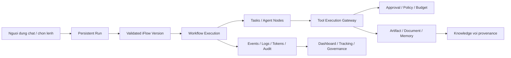
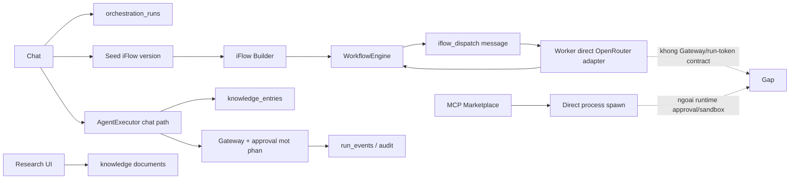
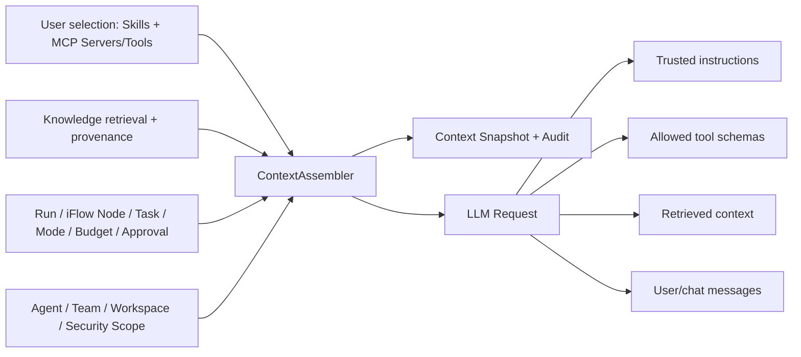
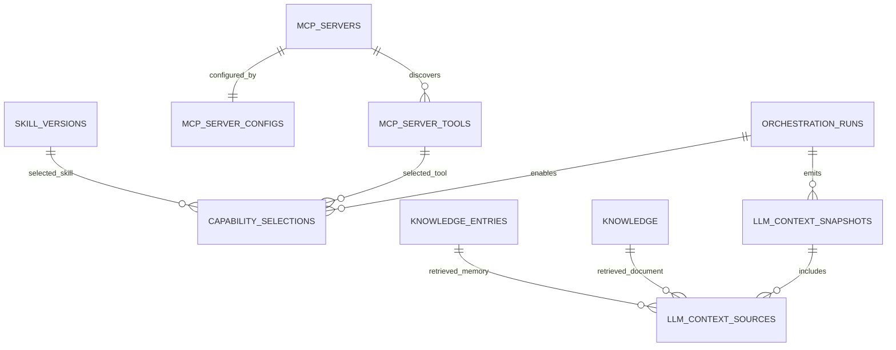
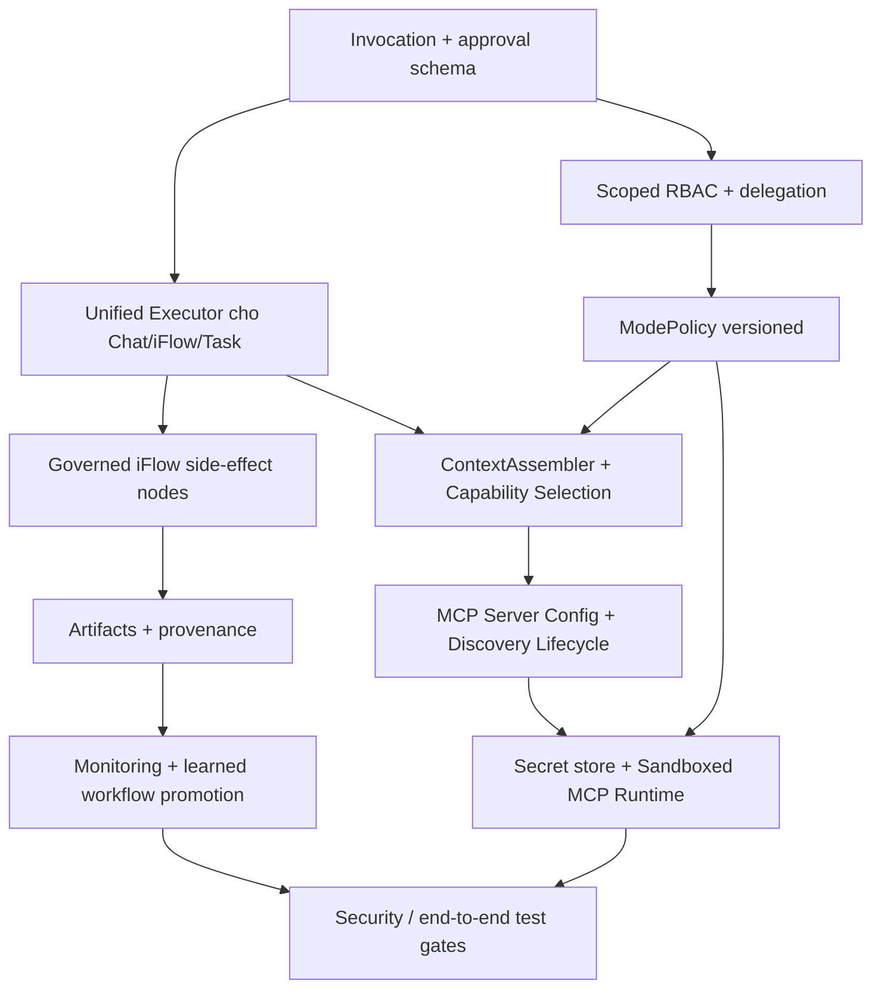
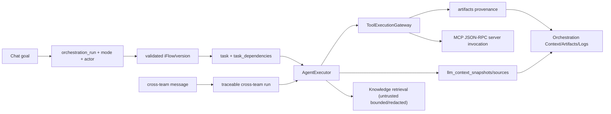

# AgentForge UI - Danh gia lai muc do hoan thien he thong va doi chieu spec

**Ngay danh gia:** 2026-05-26
**Pham vi:** `agentforge-ui/src`, `report/system_completion_implementation_spec_2026-05-25.md`, cac bao cao audit truoc va cac man hinh nguoi dung da cung cap.
**Muc tieu:** kiem tra cac phase da duoc thuc hien den dau, danh gia lai logic chuc nang, lien ket module/database va kha nang dap ung nghiep vu cua IDE mong muon.
**Nguyen tac danh gia:** mot tinh nang chi duoc coi la hoan thanh khi co duong thuc thi end-to-end, persistence ro rang, hien thi dung su that va co co che kiem soat phu hop; viec chi co bang DB, model hoac UI khong du de ket luan da hoan thien.

---

## 1. Ket luan dieu hanh

**Ket luan chinh: du an chua hoan hao va chua san sang de coi la mot IDE autonomous/governed hoan chinh.**

So voi audit ngay 2026-05-25, source hien tai da co tien bo ro:

| Phan da cai thien | Trang thai xac minh tu source |
|---|---|
| Run va timeline dung chung | Co `orchestration_runs`, `run_events`; chat tao run va UI orchestration doc cac record nay. |
| Mode khong con chi la state cuc bo cua panel | Mode duoc doc/ghi qua `ModeManager` chung va `app_settings`; transition duoc audit. |
| Knowledge documents va memories da duoc cung hien thi | `KnowledgeService::get_all_records()` hop nhat `knowledge` va `knowledge_entries`; UI co loc Document/Memory va provenance. |
| iFlow co version/execution persistence va duong mo tu run | Co `workflow_versions`, `workflow_executions`, selected run va view iFlow. |
| Runtime tool co gate co ban | `ToolExecutionGateway` buoc agent tool phai gan run, kiem tra actor va yeu cau approval cho nhom sensitive. |
| Context cho LLM co retrieval khoi dau | `AgentExecutor` da tim `knowledge_entries`, `knowledge` va chunk semantic de chen vao system message; day la nen tang, chua phai context contract day du. |
| Phase 5 MCP/Skill context foundation | Co `mcp_servers`, `capability_selections`, `llm_context_snapshots`, `llm_context_sources`; `AgentExecutor` chi expose MCP/skill da chon tren duong chay cua no. |

Tuy nhien, mot so hop dong trung tam van chua dung voi muc tieu san pham:

| Muc do | Ket luan |
|---|---|
| P0 | Approval chua luu mot lenh cho thuc thi tiep; no chi phe duyet hash cua payload va retry lai task/LLM. Khong the dam bao hanh dong duoc thuc hien sau approval chinh la hanh dong nguoi dung da duyet. |
| P0 | Chat, iFlow va runtime execution chua co mot execution spine duy nhat. Chat tao iFlow nhung tra loi chat chay ngoai engine; AgentTask chay tu iFlow lai bo qua `AgentExecutor`, gateway va token/run instrumentation. |
| P1 | iFlow van hien thi node `System Command`/`HTTP Request`, validator chan node vi gateway chua noi vao engine, trong khi engine con code chay command/HTTP truc tiep neu node duoc dua vao execution. |
| P1 | `Autonomous`, `Supervision`, `Human Interaction` moi la mode persisted/label va mot phan audit; gateway khong co policy hanh vi khac nhau theo mode. |
| P1 | RBAC moi chi bootstrap mot actor cuc bo co quyen `all`; chua co danh tinh nguoi dung, pham vi team/instance, UI quan tri security role, hay delegation scope cho agent. |
| P1 | Phase 5 moi enforce MCP/Skill selection trong `AgentExecutor`; iFlow `execute_iflow_task` van goi provider truc tiep nen khong inject selection/context va khong tao snapshot. |
| P1 | Context snapshot moi ghi mot lan moi `execute_task`, khong ghi tung LLM request sau tool result; khong co API doc/UI inspector va loi insert bi bo qua. |
| P1 | MCP UI da co server/config/toggle va bo nut Run, nhung chua co protocol discovery/refresh/invocation; `McpServer` van la placeholder spawn/dummy response. |
| P1 | MCP config chan credential trong `env`/mot so headers nhung van co the luu raw secret trong `args` hoac query cua `serverUrl`; secret boundary chua day du. |
| P1 | Secret van duoc luu/nhap bang settings hoac `provider_configs.api_key_ref`; keychain la in-memory mock. |
| P1 | Panel Monitoring/Usage Analytics van chua phan anh day du runtime that; mot so hien thi con placeholder/tinh. |
| P2 | `task_dependencies`, artifact provenance, promotion cua learned workflow va cac service mock con chua hoan tat. |
| P2 | Mot so test target Phase 5 da chay thanh cong, nhung full regression/unit suite chua duoc xac nhan va `cargo fmt --all -- --check` van fail tren cac file source khac. |

**Release verdict:** co the tiep tuc dung source hien tai lam nen tang phat trien; khong nen goi he thong la hoan thien, khong nen bat autonomous cho cong viec co side effect quan trong truoc khi dong cac P0/P1 ben duoi.

---

## 2. Findings uu tien

### P0-01 - Approval khong phai durable continuation cua thao tac da duyet

**Van de**

Gateway tao approval theo chuoi `tool:<name>:<sha256(payload)>:mode=<mode>`, nhung record approval khong luu `task_id`, `tool payload` da redact/co cau truc, execution checkpoint hay mot pending invocation co the replay. Khi phe duyet, UI cap nhat tat ca task `waiting_approval` trong cung `run_id` thanh `pending`; worker se goi lai LLM va de LLM sinh lai tool call.

**Bang chung source**

| File | Dong | Bang chung |
|---|---:|---|
| `src/application/orchestration/tool_gateway.rs` | 108-157, 280-286 | Approval duoc tim/tao theo operation hash tu payload; khong persist pending invocation. |
| `src/core/models/orchestration.rs` | 27-38 | `ApprovalRequestRecord` chi co run, operation, status va decision metadata. |
| `src/infrastructure/database/sqlite_adapter.rs` | 418-428, 2876-2987 | Bang va CRUD approval khong co task/payload/replay state. |
| `src/application/orchestration/executor.rs` | 604-641, 786-803 | Executor tra ve chuoi `"Approval required..."` va dung luong dang chay. |
| `src/application/orchestration/worker.rs` | 458-471 | Task bi danh dau `waiting_approval`; khi chay lai se thuc thi lai task. |
| `src/ui/panels/orchestration.rs` | 545-609 | Approve/reject cap nhat moi task dang cho cua cung run, khong phai task/operation cu the. |
| `src/infrastructure/database/sqlite_adapter.rs` | 1644-1654 | SQL `UPDATE tasks ... WHERE run_id = ? AND status = 'waiting_approval'`. |

**Tac dong nghiep vu**

1. Agent de nghi ghi file `A` va bi dung de duyet.
2. Nguoi dung approve yeu cau cho file `A`.
3. Task duoc khoi dong lai, LLM co the sinh file `B`, noi dung moi, hoac khong sinh tool call cu.
4. Neu payload moi khac hash, he thong yeu cau duyet lai; neu luong ket thuc khac, phe duyet cu khong bao dam co tac dung nhu mong muon.

Neu mot run co nhieu task dang cho cac operation khac nhau, approve mot request co the lam nhieu task cung duoc retry. Day la sai pham vi phe duyet.

**Yeu cau sua**

- Tao entity `pending_tool_invocations` gan `approval_request_id`, `run_id`, `task_id`, `agent_id`, `tool_name`, `risk`, `payload_redacted_summary`, encrypted/sealed payload can thi hanh va checkpoint.
- Approval chi resume dung invocation/task duoc duyet; khong `UPDATE` hang loat theo run.
- UI Governance phai hien thi summary an toan nhung du thong tin: tool, target path/host/command class, instance, delegated agent, expected side effect.
- Dinh nghia continuation cho ca task queue va live chat; khong dung chuoi text de bao hieu state machine.

### P0-02 - Chat -> iFlow -> Execution khong phai mot luong thuc thi duy nhat

**Van de**

Muc tieu san pham la khi nguoi dung chat, he thong tao iFlow de xem va theo doi execution. Hien tai chat tao mot `Start -> AgentTask -> End` workflow co lien ket run, nhung sau do chat van chay `AgentExecutor` truc tiep ngoai `WorkflowEngine`. Khi nguoi dung bam chay mot iFlow, worker xu ly `iflow_dispatch` bang adapter truc tiep, khong dung `AgentExecutor`.

**Bang chung source**

| File | Dong | Bang chung |
|---|---:|---|
| `src/ui/panels/team_workspace/chat.rs` | 2162-2226 | Moi chat tao run va seed mot iFlow version. |
| `src/ui/panels/team_workspace/chat.rs` | 2633-3546, dac biet 2849-2889 | Luong tra loi chat khoi tao `AgentExecutor` truc tiep, khong start iFlow vua seed. |
| `src/ui/panels/iflow_builder.rs` | 446-497 | iFlow chi chay khi nguoi dung tu bam execution trong builder. |
| `src/application/iflow_engine/engine.rs` | 437-483 | Node `AgentTask` dispatch tin nhan sang worker. |
| `src/application/orchestration/worker.rs` | 995-1108 | `execute_iflow_task` dung rieng `OpenRouterAdapter`, khong tao `AgentExecutor`, khong truyen `run_id`, khong goi gateway, khong ghi token usage. |

**Tac dong nghiep vu**

| Ky vong nguoi dung | Runtime hien tai |
|---|---|
| iFlow la ban do cua chinh viec chat dang thuc hien | iFlow seed la ban mo ta song song; chat response da chay ngoai flow. |
| Node iFlow va chat co cung tool/policy/approval/log | Node AgentTask iFlow khong co tool gateway hoac run-aware executor. |
| Orchestration co the theo doi mot execution thong nhat | Mot run co the co chat execution va mot iFlow execution rieng voi hanh vi khac nhau. |

**Yeu cau sua**

- Chon mot trong hai contract ro rang: chat request la trigger cua iFlow execution, hoac iFlow chi la plan va UI phai ghi ro chua chay.
- Cho `AgentTask` iFlow tao task/run-bound work item va chay qua cung `AgentExecutor`/gateway/token/event path nhu chat va queue.
- Truyen `run_id`, `session_id`, `workflow_execution_id`, `node_id` vao task/executor; ghi su kien lien ket node -> task -> tool -> approval -> artifact.
- Khong hardcode `OpenRouterAdapter` trong worker iFlow; dung provider factory cung contract voi cac luong con lai.

### P1-03 - iFlow side-effect node vua khong dung duoc vua con duong thuc thi khong governed

**Van de**

Builder van cho nguoi dung them `System Command` va `HTTP Request`. Validator tu choi chung voi thong bao rang gateway chua duoc trien khai, du Phase 4 da co gateway o executor. Trong `WorkflowEngine`, hai node nay van co code thuc thi raw `bash -lc` va `reqwest` truc tiep, khong qua gateway.

**Bang chung source**

| File | Dong | Bang chung |
|---|---:|---|
| `src/ui/panels/iflow_builder.rs` | 383-424 | Palette tao duoc `System Command` va `HTTP Request`. |
| `src/application/iflow_engine/engine.rs` | 134-144 | Validation cam node vi governed gateway chua noi vao engine. |
| `src/application/iflow_engine/engine.rs` | 485-541 | Runtime implementation van co kha nang chay `bash` va HTTP truc tiep. |

**Tac dong**

- UI chao moi mot kha nang ma nguoi dung khong the luu/chay hop le.
- Phase 4 chua bao phu iFlow; neu trong tuong lai bo validation ma khong doi executor, side effect se vuot approval/workspace/audit.
- Tren Windows, raw `bash` con khong phu hop voi moi truong mac dinh.

**Yeu cau sua**

- Hoac an/loai hai node khoi UI cho den khi co implementation governed.
- Hoac chuyen node sang `ToolInvocationNode`/`HttpActionNode` chay qua gateway voi invocation persistence, approval va output artifact.
- Xoa duong thuc thi raw trong engine sau khi co gateway path duy nhat.

### P1-04 - Operating mode duoc persist nhung chua la policy nghiep vu

**Van de**

Loi UI cu ve mode luon hien Human da duoc khac phuc o muc state persistence. Tuy nhien, mode chua quyet dinh hanh vi. `ModeManager` cho phep moi transition; gateway chi chen mode vao operation hash, khong thay doi rule approval/allow/deny theo mode.

**Bang chung source**

| File | Dong | Bang chung |
|---|---:|---|
| `src/application/orchestration/modes.rs` | 14-38, 67-89 | Luu/doi mode dung; transition rules hien de trong va cho phep moi thay doi. |
| `src/lib.rs` | 129-139 | Mode duoc tai tu DB khi khoi dong. |
| `src/ui/panels/orchestration.rs` | 705-910 | UI chuyen mode va ghi history/audit. |
| `src/application/orchestration/tool_gateway.rs` | 44-55, 103-166, 280-286 | Risk/decision khong branch theo `OperatingMode`; mode chi nam trong approval key. |

**Tac dong**

`Autonomous` khong co nghia nghiep vu ro hon `Human Interaction`: `save_to_knowledge`, `create_subtasks`, `handoff_to_team` la controlled mutation va duoc phep nhu nhau; moi sensitive action lai yeu cau approval nhu nhau. Nguoi dung thay mode da doi nhung khong the biet he thong tu chu hon o dau, bi chan o dau hay co gioi han nao khac.

**Yeu cau sua**

- Tao `ModePolicy` persisted/versioned theo instance/run, quy dinh risk matrix va approval threshold.
- Dinh nghia ro: Human = user-triggered only; Supervision = agent co the chay low/medium, sensitive can approve; Autonomous = policy allowlist + budget + rollback + escalation.
- Snapshot policy version trong run va giai thich decision tren Governance.

### P1-05 - RBAC la skeleton local owner, chua phai authorization theo nguoi dung/agent/team

**Van de**

Schema security moi tach khoi routing roles la huong dung, nhung runtime chi tao `local-user` va gan `Owner -> all` khi app khoi dong. `delegated_agent_id` duoc truyen vao gateway nhung khong tham gia quyet dinh. Khong tim thay UI/application service de quan tri `security_roles`, gan quyen cho actor khac hoac gioi han theo instance.

**Bang chung source**

| File | Dong | Bang chung |
|---|---:|---|
| `src/infrastructure/database/sqlite_adapter.rs` | 104-142 | Hai he role ton tai: `roles` nghiep vu va bo `security_*`. |
| `src/lib.rs` | 103-111 | Moi app start deu bootstrap actor `local-user`. |
| `src/infrastructure/database/sqlite_adapter.rs` | 3141-3189 | Actor local duoc gan quyen `all`; check permission chi doc joins, khong co scope. |
| `src/application/orchestration/tool_gateway.rs` | 18-25, 78-101, 295-303 | Gateway authorize theo initiating actor; `delegated_agent_id` chi di vao audit text. |

**Tac dong**

- Moi thao tac trong desktop deu mang quyen owner, khong co phan biet nguoi phe duyet, nguoi chay, agent duoc uy quyen.
- Routing role cua team khong giai thich duoc security permission; nguoi dung van khong co cach khai bao role security moi hay dung role do vao business flow.
- Cam ket trong spec “initiating member plus delegated agent scope” chua duoc dat.

**Yeu cau sua**

- Xac dinh actor model: local single-user hay multi-user; neu local van can named profiles va least privilege.
- Them CRUD va assignment cho security role/permission, scope theo workspace/instance/tool/risk.
- Tao delegation grant gan run: initiating actor, delegated agent, allowed capabilities, budget va thoi han.
- UI phai tach ro “Routing role” (phan cong agent) va “Security role” (quyen thuc thi/phe duyet).

### P1-06 - MCP co hai duong chay khac muc bao ve

**Van de**

Runtime agent goi MCP qua `AgentExecutor` se qua gateway va sensitive approval. Nhung nguoi dung bam Run tren MCP Marketplace thi code chi goi `can_execute_interactively`, sau do spawn process truc tiep. Khong co run context, approval request, workspace boundary hoac OS sandbox.

**Bang chung source**

| File | Dong | Bang chung |
|---|---:|---|
| `src/application/orchestration/tool_gateway.rs` | 44-47, 108-157 | MCP runtime duoc xep Sensitive va yeu cau approval. |
| `src/infrastructure/mcp/registry.rs` | 21-63 | Middleware interactive chi kiem tra actor permission. |
| `src/ui/panels/mcp_marketplace.rs` | 45-113 | UI spawn `std::process::Command` ngay sau interactive permission. |
| `src/infrastructure/mcp/server.rs` | 33-82 | MCP protocol server van placeholder/mock, khong phai sandboxed protocol runtime. |

**Tac dong**

Quyen UI va quyen agent da cung dung actor, nhung security property khong cung nhau. Mot tool duoc bam boi user van co the chay process co side effect ngoai audit/approval/sandbox cua run. Day khong phu hop voi cam ket “all side-effect boundaries”.

**Yeu cau sua**

- Dua ca invocation tu Marketplace vao mot `interactive_run` hoac `manual_tool_invocation` co cung gateway va audit model.
- Them sandbox/process isolation, cwd allowlist, timeout, environment/secret filtering va output limit.
- MCP Registry chi quan ly catalog; execution phai di qua mot executor duy nhat.

### P1-07 - Cross-team collaboration khong con theo dung contract tool/gateway

**Van de**

Prompt cho agent review bat buoc goi `handoff_to_team`, nhung hai executor xu ly cross-team trong worker duoc tao voi `run_id = None`. Gateway tu choi moi tool khong gan run truoc khi xet risk. Sau do worker van tu gui reply bang `TeamMessage` ngoai tool gateway neu LLM tra ve text.

**Bang chung source**

| File | Dong | Bang chung |
|---|---:|---|
| `src/application/services/chat_service.rs` | 89-93 | Protocol yeu cau goi `handoff_to_team`. |
| `src/application/orchestration/worker.rs` | 595-604, 690-730 | Review prompt yeu cau tool; executor khong co run; worker tu route reply. |
| `src/application/orchestration/worker.rs` | 903-930 | Message-handler executor cung khong co run. |
| `src/application/orchestration/tool_gateway.rs` | 57-64 | Tool khong co run bi deny. |

**Tac dong**

- Agent khong the tuan thu protocol ma prompt yeu cau.
- Cross-team reply duoc thuc hien bang duong side effect rieng, khong co cung run/policy/audit voi tool.
- Case event, conversation va tool audit khong the tao mot chain giai thich thong nhat.

**Yeu cau sua**

- Moi cross-team case/request phai co parent run hoac tao child run co delegation.
- Route handoff qua service/gateway thong nhat, khong vua yeu cau agent tool vua tu gui message ben ngoai tool.
- Gan `correlation_id`, run, event, approval va actor vao cung mot contract.

### P1-08 - Secret storage khong dat gate cua governed autonomy

**Van de**

Spec da ghi day la residual work va source xac nhan ro: provider UI gan noi dung API key vao `api_key_ref`; output tool settings luu token trong `app_settings`; `Keychain` chi la `HashMap` trong bo nho.

**Bang chung source**

| File | Dong | Bang chung |
|---|---:|---|
| `src/ui/panels/custom_provider.rs` | 96-145 | Input key duoc gan truc tiep vao `Provider.api_key_ref` va insert DB. |
| `src/ui/panels/settings.rs` | 190-257 | Output API key duoc doc/ghi bang setting thong thuong. |
| `src/application/output_tools.rs` | 29-136, 209-214 | Runtime lay key tu setting/env de gui bearer. |
| `src/infrastructure/security/keychain.rs` | 5-39 | Keychain la in-memory mock, khong OS-backed, khong persistent secure storage. |

**Tac dong**

Database/settings backup, debug dump hoac bat ky truy cap file local nao co the de lo credential. Autonomous khong duoc xem la production-ready trong khi secret boundary chua co.

**Yeu cau sua**

- Dung OS credential store; DB chi luu opaque secret reference.
- Migrate va xoa secret raw cu co kiem tra/bao cao.
- Mask UI, redaction audit, khong dua secret vao prompt/log/event.

### P1-09 - Monitoring va mot so operational surface van khong truthful

**Van de**

Orchestration Dashboard/Tracking/Logs da doc DB thuc. Tuy nhien Monitoring la panel truy cap duoc tu shell va default tab `System Health` tao cac vector rong, comment ro la mock. Usage Analytics hien thi chi so bien thien va thoi gian co dinh khong tinh tu database.

**Bang chung source**

| File | Dong | Bang chung |
|---|---:|---|
| `src/ui/panels/orchestration.rs` | 89-475 | Dashboard, Tracking, Logs da query DB/runtime record. |
| `src/ui/panels/monitoring.rs` | 25-41, 136-148 | Monitoring panel expose `System Health` va `Usage Analytics`. |
| `src/ui/panels/monitoring/dashboard.rs` | 12-36 | Dashboard state ghi ro mock/demo va hien vector rong. |
| `src/infrastructure/monitoring/usage_analytics.rs` | 18-29, 87-124 | Lay hai count DB nhung hien `+12%`, `4m 12s`, `-5%` la noi dung tinh. |
| `src/ui/panels/monitoring/token_dashboard.rs` | 20-43, 176-199 | Token tab doc DB that, nhung chi phi thang van placeholder. |

**Tac dong**

Release gate Phase 0 “visible panels no longer report fabricated operational state” chua dat tren toan bo ung dung. Nguoi van hanh khong phan biet chi so nao la that va chi so nao la minh hoa.

**Yeu cau sua**

- Loai bo chi so tinh hoac ghi ro empty/not available; tot hon la tao projection tu `run_events`, `tasks`, `token_usage`, `approval_requests`.
- Dung cung run filter/time range tren Orchestration va Monitoring.

### P1-10 - Context injection cho LLM chua theo lua chon MCP/Skill va run context duoc govern

**Yeu cau nghiep vu bo sung**

Khi nguoi dung chon MCP server/tool hoac Skill cho mot chat/run, chi cac kha nang da chon va duoc policy cho phep moi duoc chen vao request gui LLM. Request cung can dung dung context lien quan tu Knowledge, Orchestration, Session/iFlow, agent/team va policy thay vi cac module dung tach roi.

**Trang thai hien tai tu source**

| Noi dung | Trang thai | Bang chung |
|---|---|---|
| Chen knowledge vao LLM | Co co ban | `src/application/orchestration/executor.rs:401-467` tim memory tu `knowledge_entries`, document tu `knowledge`, semantic chunk va noi vao system injection. |
| Chen MCP tool schema | Co nhung qua rong | `src/application/orchestration/executor.rs:382-398, 488-506` lay `mcp_registry.list_tools()` va chen toan bo schema vao system message. |
| Loc MCP theo lua chon/enable/scope cua run | Khong | `src/infrastructure/mcp/registry.rs:75-89` chi list tool; `src/infrastructure/database/sqlite_adapter.rs:3232-3256` list moi record, khong filter `is_active`, server, user, session hay run. |
| Chen Skill duoc nguoi dung chon | Khong | `src/application/orchestration/executor.rs:471-490` khoi tao moi registry va chen metadata cua tat ca 9 built-in skills. |
| UI selected skill noi toi execution | Khong | `src/ui/panels/session.rs:30-76, 113-210` `selected_skill_id` chi chon learned workflow de xem trong panel; khong ghi binding cho chat/run va khong duoc executor doc. |
| Chen orchestration/policy snapshot vao prompt | Chua thanh contract | Executor co `run_id` de log/budget va chat co dynamic team prompt, nhung khong co mot `ContextAssembly` record gom mode, flow/node, approvals, budget, selected capabilities va provenance. |

**Van de logic**

- Context retrieval hien dang la noi chuoi truc tiep vao system message. Khong co ban ghi biet request da su dung record knowledge nao, tool/skill nao, token budget nao hay tai sao record duoc chon.
- Danh sach tool/skill duoc expose cho LLM rong hon lua chon cua nguoi dung. Dieu nay vua lam context nhieu, vua pha ky vong ve permission/capability scope.
- `AVAILABLE SKILLS` chi la metadata mo ta, khong phai instruction, execution binding hay tool contract cua skill da chon. UI co khai niem learned automation khac voi built-in SkillRegistry nhung khong co domain contract noi hai ben.
- Orchestration dang biet run/mode/task/approval o nhieu bang, nhung LLM request khong co context pack versioned de tai lap hoac audit quyet dinh cua agent.

**Kien truc can bo sung**

- Tao `ContextAssembler` duy nhat truoc moi LLM call, nhan `run_id`, `session_id`, `agent_id`, current workflow/node/task, mode/policy, selected skills, selected MCP capabilities va retrieval query.
- Phan tach `instructions` tin cay (system, mode policy, skill instruction da duyet), `tool schemas` (chi tool enabled/allowed), `retrieved context` (knowledge/provenance) va `user content` (khong tin cay).
- Luu `llm_context_snapshots` hoac entity tuong duong: input sources, record ids/hash, selection ids, token budget, redaction result, prompt/template version va invocation/run.
- Bat buoc token budgeting, ranking/dedupe, sanitization va prompt-injection boundary cho knowledge/tool output truoc khi chen vao model.

### P1-11 - MCP Marketplace chua la MCP Server Catalog/Configuration va lifecycle runtime

**Yeu cau nghiep vu bo sung tu giao dien tham chieu**

Nguoi dung can thay `Installed MCP Servers`, bat/tat tung server, xem cac tool da discover, them server tu catalog ben ngoai hoac mo config de khai bao server. Config can ho tro it nhat server local qua `command`, `args`, secret-backed `env` va server remote qua endpoint URL, secret-backed headers/auth.

**Trang thai hien tai tu source**

| Kha nang | Trang thai hien tai | Bang chung |
|---|---|---|
| Persistent server installation/config | Khong co | Schema chi co `mcp_tools` voi `command`, `args`, `input_schema`, `is_active` tai `src/infrastructure/database/sqlite_adapter.rs:335-345`. |
| Server -> discovered tools relationship | Khong co | `McpTool` khong co `server_id`, transport, source hoac install state tai `src/infrastructure/mcp/registry.rs:8-19`. |
| Built-in team tool registration | Global/flat | Startup tu dong ghi 5 tool vao registry tai `src/lib.rs:116-119` va `src/infrastructure/mcp/tools.rs:3-64`. |
| Install/config/catalog UI | Khong co | `src/ui/panels/mcp_marketplace.rs:137-258` chi render `Available MCP Tools` va dialog Run voi payload. |
| MCP protocol lifecycle/discovery | Placeholder | `src/infrastructure/mcp/server.rs:33-82` spawn process, dang ky dummy tool va tra mock success; khong initialize/listTools/callTool lifecycle. |
| Invocation governance | Tach doi | Agent MCP qua gateway; button Run spawn truc tiep tai `src/ui/panels/mcp_marketplace.rs:45-113`. |

**Mo hinh can co**

| Thanh phan | Trach nhiem toi thieu |
|---|---|
| MCP Server Catalog | Metadata nguon/cap nhat; server co the install tu catalog/package hoac them config thu cong. |
| MCP Installation | Cau hinh theo workspace/profile; enabled state; transport `stdio` hoac remote; health, last error, tool discovery timestamp. |
| MCP Configuration | `command`/`args` cho local; endpoint/transport cho remote; `env` va header chi luu secret references, khong luu token raw. |
| MCP Discovered Tool | Tool gan `server_id`, schema/version/hash va enable state; refresh khi server thay doi. |
| Run Capability Selection | Binding user chon server/tool cho session/run/agent; executor chi expose tool duoc chon, enabled va duoc policy cho phep. |
| MCP Runtime Gateway | Khoi tao protocol, invoke/cancel/timeout, approval, sandbox, audit, redaction va artifact/provenance qua mot duong duy nhat. |

### P2-10 - Database van co hop dong chua hoan tat: dependencies va artifacts

**Van de**

Task scheduler van doc dependency tu JSON payload; `task_dependencies` chi la helper tach roi, khong nam trong schema initialization cua adapter va khong duoc worker dung. Output/artifact khong co entity rieng gan run/tool/provenance.

**Bang chung source**

| File | Dong | Bang chung |
|---|---:|---|
| `src/infrastructure/database/sqlite_adapter.rs` | 71-462 | Schema chinh khong tao `task_dependencies` hay `artifacts`. |
| `src/application/tasks/dependency.rs` | 12-68 | Helper co SQL bang rieng nhung khong tim thay runtime wiring. |
| `src/application/orchestration/core.rs` | 81-150, 319-350 | Dependency model van la `DagTask.dependencies`. |
| `src/application/orchestration/worker.rs` | 289-313 | Worker parse dependency tu `task.payload`. |
| `src/application/output_tools.rs` | 29-136, 323-334 | Output tra ve path/file nhung khong persist artifact provenance. |

**Tac dong**

- Khong query on dinh duoc DAG, blocked reason, dependency audit hay migration.
- File/video/document sinh ra khong the truy vet day du ve tool call, approval, run, provider va knowledge record.

**Yeu cau sua**

- Migrate dependency sang normalized table va de JSON payload chi la input/display.
- Tao `artifacts` + `artifact_events`/link toi run, invocation, knowledge; ingest artifact co chu dich vao Knowledge.

### P2-11 - Knowledge da hop nhat view, nhung chua hop nhat toan bo provenance lifecycle

**Phan da dung**

| Kha nang | Bang chung |
|---|---|
| UI hien document va agent memory | `src/application/services/knowledge_service.rs:22-51`; `src/ui/panels/knowledge.rs:381-399, 1211-1233`. |
| Document co source/hash/run/session fields | `src/infrastructure/database/sqlite_adapter.rs:264-278`; `src/core/models/knowledge.rs:35-53`. |
| Agent RAG doc ca memory va document | `src/application/orchestration/executor.rs:400-450`. |
| FTS update thuc hien trong transaction upsert | `src/infrastructure/database/sqlite_adapter.rs:2086-2147, 3262-3305`. |

**Phan chua dat**

| Gap | Bang chung va y nghia |
|---|---|
| Artifact khong phai `KnowledgeRecordKind` | Enum chi co `Document`, `Memory` tai `src/core/models/knowledge.rs:16-20`. |
| Save tu Research UI khong gan run/session | `src/ui/panels/research_notebook.rs:312-370` va `src/application/research/web.rs:180-216` tao document theo source nhung khong co execution provenance. |
| Learned workflow promotion chua co | `src/infrastructure/mcp/action_recorder.rs:93-112` chi luu `learned`/`review_required`; khong co approval/promotion thanh active run. |
| Semantic search module legacy van mock | `src/application/knowledge/search.rs:12-54` dung embedding co dinh; can lam ro module nay co bi UI/runtime dung hay nen loai bo. |

### P2-12 - Cac placeholder/mock con ton tai o module co ten chuc nang san pham

| Module | Evidence | Danh gia |
|---|---|---|
| Research synthesis | `src/application/research/synthesis.rs:34-46` | Tra summary mau, khong synthesis thuc. |
| Knowledge token summarize | `src/application/knowledge/tokens.rs:103-146` | Dem token va summarize xap xi/mock. |
| Marketplace catalog/install/security | `src/application/marketplace_service/core.rs:15-55`, `security.rs:33-55` | Chua phai marketplace/security scanner thuc. |
| MCP server protocol | `src/infrastructure/mcp/server.rs:33-82` | Spawn + dummy tool/mock invocation, khong JSON-RPC lifecycle hoan chinh. |
| Message encryption | `src/infrastructure/message_bus/security.rs:15-75` | Dao chuoi, khong phai bao mat du lieu. |

Neu cac module nay chua duoc exposure trong UX chinh, co the danh dau experimental va loai khoi completion claim. Neu co expose, phai hoan tat hoac an khoi product surface.

### P2-13 - Test gate khong san sang cho release

Tai thoi diem audit ban dau, `cargo test --lib` bi chan boi cau hinh test GPUI va dependency `indoc`. Phan cap nhat Section 12-13 da sua test-support/null-byte source va xac minh ba target Phase 5 rieng le; full unit/regression suite van chua co ket qua pass.

**Yeu cau sua**

- Sua test harness/dependency truoc khi chap nhan cac phase la complete.
- Them integration tests cho invocation approval replay, mode policy, chat-to-iFlow execution, knowledge provenance, MCP denial va workspace escapes.

---

## 3. Doi chieu cac phase trong spec

### 3.1 Cac residual ma spec da tu ghi nhan

Tai `report/system_completion_implementation_spec_2026-05-25.md:138-145`, Phase 4 da ghi nhan bon muc con mo:

| Residual trong spec | Trang thai audit lai | Ket luan |
|---|---|---|
| Secret storage | Xac nhan chua lam; key luu DB/settings, keychain mock. | Bat buoc lam truoc production autonomy. |
| Interactive chat approval continuation | Xac nhan chua lam. Audit mo rong: queue retry cung chua dam bao thi hanh dung invocation da duyet. | Gap lon hon mo ta trong spec. |
| External MCP process sandbox | Xac nhan chua lam; direct UI spawn con khong qua approval. | Gap lon hon mo ta trong spec. |
| Artifact provenance entity | Xac nhan chua lam; output va research khong thanh artifact lifecycle. | Bat buoc cho traceability. |
| User-selected MCP/Skill context injection | Chua nam trong spec cu; audit bo sung xac nhan executor inject tat ca MCP tool/skill metadata. | Can bo sung vao release gate truoc khi goi autonomous la governed. |
| MCP server install/config/discovery lifecycle | Chua nam trong spec cu; hien chi co `mcp_tools` flat va placeholder server. | Can tach thanh work package rieng. |

Tai `report/system_completion_implementation_spec_2026-05-25.md:85-94`, con mot muc da ro rang de mo:

| Residual trong spec | Trang thai audit lai |
|---|---|
| Normalized `task_dependencies` va scheduler migration | Van chua lam; runtime doc `DagTask.dependencies` trong payload JSON. |

Tai `report/system_completion_implementation_spec_2026-05-25.md:122`, spec cung ghi:

| Residual trong spec | Trang thai audit lai |
|---|---|
| Promote learned draft thanh executable governed run | Van chua co duong promotion/approval/activation. |

### 3.2 Cac claim “Implemented” can ha muc sau khi doc source

| Phase / claim trong spec | Claim hien tai | Trang thai thuc te | Ly do |
|---|---|---|---|
| Phase 0 - visible panels no fabricated operational state | Release gate | **Partial** | Orchestration da doc DB, nhung Monitoring/Usage Analytics con placeholder/tinh. |
| Phase 1 - run/event/mode/approval storage | Implemented | **Implemented ve schema/projection** | Run, event, transition, approvals da co persistence. |
| Phase 1 - chat traced through logs/cost/mode | Release gate | **Partial** | Chat co run; artifact va iFlow execution authority chua thong nhat. |
| Phase 2 - Chat to iFlow trace | Implemented | **Implemented ve lien ket/visual seed** | Chat tao workflow version gan run va mo duoc builder. |
| Phase 2 - iFlow la execution surface cua run | Muc tieu phase | **Chua dat** | Chat van chay ngoai iFlow; iFlow AgentTask chay qua adapter rieng bo qua gateway/token. |
| Phase 2 - runtime completion resume | Implemented | **Co state resume co ban, nhung execution semantics chua dong nhat** | Engine co fallback tai state tu DB; tuy nhien worker path khong cung executor contract. |
| Phase 2 - interim side-effect control cho den khi gateway co | Implemented safety boundary | **Can trien khai tiep** | Gateway da ton tai nhung iFlow van chan node, va code raw execution van nam trong engine. |
| Phase 3 - unified Knowledge projection | Implemented | **Implemented cho Document/Memory** | UI doc hai store va hien provenance. |
| Phase 3 - outputs/memories traceable and reusable | Release gate | **Partial** | Memories co run/session; artifacts va research run provenance chua co. |
| Phase 4 - run-scoped delegation | Implemented | **Partial** | Run co initiating actor; delegated agent khong duoc authorize theo scope. |
| Phase 4 - Tool Execution Gateway | Implemented | **Partial** | AgentExecutor di qua gateway; iFlow worker, cross-team side effect va MCP interactive khong cung boundary. |
| Phase 4 - sensitive approvals | Implemented | **Partial/unsafe continuation** | Co stop va request, nhung approve khong replay invocation chinh xac. |
| Phase 4 - queue continuation | Implemented | **Khong dat semantics phe duyet** | Retry all waiting tasks trong run, khong tiep tuc exact invocation. |
| Phase 4 - governed autonomy release gate | Muc tieu phase | **Chua dat** | Mode policy, secret, sandbox, invocation continuation, RBAC scope, selected capability/context injection, MCP server lifecycle va test con thieu. |

### 3.3 Ma tran phase tong the

| Phase | Phan da co gia tri that | Phan chua xong / can sua | Danh gia |
|---|---|---|---|
| Phase 0 - Integrity / truthful UI | Mode shared state; Orchestration DB projection; Knowledge projection/dedupe path; FTS transaction updates. | Monitoring placeholders; legacy/mock modules van co product-like surface. | Partial, khong dat toan bo release gate. |
| Phase 1 - Execution spine | Run, event, approval, mode transition, token/run and task/run columns. | Dependency normalized; artifact trace; approval invocation contract. | Nen tang tot, chua complete. |
| Phase 2 - iFlow lifecycle | Flow version/execution schema; Chat seed flow; navigation; state persist/load. | Chat khong execute thong qua flow; iFlow worker bo gateway/provider factory; side-effect nodes chua governed. | Partial, can sua kien truc execution. |
| Phase 3 - Knowledge / learned automation | Unified document/memory UI; provenance co ban; FTS; learned draft separation. | Artifact; research run provenance; learned promotion; legacy semantic/mock paths. | Partial. |
| Phase 4 - Governed autonomy | Gateway cho AgentExecutor; workspace path bound; actor skeleton; approval state; mode persistence/audit; knowledge retrieval injection co ban. | Exact continuation, scoped RBAC/delegation, mode policy, context snapshot/selected MCP-Skill injection, MCP server lifecycle, secret store, sandbox, gateway coverage, test gates. | Chua hoan thanh. |

---

## 4. Phan tich luong chuc nang thuc te

### 4.1 Luong san pham ky vong

### 4.2 Luong hien tai tu source

### 4.3 Chat va session

| Noi dung | Trang thai | Evidence |
|---|---|---|
| Tao session neu chua co | Co | `src/ui/panels/team_workspace/chat.rs:2077-2101`. |
| Tao run gan session, instance, actor, mode | Co | `src/ui/panels/team_workspace/chat.rs:2162-2201`. |
| Tao iFlow initial cho chat thuong | Co | `src/ui/panels/team_workspace/chat.rs:2202-2226`; flow tai `1910-2021`. |
| Thuc thi chat bang cung iFlow vua tao | Khong | Chat goi `AgentExecutor` rieng tai `2849-2889`. |
| File edits qua markdown bypass | Da chan | `src/application/services/chat_service.rs:111-118`; parser khong con ghi file. |
| Tool sensitive trong live chat resume sau approval | Chua | Khi executor dung, chat khong co stored invocation de tiep tuc. |

### 4.4 Task queue va worker

| Noi dung | Trang thai | Evidence / gap |
|---|---|---|
| Task thong thuong chay qua `AgentExecutor` | Co | `src/application/orchestration/worker.rs:435-471`. |
| Task gan run khi co | Co | Executor nhan `task.run_id`; chat `/run` fallback sang current run. |
| Waiting approval duoc persist | Co | Status `waiting_approval`. |
| Resume dung operation da duyet | Khong | Task duoc dat lai `pending`, chay lai model. |
| Dependency scheduler co normalized relation | Khong | Worker doc dependencies trong payload JSON tai `289-313`. |
| Cross-team tool route co run/gateway | Khong | Cross-team executor nhan `None` run va van co outer message route. |

### 4.5 iFlow

| Kha nang | Trang thai | Nhan xet |
|---|---|---|
| Luu workflow/version gan run | Co | Dung cho xem va version. |
| Luu execution state | Co | `workflow_states` va `workflow_executions`. |
| Tai state sau reload | Co co ban | `WorkflowEngine::get_state()` co fallback DB; builder doc latest execution. |
| Node AgentTask dung runtime executor thong nhat | Khong | Worker dung direct OpenRouter adapter. |
| Node side effect qua policy/gateway | Khong | Node bi cam khi validation; raw path con ton tai trong engine. |
| IFlow la nguon su that cho chat execution | Khong | Chat seed flow va chay execution rieng. |

### 4.6 Orchestration / Governance / Mode

| Kha nang | Trang thai | Nhan xet |
|---|---|---|
| Dashboard doc run/task/agent persistence | Co | Da thay du lieu tinh cua anh cu. |
| Tracking doc task | Co | Van phu thuoc payload JSON de dat ten/dependency. |
| Logs doc run events | Co | Su kien khong luon du chi tiet de replay/approve. |
| Governance liet ke pending approval | Co | Chi hien operation hash; nguoi duyet thieu noi dung quyet dinh. |
| Chuyen mode va persist | Co | Loi hien mode cu da duoc khac phuc ve state. |
| Mode anh huong policy | Chua | Cac mode chua co ma tran quyen/approval khac nhau. |

### 4.7 Knowledge va research

| Kha nang | Trang thai | Nhan xet |
|---|---|---|
| Document store | Co | Bang `knowledge`, FTS, chunks va provenance source co ban. |
| Agent memory store | Co | Bang `knowledge_entries`, FTS va run/session/agent mapping. |
| UI hop nhat hai store | Co | Document/Memory filter va provenance display. |
| Agent retrieval doc ca hai store | Co | Memory FTS + document FTS + document vector chunk. |
| Research explicit save | Co | Khong tu dong ghi sau auto-search; phai bam Save. |
| Research save gan current run/session | Khong | No la UI action khong co run provenance. |
| Artifact/output knowledge type | Khong | Chua co record kind/entity cho artifact. |

### 4.8 MCP va external tools

| Duong goi | Permission | Approval | Sandbox/workspace | Traceability |
|---|---|---|---|---|
| AgentExecutor runtime MCP | Actor check | Sensitive approval | Khong co OS sandbox; process sau approval | Co run event/audit mot phan. |
| MCP Marketplace button | Actor check interactive | Khong | Khong | Audit interactive, khong run. |
| `McpServer` infrastructure | Chua phai runtime day du | Khong ro | Khong | Placeholder/dummy registration. |

### 4.9 Context assembly va injection vao LLM

**Luong mong muon**

**Doi chieu voi runtime hien tai**

| Lop context | Hien co | Gap can dong |
|---|---|---|
| Team/agent prompt | Chat service co dynamic system prompt. | Can version hoa va dua vao snapshot cua request. |
| Knowledge | Executor tim memory/document/vector chunks va chen text. | Can source IDs/hash, ranking, token budget, trust boundary va audit record. |
| MCP tools | Executor chen toan bo tool trong flat registry. | Chi chen tool thuoc server duoc chon, enabled, dung scope va qua policy. |
| Skills | Executor chen metadata tat ca built-in skills. | Chen instruction/tool binding cua skill da chon; learned automation can promotion truoc khi dung. |
| Orchestration | Run duoc dung cho budget/event; mode duoc persist. | Chen run/node/task/mode/policy/approval state theo contract co the tai lap. |
| Security/secrets | Gateway co gate mot phan. | Khong de secret/tool output khong tin cay ro ri vao prompt; redaction va provenance bat buoc. |

Day khong chi la cai tien prompt. No la lien ket nghiep vu giua Marketplace/Skills, Knowledge, Orchestration, iFlow va LLM execution. Neu khong co snapshot va capability scope, nguoi dung khong the biet agent da duoc trao cong cu/ngu canh gi tai thoi diem no ra quyet dinh.

### 4.10 MCP server install/config/runtime flow can dat

```mermaid
flowchart LR
    Catalog["Catalog / External Config"] --> Install["Installed MCP Server"]
    Install --> Config["Transport + Secret References"]
    Config --> Discover["Initialize + Discover Tools"]
    Discover --> Select["User enables/selects for Run"]
    Select --> Context["ContextAssembler exposes schemas"]
    Context --> Gateway["Governed Tool Gateway"]
    Gateway --> Invoke["Protocol Invocation"]
    Invoke --> Audit["Run Events / Audit / Artifacts"]
```

| UX theo anh tham chieu | Database/runtime can co | Hien tai |
|---|---|---|
| Installed servers, toggle, refresh va tool chips | Server installation, health, discovery result va enabled state | Khong co entity server; chi list tool phang. |
| Add server tu danh sach ngoai | Catalog/source/version/install transaction | Khong co. |
| Open MCP Config cho local server | Stdio transport: command, args, env secret refs | Khong co config UI/storage. |
| Open MCP Config cho remote server | URL/transport, header secret refs, auth/redaction | Khong co. |
| Chon server/tool cho agent/chat | Binding theo session/run/agent va policy decision | Khong co; tat ca registry tool duoc inject. |

---

## 5. Lien ket module va ranh gioi so huu du lieu

| Bounded context mong muon | Module/source hien tai | Bang du lieu lien quan | Muc lien ket hien tai | Van de can giai quyet |
|---|---|---|---|---|
| Identity / Security | `lib.rs`, `tool_gateway.rs`, `teams/role.rs`, `security/*` | `roles`, `security_actors`, `security_roles`, `security_permissions`, joins | Co skeleton tach routing/security | Khong co user identity/scope/delegation/role admin. |
| Team Workspace | `ui/panels/team_workspace/*`, `teams/*` | `teams`, `instances`, `agents`, `members`, `sessions`, `conversations`, `team_messages` | Chat/session/team co persistence | Message contracts song song; cross-team khong gan run policy. |
| Orchestration | `orchestration/*`, `ui/panels/orchestration.rs` | `orchestration_runs`, `run_events`, `approval_requests`, `mode_transitions`, `token_usage`, `tasks` | Da co projection that | Approval continuation va dependencies con sai contract. |
| iFlow | `iflow_engine/*`, `ui/panels/iflow_builder.rs` | `workflows`, `workflow_states`, `workflow_versions`, `workflow_executions` | Version/state co persistence | Khong phai execution authority cho chat; node worker bo gateway. |
| Knowledge | `knowledge/*`, `knowledge_service.rs`, `ui/panels/knowledge.rs`, `obsidian_adapter.rs` | Cac bang `knowledge*` | Document/memory UI da hop nhat | Artifact va mot so origin/provenance action con thieu. |
| Research | `research/*`, `research_notebook.rs`, `action_recorder.rs` | `knowledge`, `workflows` | Explicit save va learned draft | Draft promotion va run provenance thieu; synthesis module mock. |
| MCP / Skills / Context Assembly | `executor.rs`, `skills/*`, `mcp/*`, `session.rs`, `mcp_marketplace.rs`, `output_tools.rs` | Hien chi co `mcp_tools`, `audit_log`, approvals; thieu selection/context entities | Executor co knowledge injection va gateway co cho runtime agent | Inject tat ca MCP/skill; khong co MCP server config/install; direct UI path, sandbox va secrets chua thong nhat. |
| Monitoring | `ui/panels/monitoring*`, `infrastructure/monitoring/*` | `tasks`, `token_usage`, run/audit can duoc doc | Token tab co data that | System health/analytics chua duoc tao tu cung event spine. |

### 5.1 Hai kieu role can duoc dinh nghia ro cho nguoi dung

| Loai role | Bang/source | Y nghia dung nen co | Trang thai hien tai |
|---|---|---|---|
| Routing/business role | `roles`, `members.role_id`, agent `routing_role()` | Agent nao nhan loai task/tin nhan nao trong team | Co mot phan; UI chu yeu hien agent/routing config, chua giai thich schema role day du. |
| Security/authorization role | `security_roles`, `security_permissions`, joins | Nguoi/agent/delegation nao duoc dung tool va approve gi | Chi co owner local bootstrapped; khong co quan tri product. |

Viec tao them `roles` khong tu dong cap quyen tool. Nguoc lai, `security_roles` hien khong co man hinh de nguoi dung tao/gan vao actor. Day la ly do nghiep vu role van chua ro du schema da co them bang.

---

## 6. Database inventory va contract hien tai

### 6.1 Nhom bang core va team

| Bang | Chuc nang | Module doc/ghi chinh | Danh gia |
|---|---|---|---|
| `teams` | Dinh nghia team | Team UI/service, adapter | Goc nghiep vu. |
| `instances` | Workspace/runtime instance cua team | Team Workspace, run | Can la scope chinh cho policy va knowledge. |
| `agents` | Cau hinh agent/provider/prompt | Team UI, worker, chat | Agent identity chua la security identity. |
| `members` | Gan agent vao team/instance/role | Team UI/manager | Role business chua noi security. |
| `roles` | Routing/business permission legacy | Role manager/adapter | Khong con nen dung de authorize tool; can UI giai thich. |
| `sessions` | Chat session theo agent/instance | Chat, run | Da dung de lien ket run/memory. |
| `conversations` | Lich su chat theo session | Chat | Ton tai song song `team_messages`. |
| `team_messages` | Team bus va response hien thi | Worker/chat/bus | Sender/recipient semantics khong hoan toan cung user session. |
| `messages` | Schema message khac | Khong thay duong chinh trong audit | Can xac nhan loai bo hay migrate. |

### 6.2 Nhom security va governance

| Bang | Muc dich | Trang thai logic |
|---|---|---|
| `security_actors` | Actor thuc thi/phe duyet | Hien moi co local desktop actor duoc bootstrap. |
| `security_roles` | Role authorize | Hien co owner bootstrap. |
| `security_permissions` | Permission code | Hien owner dung `all`, chua co catalog/scope granular. |
| `security_actor_roles` | Gan actor-role | Co join, chua co flow quan tri. |
| `security_role_permissions` | Gan role-permission | Co join, chua co policy UI/service. |
| `audit_log` | Audit generic | Gateway va mode co ghi, nhung cac duong bypass khong day du. |
| `approval_requests` | Phe duyet sensitive action | Thieu invocation/task/payload summary/replay checkpoint. |
| `mode_transitions` | Lich su chuyen mode | Co persistence; policy effect chua co. |

### 6.3 Nhom execution / iFlow

| Bang | Muc dich | Ket noi that | Gap |
|---|---|---|---|
| `orchestration_runs` | Aggregate cua mot goal/run | Chat tao; orchestration UI doc; tool gateway doc initiating actor/mode | Chua gom moi execution path. |
| `run_events` | Timeline cua run | Chat, executor, workflow va approval ghi | Payload chua du cho replay/provenance day du. |
| `tasks` | Work queue agent | Worker/`/run` doc/ghi, co `run_id` migration | Dependency nam trong `payload`. |
| `token_usage` | Usage theo agent/instance/run | AgentExecutor ghi va Monitoring token doc | iFlow direct worker khong ghi theo cung path; cost chua co. |
| `workflows` | iFlow definition | Chat/builder/action recorder | Co active run flow va learned draft cung table. |
| `workflow_versions` | Definition version gan run | Chat/builder/executor | Tot cho traceability. |
| `workflow_states` | Engine state theo execution | WorkflowEngine | Co persistence nhung legacy overlap voi execution record. |
| `workflow_executions` | Run/version execution projection | WorkflowEngine/builder | Chua bao phu chat execution thuc. |
| `task_dependencies` | Dependency normalized du kien | Chi co helper tach roi, khong trong schema adapter | Chua trien khai runtime. |
| `artifacts` | File/output provenance du kien | Khong ton tai | Chua trien khai. |

### 6.4 Toan bo bang/virtual table business bat dau bang `knowledge`

Schema source hien tai khai bao sau:

| Object | Loai | Y nghia nghiep vu | Duong doc/ghi |
|---|---|---|---|
| `knowledge` | Table | Document/research/Obsidian knowledge canonical | `upsert_knowledge_item`, `get_all_knowledge_items`, research/Obsidian sync. |
| `knowledge_fts` | FTS5 virtual table | Full-text index cua document | Cap nhat cung transaction voi `knowledge`; search document. |
| `knowledge_chunks` | Table | Chunk va embedding cho document vector retrieval | Obsidian/document ingestion ghi; executor/worker tim similar chunks. |
| `knowledge_entries` | Table | Agent memory/session summary hoac `save_to_knowledge` | AgentExecutor ghi; KnowledgeService doc. |
| `knowledge_entries_fts` | FTS5 virtual table | Full-text index cua memory | Cap nhat cung transaction; executor search memory. |
| `knowledge_migration_audit` | Table | Audit dedupe/migration document source | Migration knowledge provenance ghi. |

SQLite FTS5 se tao them cac **shadow tables** tren database runtime cho moi virtual table, thuong co dang:

| Nhom shadow object | Y nghia |
|---|---|
| `knowledge_fts_config`, `knowledge_fts_content`, `knowledge_fts_data`, `knowledge_fts_docsize`, `knowledge_fts_idx` | Storage noi bo cua index document. Khong phai business tables de CRUD truc tiep. |
| `knowledge_entries_fts_config`, `knowledge_entries_fts_content`, `knowledge_entries_fts_data`, `knowledge_entries_fts_docsize`, `knowledge_entries_fts_idx` | Storage noi bo cua index memory. Khong phai business tables de CRUD truc tiep. |

Do do, neu dem object tren DB runtime, nhom ten `knowledge*` co the gom 16 object trong source hien tai: 6 object business/virtual khai bao truc tiep va 10 FTS shadow objects do SQLite tao tu dong. Bao cao truoc ngay 2026-05-25 da dem theo snapshot cu khi chua co `knowledge_migration_audit`, nen can cap nhat cach dem khi kiem tra database moi.

### 6.5 Contract knowledge da ro hon nhung van can mo rong

| Loai record | Bang goc | Provenance hien co | Noi dung con thieu |
|---|---|---|---|
| Document | `knowledge` | `source_kind`, normalized URI, hash, origin run/session | Instance/agent origin va artifact relationship khong luon co. |
| Memory | `knowledge_entries` | Agent, session, instance, run | Retention/version/source URI khong dong bo voi document. |
| Artifact | Chua co | Khong co | Tool invocation, file path/hash, mime, approval, provider, run/node. |
| Learned workflow | `workflows` | `origin_kind=learned`, `activation_status=review_required` | Review/promotion decision, actor, approved version/run. |

### 6.6 Database contract con thieu cho MCP, Skill va LLM Context

Schema hien tai chi co `mcp_tools`; khong co bang cho MCP server, transport/config, lua chon cua nguoi dung hay snapshot context gui toi model. `selected_skill_id` dang la state UI trong memory cua `SessionPanel`, khong phai persistence nghiep vu. Day la gap database truc tiep doi voi yeu cau bo sung.

**Cac entity de nghi, ten cu the co the dieu chinh trong implementation spec**

| Entity de nghi | Quan he chinh | Noi dung can luu | Ly do nghiep vu |
|---|---|---|---|
| `mcp_catalog_entries` | 1 catalog entry -> nhieu installations | Name, description, source/package/config template, version metadata | Ho tro danh sach Add/Install va cap nhat nguon ngoai. |
| `mcp_servers` | 1 installation -> nhieu tools | Workspace/profile scope, name, transport, enabled, health, last_error, installed source | Bieu dien Installed MCP Servers thay vi tool phang. |
| `mcp_server_configs` | 1:1 voi server/versioned | Stdio `command`/`args` hoac remote URL/transport, secret ref mapping, config hash | Ho tro Open MCP Config va audit thay doi cau hinh. |
| `mcp_server_tools` | Nhieu tool -> 1 server | Tool name/schema/hash, discovered_at, enabled, version | Biet tool xuat phat tu server nao va refresh discovery. |
| `capability_selections` | Run/session/agent -> MCP tool hoac skill | Subject, capability kind/id, selected_by, selected_at, policy status | LLM chi nhan kha nang nguoi dung chon va duoc phep. |
| `skills` / `skill_versions` | Skill -> versions | Type built-in/learned, instructions/schema, review status, hash | Hop nhat skill executable va learned automation sau promotion. |
| `llm_context_snapshots` | Snapshot -> run/invocation/request | Model/provider, template version, selected capability ids, token budget, redaction status, context hash | Tai lap request va audit agent da biet gi. |
| `llm_context_sources` | Nhieu source -> snapshot | Source kind, source record id, content hash, rank/token count, trust classification | Noi knowledge/orchestration/file/context voi LLM input co provenance. |
| `secret_refs` hoac OS-store mapping | Config -> secret reference | Opaque reference va metadata xoay vong; khong luu value raw | Cho env/header/token MCP ma khong ro ri credential. |

**Quan he logic toi thieu**

---

## 7. Danh gia nghiep vu theo trai nghiem IDE mong muon

| Tinh huong nguoi dung | Da lam duoc | Chua dam bao |
|---|---|---|
| Chat mot muc tieu va thay mot iFlow lien quan | Co: run va seed iFlow version duoc tao, co the mo builder. | Flow khong phai chinh execution dang tra loi chat. |
| Xem agent dang lam gi va task nao dang chay | Co: Orchestration doc runs/tasks/events. | Node iFlow, chat va cross-team chua cung execution semantics. |
| Chuyen sang Autonomous | Co: nhan va persistence hien dung sau chuyen. | Khong co policy khac biet co y nghia; chua an toan de giao side effect. |
| Agent ghi file/chay command va xin phe duyet | Co: AgentExecutor sensitive tool tao pending approval. | Duyet xong khong tiep tuc exact action; UI khong cho xem summary co nghia. |
| Them role va hieu role duoc dung ra sao | Chua du day du. | Routing role va security role tach roi nhung khong co UX/contract quan tri hoan chinh. |
| Tim va luu knowledge | Co: document/memory unified display, provenance co ban. | Artifact/research run context va automation promotion thieu. |
| Chay MCP tool | Co hai duong chay. | Policy khong dong nhat; interactive process khong sandbox/approval. |
| Chon MCP/Skill de agent dung trong chat | UI learned automation co chon item de xem; executor co hien danh sach built-in skill/tool. | Khong co binding selection -> run/request; model dang nhan tat ca tool/skill metadata. |
| Them/config MCP server ngoai nhu man hinh tham chieu | Khong. | Chua co Installed Servers, Add/Install, config local/remote, discovery, health hay secret refs. |
| Biet LLM da nhan context nao khi tra loi | Knowledge text co the duoc inject. | Khong co context snapshot/provenance audit de nguoi dung truy vet. |
| Theo doi health/cost/usage | Token usage co mot phan that. | System health/analytics va cost van placeholder/chua cung projection. |

**Tra loi truc tiep cho cau hoi “du an da hoan hao hay chua”: chua.**
Du an hien co mot backbone du lieu moi co gia tri, nhung cac luong quyet dinh cua mot IDE tu chu - execution authority, phe duyet side effect, RBAC/delegation, sandbox/secret va monitoring trung thuc - van chua duoc dong lai thanh mot he thong nhat quan.

---

## 8. Backlog de hoan tat he thong

### 8.1 Bat buoc truoc khi tiep tuc goi la Phase 4 complete

| Thu tu | Work package | Ket qua chap nhan |
|---:|---|---|
| 1 | Durable Tool Invocation va approval continuation | Approve/reject tac dong den mot invocation cu the; replay dung payload da duyet; live chat va queued task cung contract. |
| 2 | Execution spine thong nhat cho Chat/iFlow/Task/Cross-team | Moi AgentTask/side effect chay qua run-bound executor/gateway; iFlow la nguon state thuc hoac duoc ghi ro chi la plan. |
| 3 | iFlow governed nodes | System/HTTP/tool nodes dung gateway; khong con raw side-effect path ngoai policy. |
| 4 | Scoped security principal va delegation | Actor/role/permission quan tri duoc; delegated agent grant va instance scope duoc enforce. |
| 5 | ModePolicy engine | Mode anh huong allow/approval/escalation/budget mot cach versioned va kiem thu duoc. |
| 6 | Secret store va MCP process isolation | Khong luu key raw; allowed process bi gioi han cwd/env/time/resource va co audit. |
| 7 | ContextAssembler va capability selection | Moi LLM request chi nhan selected MCP/Skill da duoc allow; context tu knowledge/run/iFlow/policy co token budget, redaction va persisted snapshot. |
| 8 | MCP server catalog/config/runtime lifecycle | Cai dat/config local-remote server, discover tool, enable/disable, health va invoke qua gateway duy nhat. |

### 8.2 Hoan tat traceability va product truth

| Thu tu | Work package | Ket qua chap nhan |
|---:|---|---|
| 9 | `task_dependencies` migration | Worker/scheduler query normalized dependencies; co migration cho JSON cu. |
| 10 | Artifact model va Knowledge linkage | File/media/output co hash, provenance, invocation/run/node va optional promotion sang document. |
| 11 | Learned workflow review/promotion | Draft duoc review, approve, scope vao instance/run va activation co audit. |
| 12 | Monitoring projections | Moi metric operational den tu run/task/token/approval/audit; khong con so lieu minh hoa. |
| 13 | Legacy/mock surface cleanup | An, danh dau experimental hoac trien khai that cho marketplace, synthesis, MCP server, encryption, semantic module. |
| 14 | Automated verification gate | `cargo test --lib` chay duoc; co integration test cho cac luong tren. |

### 8.3 Thu tu implement duoc de nghi

---

## 9. Acceptance criteria can them vao spec

| ID | Tieu chi bat buoc | Kiem thu toi thieu |
|---|---|---|
| AC-01 | Moi sensitive tool call co `invocation_id`; approve chinh invocation do. | Tao 2 payload khac nhau trong cung run; approve mot payload khong lam payload con lai chay. |
| AC-02 | Chat action da gan flow thi execution visible trong iFlow la cung runtime action. | Chat tao file qua tool; iFlow node/task/event/artifact va approval deu tro ve cung run/invocation. |
| AC-03 | IFlow agent node dung cung executor/gateway/provider factory. | Node dung Gemini/Claude/Codex phu hop cau hinh; token/audit/approval duoc ghi. |
| AC-04 | Khong co direct side-effect path ngoai gateway. | Static scan va integration test cho file/CLI/HTTP/MCP/output/cross-team mutation. |
| AC-05 | Mode thay doi ket qua policy theo matrix duoc cong bo. | Cung mot tool/payload o 3 mode tra ve decision mong doi. |
| AC-06 | Security role co the khai bao, gan va revoke; agent delegation bi gioi han. | User viewer khong chay write; delegated agent khong chay tool ngoai grant. |
| AC-07 | Credential khong xuat hien trong SQLite/log/event. | Test migrate/keychain + grep sanitized DB dump/log. |
| AC-08 | Artifact co provenance va xem duoc tu Run/Knowledge. | Tao output document/media; mo provenance tu UI. |
| AC-09 | Monitoring khong hien gia tri fabricated. | Empty DB hien empty state; seeded DB hien dung aggregate. |
| AC-10 | Regression suite chay thanh cong. | `cargo check --lib`, `cargo test --lib`, integration/e2e critical paths deu pass. |
| AC-11 | MCP/Skill chi duoc inject vao LLM khi nguoi dung chon va policy allow trong scope hien hanh. | Chon mot tool/mot skill cho run; snapshot/request khong co capability khac va call capability khong chon bi deny. |
| AC-12 | Moi LLM call co context snapshot truy vet duoc tu Knowledge, Orchestration, iFlow/session va policy. | Truy van mot request da chay; xem duoc source IDs/hash, rank/token count, mode, selected capability, redaction va run/invocation. |
| AC-13 | MCP UI ho tro installed server, Add/Config/Enable/Refresh va discovery cho local/remote transport. | Cai server stdio va remote test; discover tool, toggle server, refresh health va tool schema thanh cong. |
| AC-14 | MCP config khong luu secret raw va moi invocation di qua cung gateway. | Kiem tra DB/log khong co token; invocation tu UI va tu agent deu co run/audit/approval/sandbox decision tuong ung. |

---

## 10. Phuong phap va gioi han danh gia lan nay

### 10.1 Tai lieu da doi chieu

| Tai lieu | Muc dich |
|---|---|
| `report/module_database_logic_audit_2026-05-22.md` | Baseline van de ban dau theo anh va source. |
| `report/module_database_logic_audit_2026-05-25.md` | Audit mo rong database/knowledge truoc implementation phases. |
| `report/system_completion_implementation_spec_2026-05-25.md` | Muc tieu, phase va claim implementation hien tai. |
| Anh tham chieu MCP Settings nguoi dung bo sung ngay 2026-05-26 | Yeu cau UX cho Installed Servers, catalog Add/Install va config server local/remote. |

### 10.2 Vung source da truy vet truc tiep

| Vung | File tieu bieu |
|---|---|
| Database/schema/port | `src/infrastructure/database/sqlite_adapter.rs`, `src/core/traits/database.rs` |
| Run/mode/gateway/executor/worker | `src/application/orchestration/*.rs`, `src/core/models/orchestration.rs` |
| Chat/team workspace | `src/ui/panels/team_workspace/chat.rs`, `src/application/services/chat_service.rs` |
| iFlow | `src/application/iflow_engine/*.rs`, `src/ui/panels/iflow_builder.rs` |
| Knowledge/research | `src/application/services/knowledge_service.rs`, `src/ui/panels/knowledge.rs`, `src/ui/panels/research_notebook.rs`, `src/infrastructure/fs/obsidian_adapter.rs` |
| MCP/security/output | `src/infrastructure/mcp/*.rs`, `src/ui/panels/mcp_marketplace.rs`, `src/infrastructure/security/*.rs`, `src/application/output_tools.rs` |
| Skill va LLM context injection | `src/application/skills/*.rs`, `src/ui/panels/session.rs`, `src/application/orchestration/executor.rs`, `src/ui/panels/team_workspace/chat.rs` |
| Monitoring/mock surfaces | `src/ui/panels/monitoring*.rs`, `src/infrastructure/monitoring/*.rs`, `src/application/marketplace_service/*.rs` |

### 10.3 Gioi han

- Bao cao nay danh gia source va hop dong runtime; khong thao tac ghi hay migrate database runtime.
- Worktree dang chua cac sua doi Phase 0-4 va cac file SQLite runtime (`agentforge.db`, `agentforge.db-shm`, `agentforge.db-wal`) da thay doi truoc khi tao bao cao; cac file nay khong duoc sua hay hoan tac trong lan audit nay.
- Ket luan ve bang runtime FTS shadow dua tren schema FTS5 va audit snapshot truoc; neu can row count ngay 2026-05-26, nen chay mot snapshot read-only rieng voi dung database path ung dung dang su dung.

### 10.4 Ket qua xac minh ngay 2026-05-26

| Check | Ket qua | Ghi chu |
|---|---|---|
| `git diff --check` cho cac file Phase 5/test/report da sua | Pass | Git chi in canh bao line-ending LF/CRLF. |
| `cargo check --lib` | Pass | Co hai warning `dead_code` tai `src/ui/text/mod.rs:77` va `src/ui/text/state.rs:137,202`. |
| `cargo build --bin agentforge-ui` | Pass | Sau khi cau hinh `fastembed` sang `ort-load-dynamic`; binary khong con loi link `OrtGetApiBase`. Embedding runtime van can ONNX Runtime khi su dung semantic search. |
| `cargo test --test e2e_tests -- --test-threads=1` | Pass | Kiem tra run-scope selection override default MCP selection. |
| `cargo test --test integration_tests -- --test-threads=1` | Pass | Kiem tra server disabled khong expose selected MCP tool. |
| `cargo test --test performance_tests -- --test-threads=1` | Pass | Kiem tra built-in skill co ID duy nhat va instruction de inject. |
| `cargo test --lib -- --test-threads=1` | Chua ket luan | Lenh bi dung truoc khi co ket qua cuoi; khong duoc tinh la pass. |
| `cargo fmt --all -- --check` | Fail | Con diff/trailing whitespace o cac file ngoai patch Phase 5, gom `src/application/orchestration/worker.rs`, `src/ui/panels/knowledge.rs`, `src/ui/panels/team_workspace/chat.rs` va mot so panel khac. |

---

## 11. Ket luan cuoi

Source hien tai khong con o muc prototype tach roi nhu anh giao dien ban dau: no da co run spine, mode persistence, knowledge projection, iFlow version state va mot gateway khoi dau. Tuy nhien, cac thanh phan quan trong nhat van chua tao thanh mot hop dong thuc thi duy nhat:

- Flow duoc tao tu chat chua phai flow dang thuc thi chat.
- Phe duyet chua duyet mot hanh dong co the tiep tuc chinh xac.
- iFlow task van co duong goi provider truc tiep ngoai `AgentExecutor`; do do context/capability/governance khong phu toan bo LLM calls.
- Context gui LLM trong `AgentExecutor` da loc MCP/Skill va co snapshot khoi dau, nhung snapshot chua per-request/per-tool-turn, chua xem duoc tu UI va chua co redaction/token/trust policy.
- MCP UI da quan ly server config/selection co ban va bo runner truc tiep, nhung chua co discovery/invocation theo protocol, sandbox hoac secret boundary day du.
- Autonomous mode chua co policy phan biet va chua co secret/sandbox/delegation du an toan.
- Monitoring, artifact, dependency va test gate chua dat muc san pham hoan chinh.

Vi vay, danh gia chinh thuc la: **Phase 0-3 co cac vertical slice da thuc hien mot phan dang ke; Phase 4 moi co lop gateway/persistence khoi dau va chua hoan thanh release gate; Context Assembly va MCP Server Lifecycle can duoc them thanh hang muc bat buoc; he thong chua hoan hao, chua production-ready cho IDE autonomous.**

---

## 12. Cap nhat implementation sau audit ngay 2026-05-26

Sau khi bo sung yeu cau ve MCP/Skill va model input context, mot vertical slice Phase 5 da duoc trien khai va ghi lai trong `report/system_completion_implementation_spec_2026-05-25.md`.

| Finding lien quan | Phan da sua trong source | Trang thai sau sua |
|---|---|---|
| P1-10 - MCP/Skill injection khong theo selection | Them `capability_selections`; Skills UI cho bat/tat built-in skill; MCP UI cho chon tool; `AgentExecutor` chi inject selected skill instructions va selected MCP schema. | Da dong phan injection co ban; con thieu per-run UX, context inspector, token/trust/redaction policy day du. |
| P1-10 - Khong co context snapshot | Them `llm_context_snapshots`, `llm_context_sources`; executor ghi context hash, capability IDs va provenance cua Knowledge/orchestration context. | Da co persistence foundation; con thieu man hinh xem va full source coverage. |
| P1-11 - MCP flat tool runner | Them `mcp_servers`, lien ket `mcp_tools.server_id`; UI hien installed server, enable/disable va config JSON local/remote; bo nut direct process Run. | Da co configuration/selection UX; con thieu protocol discovery/invocation thuc va catalog install ngoai. |
| P1-08 - Secret trong MCP config | Config MCP bat buoc `secret://...` cho `env` va cac header credential nhu `Authorization`; header protocol khong bi coi la secret. | Chi dong mot phan: `args`/`serverUrl` van co the mang raw secret; OS-backed resolver va provider/output migration van chua co. |

**Cac file chinh da thay doi trong Phase 5**

| Vung | File |
|---|---|
| Schema va persistence API | `src/infrastructure/database/sqlite_adapter.rs`, `src/core/traits/database.rs`, `src/core/models/orchestration.rs`, `src/core/models/mod.rs` |
| Context assembly/runtime gate | `src/application/orchestration/executor.rs` |
| Skill contract va selection | `src/application/skills/*.rs`, `src/ui/panels/session.rs` |
| MCP server/config/selection | `src/infrastructure/mcp/registry.rs`, `src/infrastructure/mcp/tools.rs`, `src/infrastructure/mcp/server.rs`, `src/ui/panels/mcp_marketplace.rs` |

**Ket luan cap nhat**

Phase 5 lam cho luong `nguoi dung chon capability -> executor inject context -> luu provenance` co nen tang that va bo duong MCP UI spawn process truc tiep. No khong tu dong dong cac P0/P1 con lai: exact approval replay, Chat/iFlow execution authority, mode policy, secret store, MCP protocol runtime/sandbox, artifacts, monitoring va full test gates van la blocker truoc khi goi san pham hoan thien.

---

## 13. Reassessment Phase 5 sau khi doi chieu source va verification

### 13.1 Verdict

**Phase 5 chua hoan thien theo acceptance criteria da dat ra.** Trang thai dung la `implemented foundation / partial`: schema, selection UI va injection trong `AgentExecutor` co that; pham vi end-to-end va safety contract chua dong.

| Acceptance criterion | Bang chung da co | Gap con mo | Ket qua |
|---|---|---|---|
| AC-11 - Chi inject MCP/Skill da chon va policy allow | `executor.rs:417-433`, `573-598`; `registry.rs:110-153`; test override va server disable pass. | iFlow goi provider truc tiep tai `worker.rs:995-1108`; capability schema duoc expose truoc khi gateway kiem tra quyen khi invoke tai `executor.rs:916-952`; UI chi tao default selection. | Partial |
| AC-12 - Moi LLM call co snapshot truy vet day du | Bang DB va ghi snapshot tai `sqlite_adapter.rs:378-401`, `executor.rs:438-626`. | Snapshot ghi truoc vong lap, trong khi request tiep theo gui tai `executor.rs:643-790`; hash chi la injection; khong co read API/Context Inspector; khong co iFlow/session/policy/tool-result source. | Fail |
| AC-13 - MCP installed/config/discovery/refresh local va remote | UI list/config/toggle tai `mcp_marketplace.rs:160-400`; bang `mcp_servers`. | Config chi doc server dau tien (`mcp_marketplace.rs:41-44`); khong co refresh/discovery; `mcp/server.rs:33-83` van spawn placeholder va tra dummy invocation. | Fail |
| AC-14 - Khong raw secret va moi invocation qua gateway/sandbox | `env` va credential header bi buoc `secret://` tai `mcp_marketplace.rs:71-107`; MCP do executor invoke di qua gateway tai `executor.rs:916-952`. | `command`/`args`/`serverUrl` van co the chua token raw; khong co OS secret resolver; chua co external MCP invocation/sandbox thuc. | Fail |

### 13.2 Findings moi can sua

| Priority | Finding | Vi tri source | Anh huong |
|---|---|---|---|
| P0 | iFlow `AgentTask` bypass `AgentExecutor` va goi OpenRouter truc tiep. | `src/application/orchestration/worker.rs:995-1108`, duoc dispatch tu `src/application/iflow_engine/engine.rs:437-480`. | LLM call qua iFlow khong nhan selected MCP/Skill, context snapshot, gateway hay token/event contract; yeu cau injection khong the goi la end-to-end. |
| P1 | Snapshot khong tuong ung tung LLM request/turn. | `src/application/orchestration/executor.rs:599-641`, trong khi vong lap gui model va them tool result o `643-790`. | Audit khong replay duoc input thuc ma model nhan sau tool result; AC-12 sai neu danh dau completed. |
| P1 | MCP server lifecycle chi la configuration shell. | `src/ui/panels/mcp_marketplace.rs:34-114,323-400`; `src/infrastructure/mcp/server.rs:33-83`. | Khong cai/discover/refresh/invoke MCP server dung protocol; UI thong bao can refresh nhung khong co hanh dong refresh. |
| P1 | MCP secret validation bo sot args/URL. | `src/ui/panels/mcp_marketplace.rs:45-69,71-107`. | Token dat trong `args` hoac query `serverUrl` se duoc luu raw vao SQLite, trai AC-14. |
| P1 | Context snapshot khong co read path hoac visibility. | `src/core/traits/database.rs:344-351` chi khai bao insert; khong co list/get va khong co panel context inspector. | Nguoi dung khong xem duoc LLM da nhan gi; provenance chua phuc vu nghiep vu audit. |
| P1 | Semantic retrieval build da phuc hoi nhung runtime can dependency ngoai. | `Cargo.toml:39`, `src/infrastructure/llm_providers/embeddings.rs:1-56`. | Binary build duoc voi `ort-load-dynamic`; neu may khong co ONNX Runtime, semantic chunk retrieval degrade sang bo qua embedding va can duoc hien thi/quan ly ro. |

### 13.3 Phan da hoan thanh thuc su cua Phase 5

- Co schema persistence cho MCP server, selection va LLM context record.
- Co default/run override trong runtime selection; run override co test hoi quy.
- `AgentExecutor` chi them MCP tool cua server enabled va skill instruction da selected.
- MCP UI khong con nut process `Run` truc tiep.
- Binary da link thanh cong sau khi doi embedding runtime sang dynamic load; ba test Phase 5 muc tieu da pass rieng le.

### 13.4 Dieu kien de dong Phase 5

1. Dua moi LLM call, dac biet iFlow agent task, qua mot `ContextAssembler`/`AgentExecutor` contract duy nhat.
2. Ghi snapshot theo tung provider request/iteration, bao gom full input hash, tool-result sources, policy decision va read API/UI inspector.
3. Hoan tat MCP stdio/remote discovery, refresh, invocation qua gateway; ho tro nhieu server trong config.
4. Chan/resolve secret tren moi vi tri config co the mang credential (`args`, URL, env, headers) va them sandbox.
5. Them test cho iFlow injection, per-turn snapshot, MCP config secret rejection va protocol invocation; chay dat full regression gate.

---

## 14. Reassessment bo sung sau implementation ngay 2026-05-27

Section nay thay the ket luan trang thai o Sections 11-13 doi voi source hien tai. Cac finding cu van duoc giu lai de truy vet ly do thay doi, nhung khong con la verdict hien hanh neu da duoc danh dau `Closed` ben duoi.

### 14.1 Cac finding da dong trong source

| Finding cu | Sua doi da kiem tra trong source | Trang thai hien tai |
|---|---|---|
| iFlow `AgentTask` goi provider ngoai executor | `src/application/orchestration/worker.rs` resolve `workflow_execution -> run -> session`, tu choi execution khong co run va goi `AgentExecutor` cho agent task. | Closed |
| iFlow co side-effect path raw | `src/application/iflow_engine/engine.rs` tu choi `SystemCommand`/`HttpRequest` tai runtime, ngoai validation; stale workflow khong the dung nhanh cu de chay shell/HTTP. | Closed |
| Cross-team khong nam tren execution spine | Review/message handler tao run co `session`, `mode`, actor va context snapshot; response phai den tu tool `handoff_to_team`, va completion chi ghi khi run co `tool_call_succeeded`. | Closed cho runtime slice; delegation grant rieng van mo |
| Snapshot chi ghi mot lan, khong doc duoc tu UI | `AgentExecutor` ghi snapshot truoc tung provider request va them source `tool_result`/`policy_mode`; DB co list API; `Orchestration > Context` render request/source/trust metadata. | Closed cho provenance co ban |
| Context retrieval khong co trust/redaction/budget | Executor gan retrieved Knowledge/tool output la untrusted, neutralize `<tool_call>`, redact dong co dau hieu credential, va gioi han bang `governance_max_retrieved_context_chars`. | Closed boundary toi thieu; con adversarial/tokenizer gate |
| MCP lifecycle chi la configuration shell | `McpServer` thuc hien JSON-RPC local stdio va remote request cho initialize/tools list/tools call; Marketplace import nhieu server, refresh schema/health va executor invoke qua gateway. | Closed foundation; con sandbox/catalog/live conformance |
| MCP raw secret qua args/URL va khong resolver | Marketplace reject credential-bearing args/query/userinfo; env/header nhay cam dung `secret://`; `Keychain` resolve bang OS credential store tren Windows/macOS. | Closed cho config moi; con migration/output secrets |
| Mode khong thay doi policy runtime | `ToolExecutionGateway` co matrix Human/Supervision/Autonomous; Mode Transition hien mutation policy tu state thuc. | Closed |
| Artifact chi la file path | Them `artifacts` voi run/session/instance/agent/invocation/hash; `OutputTools` persist sau khi tao file; `Orchestration > Artifacts` doc projection. | Closed |
| Dependency chi nam trong JSON payload | Them `task_dependencies`, backfill/upsert sync; pending query va atomic claim enforce prerequisite; worker khong tu parse dependencies de quyet dinh claim. | Closed |
| UI hien mock tracking/log/analytics | Usage Analytics bo chi so co dinh; iFlow Execution Logs khong con luon hien initializing/ready/waiting khi khong co execution. | Closed cho cac projection da sua |

### 14.2 Contract lien ket sau thay doi

### 14.3 Cac muc van chua hoan thanh

| Priority | Gap hien tai | Logic nghiep vu bi anh huong | Can trien khai tiep |
|---:|---|---|---|
| P0 | Approval chua tiep tuc dung sealed invocation | Khi live chat dung o sensitive tool, approval chi mo khoa operation hash neu model tao lai cung payload; khong dam bao replay chinh xac hanh dong da duyet. | Persist `tool_invocations` voi payload ma hoa/sealed, decision gan invocation va resume dispatcher. |
| P0 | Chat-created iFlow chua la execution authority duy nhat | Nguoi dung thay flow lien ket voi run, nhung mot so chat turn van co the hoan thanh boi executor ma khong duoc driven boi node state cua flow. | Chuyen actionable Chat sang workflow scheduler, hoac ghi ro flow chi la generated plan. |
| P1 | Delegation permission/budget chua co entity rieng | Cross-team run hien duoc truy vet bang local initiating actor; agent nhan viec chua co capability grant/budget scope persist rieng. | Them delegated grant va enforce tai gateway. |
| P1 | MCP external runtime chua duoc sandbox/cai dat day du | MCP da invoke that nhung server cho phep van co the su dung quyen process/network cua host; chua co marketplace install lifecycle. | Isolation, allowlist, resource/network policy, catalog/install va protocol integration test. |
| P1 | Secret boundary chua bao phu migration cu/output provider | New MCP config an toan hon, nhung output endpoint key/settings cu van can duoc migrate va kiem chung khong lo qua DB/log. | Keychain migration/redaction scanner/negative tests. |
| P1 | Context defense chua du token-accurate/adversarial | Character cap va redaction lam giam rui ro, khong thay cho tokenizer budget hay kiem thu injection. | Tokenizer/ranker/policy evaluation va tests. |
| P2 | Learned workflow chua co promote/rollback governed | Draft da tach khoi skill built-in nhung chua co quy trinh nguoi dung duyet thanh automation active co audit. | Promotion action qua gateway + audit/version rollback UI. |
| P2 | Mot so module legacy/experimental van ton tai mock | `application/knowledge/search.rs`, `infrastructure/message_bus/security.rs` va System Health shell chua duoc gan vao runtime authoritative. | Xoa, an/gan experimental hoac trien khai that truoc production claim. |
| P0 | Release verification gate chua dat | Khong du bang chung regression end-to-end cho code moi. | Chay formatter/test/e2e matrix khi duoc phep; sua cac failure con lai. |

### 14.4 Verification thuc hien trong pass 2026-05-27

| Check | Ket qua |
|---|---|
| `cargo check --lib` | Pass; chi co warning `dead_code` san co tai `src/ui/text/mod.rs` va `src/ui/text/state.rs`. |
| `rustfmt` cho cac Rust module sua truc tiep (tru file chat co whitespace legacy) | Pass. |
| `git diff --check` tren cac source/test file da sua | Pass; chi in canh bao LF/CRLF cua repository. |
| Test moi cho context/mode/dependency/artifact | Da them source test, nhung khong chay lai trong pass nay vi nguoi dung yeu cau khong chay `cargo test --test integration_tests -- --test-threads=1`. |

### 14.5 Verdict hien tai

He thong da co spine lien ket thuc cho run, mode, context, MCP selection/runtime, task dependency va artifact provenance; nhieu man hinh khong con hien state gia nhu audit ban dau. Tuy nhien, du an **chua hoan hao va chua production-ready cho autonomous IDE**, vi exact approval continuation va Chat/iFlow authority van la P0, trong khi MCP sandbox, delegation, secret migration va release verification van la P1/P0 gate.

## 15. Phase 7/8 reconciliation - 2026-05-27

Muc nay supersede cac dong cu tai muc 14.3 ve viec chua co delegation entity va chua co governed promotion/rollback record lifecycle.

| Hang muc | Source hien tai | Trang thai dung sau continuation |
|---|---|---|
| Human-like collaboration case contract | `src/core/models/collaboration.rs`, `src/application/orchestration/collaboration.rs`, `src/infrastructure/database/sqlite_adapter.rs` | Da co persistence va state gate cho handoff/readback/decision/deliverable/review/consensus/escalation. |
| Delegation va competency routing | `src/application/orchestration/tool_gateway.rs`, `src/application/orchestration/worker.rs` | Da co `delegated_grants`, tool/token scope enforcement va routing record theo competency; MCP subprocess sandbox van con mo. |
| Governed learning contract | `src/core/models/learning.rs`, `src/application/orchestration/learning.rs` | Da co feedback quarantine, validated lesson, candidate, benchmark, canary, promotion va rollback record/state gate. |
| Visibility va LLM context | `src/application/orchestration/executor.rs`, `src/ui/panels/orchestration.rs` | Case va active validated lesson duoc inject co provenance; co tab `Collaboration`/`Learning`. |

Phan chua dong: exact approval/resume cua receiving run dang dung cho readback, authoritative Chat/iFlow, materialization candidate thanh active skill/workflow version, automated canary/circuit breaker, legacy secret migration, MCP isolation va full release test gate. Vi vay verdict production-readiness tai muc 14.5 van giu nguyen.

## 16. Continuation reassessment superseding source gaps - 2026-05-27

Sau dot trien khai tiep theo, cac nhan dinh ve `exact approval`, `authoritative normal chat iFlow`, `delegated grant`, `legacy secret migration`, `consensus/escalation operations` va `candidate materialization` tai cac muc tren khong con la gap source-level.

| Gap snapshot cu | Ket qua hien tai |
|---|---|
| Approval chi retry operation hash | Da co `tool_invocations` gan approval, payload/result AES-GCM sealed va exact executor resume; iFlow redispatch pending node. |
| Normal chat flow chi la visual plan | Normal chat persist va dispatch flow thuc; worker AgentTask chay executor va pause/resume approval theo node. |
| Delegation khong co grant | Case/handoff/readback/grant/routing da persist; gateway enforce fail-closed theo receiving case/tool/MCP/token. |
| Consensus/escalation thieu operator operation | Co vote/resolution, escalation resume/cancel va UI operation. |
| Secret migration chua co | Migration `2026052704` scrub legacy values duoc biet; can upgraded fixture/leakage verification. |
| Candidate khong activate/rollback that | Promotion materialize active skill/workflow version; rollback restore baseline/review-required; Learning UI van hanh manual lifecycle. |

Nhung verdict production-readiness van la **chua dat**: release test matrix, upgraded-data/leakage/restart verification, MCP isolation/catalog, automatic canary/circuit breaker va tokenizer/adversarial context gate van mo.
